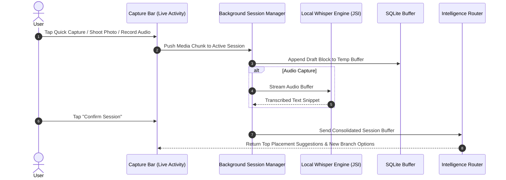
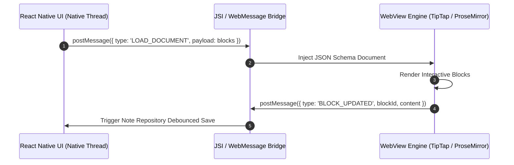
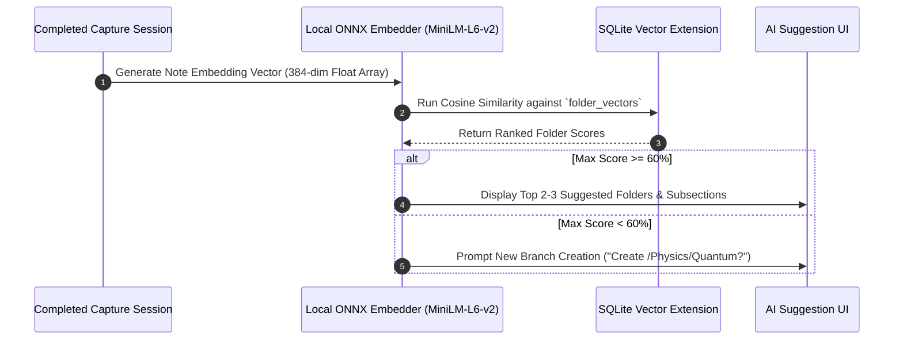
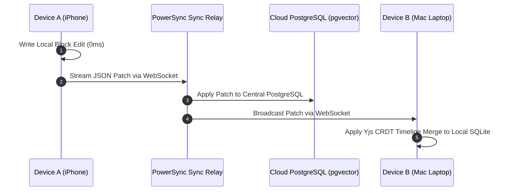

# Noteee: System Layers & Comprehensive Architectural Masterplan

## 1. System Architecture & Layered Build Strategy

Noteee is engineered as a **Modular Monorepo** (Expo React Native for mobile/desktop + Next.js for web), operating on an **Offline-First, Decoupled Architecture**.

```
  ┌────────────────────────────────────────────────────────────────────────┐
  │ LAYER 6 (ROOF): Cloud Sync, CRDT, Cloud Auth & Monetization           │
  ├────────────────────────────────────────────────────────────────────────┤
  │ LAYER 5: PDF Annotations, Skia Drawing Canvas & Image Occlusion        │
  ├────────────────────────────────────────────────────────────────────────┤
  │ LAYER 4: On-Device AI Auto-Filing, Vector DB & FSRS Flashcards          │
  ├────────────────────────────────────────────────────────────────────────┤
  │ LAYER 3: Notion-Grade Hybrid Block Editor & KaTeX Math Rendering        │
  ├────────────────────────────────────────────────────────────────────────┤
  │ LAYER 2: Multi-Modal Capture Engine, Local TTS & Session Lifecycle      │
  ├────────────────────────────────────────────────────────────────────────┤
  │ LAYER 1 (FOUNDATION): Decoupled DB, Local Auth/Vault, Tree & Anchors  │
  └────────────────────────────────────────────────────────────────────────┘
```

---

## 2. Monorepo Package Topology & Clean Boundaries

```plaintext
noteee-monorepo/
├── apps/
│   ├── mobile/                 # Expo React Native App (iOS, Android, macOS, Windows)
│   ├── web/                    # Next.js 15 App (Web Client, Marketing, Checkout)
│   └── backend/                # Node.js/TypeScript Server (PowerSync Relay, WebSockets, Webhooks)
├── packages/
│   ├── core/                   # Entities, Value Objects, FSRS Algorithm, Shared Domain Contracts
│   ├── database/               # Drizzle ORM schemas, op-sqlite & PostgreSQL Drivers
│   ├── editor/                 # TipTap Core Extensions & React Native WebView Bridge
│   ├── intelligence/           # On-Device ONNX Embeddings, ML Kit OCR, Whisper STT, Llama Drivers
│   ├── sync/                   # PowerSync Client & Yjs CRDT Provider
│   └── ui/                     # Cross-Platform Design System Component Library
```

---

## 3. Systematic 6-Layer Planning Roadmap

Each layer is meticulously planned with explicit **Architectural Patterns**, **Design Patterns**, **Lifecycles**, and **Sequence Diagrams** before any source code implementation begins.

### Layer 1: Core Foundation & Decoupled Data Architecture
- **Focus:** Decoupled SQLite/PostgreSQL storage, Virtual Root (`parent_id = NULL`), Zero-Orphans rule, 7 Universal System Anchors, Universal Date-Time Axis, Local Biometric Authentication (FaceID/TouchID/Passcode) for Encrypted Vault folder protection & Secure Keyring Integration.
- **Architectural & Design Patterns:** Dependency Inversion Principle (DIP), Repository Pattern (`INoteRepository`, `IFolderRepository`), Composite Pattern (Recursive block hierarchy).
- **Deliverable File:** `03_sector_1_foundation_spec.md` (Completed & Audited).

---

### Layer 2: Multi-Modal Capture Engine, Local TTS & Session Lifecycle
- **Focus:** Camera multi-photo scanning, Whisper offline STT audio recorder, Local TTS Audio Playback Engine (MVP offline speech synthesis), Quick Capture floating bar, Clipboard auto-detector, Background Session Manager (iOS Live Activities / Dynamic Island).
- **Architectural & Design Patterns:** Strategy Pattern (`ICaptureSource`), Observer/PubSub Pattern (Event-driven session updates), State Machine Pattern (Session Lifecycle: `IDLE` $\rightarrow$ `RECORDING` $\rightarrow$ `PROCESSING` $\rightarrow$ `SUGGESTION` $\rightarrow$ `FILED`).
- **Session Lifecycle Sequence Diagram:**



- **Deliverable File:** `05_sector_2_capture_spec.md` (Next Planning Phase).

---

### Layer 3: Notion-Grade Hybrid Block Editor Engine
- **Focus:** Hybrid TipTap WebView Bridge for mobile + Native TipTap for Next.js Web, 12 Core Block Types (Code Blocks with syntax highlighting, KaTeX LaTeX math, toggles, callouts), Slash Menu `/`.
- **Architectural & Design Patterns:** Bridge Pattern (Native-to-WebView JSI message channel), Command Pattern (Undo/Redo, Block Transformations), Factory Pattern (Block Component Renderer).
- **Editor Message Bridge Architecture:**



- **Deliverable File:** `06_sector_3_editor_spec.md`.

---

### Layer 4: On-Device AI Auto-Filing, Vector DB & Spaced Repetition (FSRS)
- **Focus:** Local ONNX embedding generator (`all-MiniLM-L6-v2`), SQLite JSI vector tables (`folder_vectors`, `page_vectors`), 3 AI placement pathways (Fallback, Existing Suggestion, New Branch Prompt), Cloze & Q&A flashcard auto-generation, FSRS algorithm.
- **Architectural & Design Patterns:** Strategy Pattern (`IClassificationEngine`), Vector Space Model (Cosine Similarity), Spaced Repetition Scheduler (`FSRSEngine`).
- **Vector Placement Sequence:**



- **Deliverable File:** `07_sector_4_ai_flashcards_spec.md`.

---

### Layer 5: PDF Annotations, Skia Drawing Canvas & Image Occlusion
- **Focus:** `@shopify/react-native-skia` 60FPS GPU drawing engine, PDF text/area highlighter, Scribble-to-erase gesture, PDF Occlusion Tape, Image Occlusion card generator.
- **Architectural & Design Patterns:** Decorator Pattern (Canvas Overlays & Annotation Layers), Flyweight Pattern (Stroke Vector Memory Optimization), Memento Pattern (Canvas Drawing History).
- **Deliverable File:** `08_sector_5_canvas_pdf_spec.md`.

---

### Layer 6 (Roof): Multi-Device Cloud Sync, Real-Time CRDT, Cloud Auth & Monetization
- **Focus:** PowerSync local-first SQLite-to-PostgreSQL streaming, Cloud Authentication (Supabase Auth / JWT / OAuth), Yjs CRDT WebSocket engine, zero-knowledge E2EE hash-fragment sharing (`#key`), Premium Cloud AI Voices (v3+ TTS), RevenueCat IAP billing.
- **Architectural & Design Patterns:** Observer Pattern (WebSocket CRDT Delta Broadcasting), Proxy Pattern (Zero-Knowledge Encryption Tunnel), Adapter Pattern (`IBillingProvider`).
- **Multi-Device CRDT Sync Lifecycle:**



- **Deliverable File:** `09_sector_6_sync_collab_monetization_spec.md`.

---

## 4. Master Architectural Principles Checklist

1. **Single Responsibility Principle (SRP):** Clear segregation of UI, Domain Logic, Persistence, and AI Services.
2. **Open/Closed Principle (OCP):** Modular capture sources, block types, and AI drivers.
3. **Liskov Substitution Principle (LSP):** Transparent swapping between local and cloud engines.
4. **Interface Segregation Principle (ISP):** Specialized, minimal API contracts (`IEmbedder`, `ISpeechToText`, `ITextRecognizer`).
5. **Dependency Inversion Principle (DIP):** High-level domain modules depend purely on abstractions, enabling seamless offline-to-cloud transitions.
6. **Strict Planning First Rule:** Every sector file must contain complete schema definitions, sequence diagrams, lifecycle state machines, and design patterns before any code is generated.
