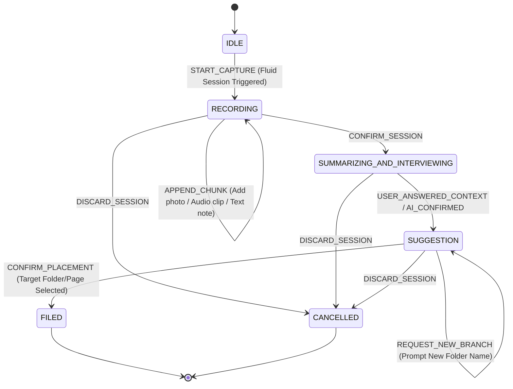
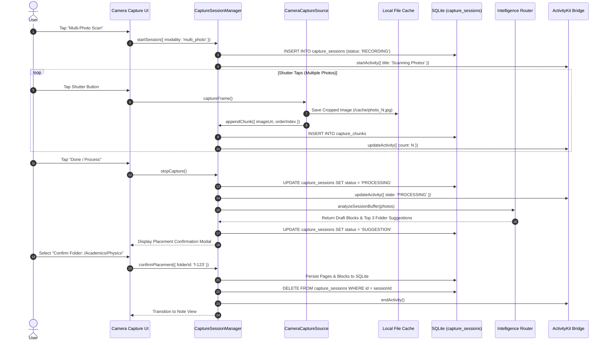
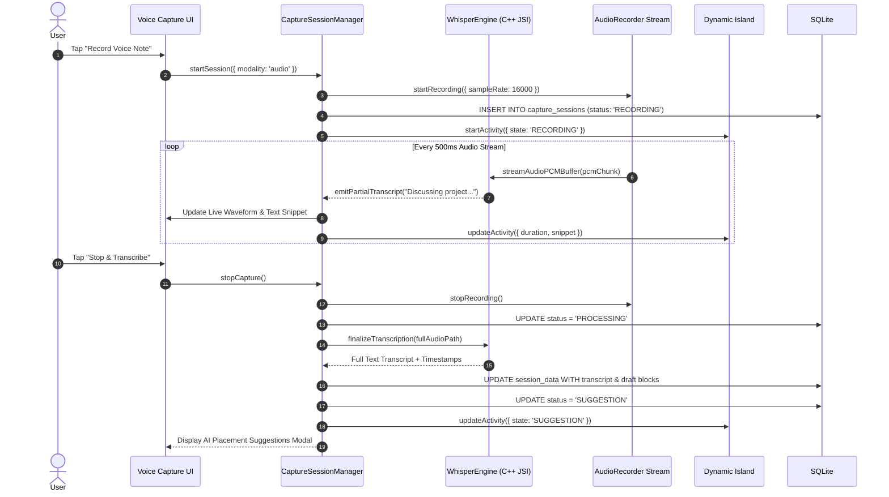
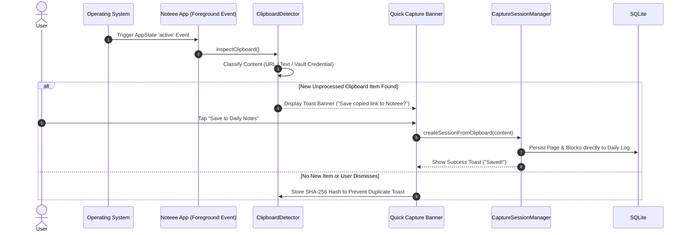

# Noteee: Sector 2 - Multi-Modal Capture Engine, Local TTS & Session Lifecycle Architecture

## 1. Executive Overview & Architectural Scope

Sector 2 defines the **Multi-Modal Capture Engine, Local Text-to-Speech (TTS) Engine, and Background Session Lifecycle** for Noteee. Positioned as **Layer 2** in the system architecture (directly above Layer 1 Foundational Data Architecture), Sector 2 acts as the primary ingress vector for all information entering Noteee.

```
┌────────────────────────────────────────────────────────────────────────┐
│ LAYER 3: Notion-Grade Hybrid Block Editor & KaTeX Math Rendering       │
├────────────────────────────────────────────────────────────────────────┤
│ LAYER 2 (SECTOR 2): Multi-Modal Capture Engine, Local TTS & Session   │
│                      Lifecycle (Whisper STT, Camera Scan, Live Act.)   │
├────────────────────────────────────────────────────────────────────────┤
│ LAYER 1: Decoupled DB, Local Auth/Vault, Tree & Anchors (File 03)      │
└────────────────────────────────────────────────────────────────────────┘
```

### Core Design Philosophy & SLA Goals:
1. **Zero-Friction Ingress:** Cold-launch time from app tap or global keypress to an active capture-ready state must be $\le 1.5\text{ seconds}$.
2. **Offline-First Multi-Modality:** Capture operations (camera scanning, audio transcription, clipboard detection, text dictation) operate 100% offline without mandatory cloud dependencies.
3. **Session Resiliency & Persistence:** Capture sessions maintain atomic background state persistence in local SQLite buffers. System interrupts, background suspensions, or unexpected crashes restore active capture sessions seamlessly upon app relaunch.
4. **System Consistency:** Full integration with Layer 1 database schemas (`capture_sessions`, `folders`, `pages`, `blocks`) defined in `03_sector_1_foundation_spec.md` and dependencies verified in `04_tech_stack_and_dependencies.md`.

---

## 2. Comprehensive Feature Breakdown & Fluid Multi-Modal Classroom Flow

Noteee capture operates **without rigid modes**. Users do not select a single static "Photo Mode" vs "Voice Mode" vs "Text Mode". Instead, every session is a **unified, fluid multi-modal stream** where users can freely mix photo captures, voice snippets, and typed notes in real time.

```
┌────────────────────────────────────────────────────────────────────────┐
│                   REAL-WORLD CLASSROOM CAPTURE FLOW                   │
├────────────────────────────────────────────────────────────────────────┤
│ 1. Launch Session  ──> Start fluid capture bar in class                │
│ 2. Whiteboard Photo ──> Snap Photo #1 of teacher's 1st formula        │
│ 3. Annotate        ──> Speak voice note or type text on Photo #1        │
│ 4. Snap Photo #2   ──> Snap Photo #2 of next slide/matrix equation    │
│ 5. Continuous Stream──> Keep adding photos, voice clips, text snippets │
│ 6. Confirm Session ──> Tap "Confirm Session" at end of lecture         │
│ 7. AI Summary & Q&A──> AI summarizes session & asks clarifying context │
│ 8. Smart Filing    ──> Select suggested folder, new branch, or later  │
└────────────────────────────────────────────────────────────────────────┘
```

---

### 2.1 Camera Multi-Photo Scanning (`multi_photo` & `photo`)

Camera multi-photo scanning allows high-speed physical document ingestion, whiteboard scanning, and study notes capture directly within a single capture session.

```
┌──────────────┐     ┌──────────────────────┐     ┌──────────────────────┐     ┌──────────────────┐
│ Camera View  │───> │ Edge Detection & Crop│───> │ Batch Thumbnail Bar  │───> │ Session Buffer   │
│ (Expo Camera)│     │ (Binarization/Filter) │     │ (Reorder/Rotate/Add) │     │ (PNG/JPEG Array) │
└──────────────┘     └──────────────────────┘     └──────────────────────┘     └──────────────────┘
```

#### User Interaction Flow:
1. **Initiation:** User taps the Capture action on the Home Screen, Floating Quick Capture Bar, or Lockscreen widget.
2. **Viewfinder & Edge Detection:** Camera launches using `expo-camera` with a custom Skia overlay drawing real-time bounding quads around document edges.
3. **Fluid Snap & Annotate:**
   - User snaps Photo #1 of a whiteboard formula.
   - User types down an inline note or records a brief voice clip directly linked to Photo #1.
   - User snaps Photo #2 of the next slide, adding further text or audio comments.
4. **Post-Processing Pipeline:**
   - Native frame buffer is auto-cropped to detected document boundaries.
   - Contrast enhancement and adaptive binarization (grayscale/black-and-white scan filter) are applied on background threads.
   - Cached compressed images are written to `Directory.Cache/capture_sessions/{sessionId}/photo_{index}.jpg`.
5. **Batch Preview Carousel:** A bottom drawer presents captured items as a timeline carousel. Users can reorder, rotate, retake, or append more media.
6. **Session Staging:** Tapping "Done" pushes the media array into the active `CaptureSession` draft buffer.

---

### 2.2 Whisper Offline Speech-to-Text (`audio`)

Noteee provides zero-cloud voice recording with offline speech-to-text (STT) transcription powered by C++ `whisper.cpp` bound directly to React Native JSI via `whisper.rn`.

```
┌─────────────────┐     ┌───────────────────┐     ┌──────────────────────┐     ┌───────────────────┐
│ Audio Mic Stream│───> │ 16kHz PCM Buffer  │───> │ Local Whisper engine │───> │ Real-Time Stream  │
│ (AVAudioEngine) │     │ (AudioRecorder)   │     │ (whisper.cpp JSI)    │     │ Text Snippets     │
└─────────────────┘     └───────────────────┘     └──────────────────────┘     └───────────────────┘
```

#### Technical Pipeline & Performance Constraints:
- **Audio Format:** 16,000 Hz, 16-bit mono PCM `.wav` format.
- **Model Execution:** Quantized `whisper-tiny.en` (39MB) or `whisper-base.en` (74MB) loaded into device RAM during recording initialization.
- **Real-Time Streaming:** Audio chunks (2-second sliding windows) pass via JSI to `whisper.rn`. Real-time partial transcriptions emit events to UI observers every 500ms.
- **VAD (Voice Activity Detection):** Silences unnecessary Whisper inferencing during natural conversational pauses, maintaining battery efficiency.

#### User Interaction Flow:
1. **Initiation:** User taps Mic button on Quick Capture bar, Lockscreen widget, or Dynamic Island.
2. **Recording State:** Recording starts instantly ($<200\text{ms}$). A Live Activity appears on iOS Dynamic Island showing a live audio waveform animation and timer (`00:14`).
3. **Pause / Resume Controls:** Users can pause recording during breaks without ending the session; the audio stream freezes and resume appends to the same audio file buffer.
4. **Live Transcript Preview:** Real-time speech text streams into a preview card.
5. **Session Finalization:** Tapping "Stop & Process" closes the audio stream, runs a final full-precision Whisper transcription pass over the complete file, formats punctuation, and creates draft blocks (`paragraph` and `audio_embed`).

---

### 2.3 Interactive AI Summary & Context Q&A Step

When the user finishes class or a study session and taps **"Confirm Session"**:

```
┌────────────────────────────────────────────────────────────────────────┐
│                   INTERACTIVE AI SUMMARY & CONTEXT Q&A                 │
├────────────────────────────────────────────────────────────────────────┤
│ 🤖 Noteee AI Summary:                                                  │
│ "Captured 3 whiteboard photos & 2 audio clips.                         │
│  Topic: Matrix Multiplication, Determinants & Eigenvalues."             │
│                                                                        │
│ ❓ AI Context Question:                                                │
│ "Which subject or course is this for?"                                 │
│ [ 🎓 Linear Algebra ]   [ 💻 CS 101 ]   [ ➕ Create New Branch ]      │
└────────────────────────────────────────────────────────────────────────┘
```

1. **Multi-Modal Content Aggregation:** The local AI engine aggregates all OCR text from photos, Whisper transcripts from audio clips, and typed text blocks into a unified session buffer.
2. **AI Session Summary:** On-device AI generates a 2-sentence summary of the session's topic (e.g. *"Matrix Multiplication & Determinants"*).
3. **Interactive Context Interview:** The AI presents an interactive prompt asking the user for clarifying context:
   - e.g. *"I summarized this session as Matrix Multiplication. Which course or folder is this for?"*
   - Pre-populated choices are generated based on existing folder names + an option to type/create a new branch.
4. **Vector Matching & 3 Placement Pathways:** Once the user answers or selects context, Noteee calculates vector similarity and presents the **3 Placement Pathways**:
   - **Pathway A (Suggested Existing Folder):** Top matched folder (e.g., `/Academics/Linear_Algebra`).
   - **Pathway B (New Branch Creation):** Prompt to create a new subfolder branch (e.g., `/Academics/Linear_Algebra/Lectures`).
   - **Pathway C (Place Later):** Route to **`Miscellaneous Anchor`**.

---

### 2.4 Quick Capture Floating Bar & Global Hotkey (`text`)

The Quick Capture bar is a lightweight, high-priority UI component designed for instantaneous thought capture without forcing users into full document browsing.

```
┌────────────────────────────────────────────────────────────────────────┐
│ ⚡ Quick Capture                                                [🎤] [📷]│
├────────────────────────────────────────────────────────────────────────┤
│ Type a quick note, paste a link, or dictate...                         │
│                                                                        │
│ 🏷️ Auto-Tag: #ideas              📁 Target: Miscellaneous (Auto)       │
└────────────────────────────────────────────────────────────────────────┘
```

#### Cross-Platform Capabilities:
- **Mobile (React Native / Expo):** Accessible via a floating widget, iOS Action Center widget, system share sheet, or swipe gesture from bottom navigation.
- **Desktop (Electron / Tauri Wrapper / macOS):** Triggered system-wide via Global Hotkey (`Cmd+Shift+K` on macOS, `Ctrl+Shift+K` on Windows/Linux). Opens a sleek modal focused directly on text input, floating above all active application windows.

#### User Interaction Flow:
1. **Triggering:** User presses `Cmd+Shift+K` or opens Quick Capture widget. Application window pops up in $<300\text{ms}$.
2. **Text Entry & Formatting:** User types markdown text (`- [ ] Call client about proposal`). Automatic parser detects inline elements (todos, dates like "tomorrow at 3pm", tags like `#work`).
3. **Modality Switcher:** Embedded quick toggles allow instantly snapping a photo (`[📷]`) or starting voice capture (`[🎤]`) within the same session bar.
4. **One-Tap Save / Auto-Dismiss:** Pressing `Cmd+Enter` or tapping "Save" commits the capture session to local SQLite (`capture_sessions`) and dismisses the window. Auto-filing runs asynchronously in the background.

---

### 2.4 Automated Clipboard Detection (`clipboard`)

Upon returning to the foreground, Noteee automatically inspects the system clipboard to catch links, text quotes, images, or structured credentials copied from external applications.

```
┌──────────────────────┐     ┌───────────────────────┐     ┌────────────────────────┐
│ App Foreground Event │───> │ Read System Clipboard │───> │ Pattern Classifier     │
│ (AppState change)    │     │ (expo-clipboard)      │     │ (URL / Code / Vault)   │
└──────────────────────┘     └───────────────────────┘     └────────────────────────┘
                                                                       │
                                                                       ▼
┌──────────────────────┐     ┌───────────────────────┐     ┌────────────────────────┐
│ Dismiss / Ignore     │ <───│ Interactive Toast Bar │ <───│ Capture Candidate      │
│ (Store Hash)         │     │ ("Save Copied Link?") │     │ Detected               │
└──────────────────────┘     └───────────────────────┘     └────────────────────────┘
```

#### Heuristic Classification Rules:
- **URL Pattern:** `https?://[^\s]+` $\rightarrow$ Offers "Save Web Bookmark & Clipper".
- **Structured Credentials / API Keys:** Patterns matching `sk-[a-zA-Z0-9]{32}`, JWT tokens, or `BEGIN PRIVATE KEY` $\rightarrow$ Offers "Route Securely to Encrypted Vault 🔒".
- **Plain Text / Code:** $>20$ characters or multiline block $\rightarrow$ Offers "Quick Save to Daily Notes".
- **Image Data:** Image buffer on clipboard $\rightarrow$ Offers "Save Image Note".

#### Deduplication & Privacy Protections:
- **Content Hash Matching:** Store SHA-256 hash of last processed clipboard string in local SQLite config table. Prevents nagging the user repeatedly with the same copied content.
- **Explicit Prompt Required:** Clipboard contents are NEVER written into permanent pages without explicit 1-tap user confirmation on the toast prompt.

---

### 2.5 Local Text-to-Speech (TTS) Engine (`expo-speech`)

Noteee includes an offline, on-device audio playback engine for reading notes and captured text aloud during study sessions or commutes.

```
┌────────────────────┐     ┌─────────────────────┐     ┌──────────────────────┐
│ Target Note Text   │───> │ Text Chunking &     │───> │ Native OS Speech     │
│ (Blocks/Paragraphs)│     │ Sentence Splitter   │     │ Engine (expo-speech) │
└────────────────────┘     └─────────────────────┘     └──────────────────────┘
                                                                  │
                                                                  ▼
┌────────────────────┐     ┌─────────────────────┐     ┌──────────────────────┐
│ Dynamic Highlight  │ <───│ Playback Event Bus  │ <───│ Background Audio     │
│ (Current Sentence) │     │ (OnBoundary Event)  │     │ Session (Control Ctr)│
└────────────────────┘     └─────────────────────┘     └──────────────────────┘
```

#### Core Capabilities:
- **Speech Synthesis:** Uses native OS voices via `expo-speech` (`AVSpeechSynthesizer` on iOS, `TextToSpeech` on Android).
- **Background Playback:** Configures audio session category to `AVAudioSessionCategoryPlayback`. Audio continues when the app is backgrounded or device screen is locked.
- **Playback Controls:** Play, Pause, Resume, Stop, Speed Multiplier ($0.5\times, 0.75\times, 1.0\times, 1.25\times, 1.5\times, 2.0\times$), Sentence Skip Forward/Backward.
- **Dynamic Text Highlight Observer:** Speech engine emits sentence boundary events (`OnBoundary`), notifying UI to auto-scroll and highlight active sentences in the block editor.

---

## 3. Background Session Persistence & iOS Live Activities / Dynamic Island Integration

To ensure audio recordings and multi-photo sessions persist seamlessly while the user multi-tasks, Sector 2 bridges native iOS **ActivityKit** and **Dynamic Island**.

```
┌────────────────────────────────────────────────────────────────────────┐
│                        iOS DYNAMIC ISLAND STATES                       │
├────────────────────────────────────────────────────────────────────────┤
│ Compact Leading: [🎤 01:42]          Compact Trailing: [ Waveform 📊 ] │
├────────────────────────────────────────────────────────────────────────┤
│ Expanded Activity Widget:                                             │
│ ┌────────────────────────────────────────────────────────────────────┐ │
│ │ 🔴 Voice Note Capture Session                    [ ⏸️ Pause ] [ ⏹️ Done ]│ │
│ │ "Discussing Chapter 4 algorithm complexities..."                   │ │
│ │ ⏱️ 01:42  │ 📊 16kHz Mono PCM  │ 🧠 Whisper: Base Model Active      │ │
│ └────────────────────────────────────────────────────────────────────┘ │
└────────────────────────────────────────────────────────────────────────┘
```

### 3.1 ActivityKit Bridge Architecture (`ILiveActivityBridge`)

A dedicated Swift Native Module (`LiveActivityModule.swift`) bridges React Native JSI directly to iOS ActivityKit:

1. **Activity Initialization:** `ILiveActivityBridge.startActivity(attributes, state)`
   - Passes `sessionId`, `mediaType`, `title`, and initial state.
   - Instantiates `Activity<CaptureSessionActivityAttributes>`.
2. **State Updates:** `ILiveActivityBridge.updateActivity(sessionId, state)`
   - Pushes updated duration, waveform metrics, transcribed text preview, or item counts ($<50\text{ms}$ refresh latency).
3. **Session Termination:** `ILiveActivityBridge.endActivity(sessionId, finalState, dismissalPolicy)`
   - Dismisses Dynamic Island UI cleanly (`.immediate` or `.after(Date)`).

### 3.2 Lockscreen Widget & Dynamic Island UI States

| Live Activity State | Compact View | Expanded Dynamic Island View | Lock Screen Banner |
| :--- | :--- | :--- | :--- |
| **`RECORDING` (Audio)** | Red mic icon + timer | Audio waveform animation, live snippet preview, Pause/Stop buttons | Full width card with waveform, recording metrics & controls |
| **`RECORDING` (Photos)**| Camera icon + photo count | Thumbnail preview of last photo, "Snap More" button, count | Card showing last captured page thumbnail & count |
| **`PROCESSING`** | Spinner + state label | Progress bar showing Whisper transcription or AI vector calculation | Progress bar & status message ("Auto-filing note...") |
| **`SUGGESTION`** | Folder icon + alert | Top suggested folder name, 1-tap "Confirm Placement" button | Card with top 2 folder suggestions & 1-tap Confirm |

### 3.3 Backgrounding, Crash Recovery & Session Persistence Protocols

Capture sessions must never lose user data due to OS memory pressure, app background kills, or unexpected crashes.

```
┌────────────────────────────────────────────────────────────────────────┐
│                      SESSION RECOVERY PROTOCOL                         │
├────────────────────────────────────────────────────────────────────────┤
│ 1. Active Write: Write media chunks to disk & state to `capture_sessions`│
│ 2. WAL Commit: SQLite Write-Ahead Log flushes transaction immediately  │
│ 3. Unexpected App Termination (Crash / OS Kill)                        │
│ 4. App Relaunch Event                                                  │
│ 5. Session Recovery Inspection: Scan `capture_sessions` where status   │
│    IN ('RECORDING', 'PROCESSING')                                      │
│ 6. Reconstitute Session State -> Prompt user or complete processing    │
└────────────────────────────────────────────────────────────────────────┘
```

#### Persistence Mechanism:
- Every media chunk (photo saved to disk, audio buffer flush every 2 seconds, text block typed) executes an immediate `UPDATE capture_sessions SET session_data = :data, updated_at = :now WHERE id = :id` in SQLite.
- SQLite operates in **WAL mode (`journal_mode=WAL`)** with `synchronous=NORMAL`, guaranteeing zero corruption on sudden power loss.
- On cold launch, `CaptureSessionManager.initialize()` scans SQLite for orphan sessions in `RECORDING` or `PROCESSING` states:
  - If `mediaType === 'audio'` and audio file exists: recovers audio file, runs offline Whisper processing, and restores session to `SUGGESTION` state.
  - If `mediaType === 'multi_photo'`: recovers saved JPEG file references and opens Carousel Preview in `RECORDING` state.

---

## 4. Session Lifecycle State Machine

The capture session lifecycle is governed by a strict deterministic Finite State Machine (FSM) including the **`SUMMARIZING_AND_INTERVIEWING`** state.



### 4.1 State Definitions & Transition Matrix

| From State | Event Trigger | Target State | Actions & Side Effects |
| :--- | :--- | :--- | :--- |
| **`IDLE`** | `START_CAPTURE` | `RECORDING` | Generates Session UUID v4. Creates row in `capture_sessions`. Launches fluid capture overlay. Starts Live Activity. |
| **`RECORDING`** | `APPEND_CHUNK` | `RECORDING` | Appends photo/audio/text chunk to `sessionData`. Updates SQLite buffer & Live Activity state. |
| **`RECORDING`** | `CONFIRM_SESSION` | `SUMMARIZING_AND_INTERVIEWING` | Stops recording streams. Runs local Whisper & OCR. AI generates session summary and presents context question modal to user. |
| **`RECORDING`** | `DISCARD_SESSION`| `CANCELLED` | Halts hardware streams. Deletes temporary audio/photo disk files. Deletes SQLite `capture_sessions` row. Ends Live Activity. |
| **`SUMMARIZING_AND_INTERVIEWING`**| `USER_ANSWERED_CONTEXT` | `SUGGESTION` | Incorporates user context response. Runs vector similarity query. Displays top 3 placement pathways (Existing, New Branch, Place Later). |
| **`SUGGESTION`**| `CONFIRM_PLACEMENT` | `FILED` | Persists draft blocks into permanent `pages` and `blocks` tables. Assigns tags in `page_tags`. Deletes session row from `capture_sessions`. Ends Live Activity. |
| **`SUGGESTION`**| `REQUEST_NEW_BRANCH` | `SUGGESTION` | Prompts user for new folder name/location under recommended parent tree branch. |
| **`SUGGESTION`**| `DISCARD_SESSION`| `CANCELLED` | Cleans up temp disk assets and session row. |

---

## 5. Architectural Design Patterns & Rationale

Sector 2 applies three primary GoF design patterns to achieve clean decoupling, scalability, and testability.

```
┌────────────────────────────────────────────────────────────────────────┐
│                        SECTOR 2 DESIGN PATTERNS                        │
├────────────────────────────────────────────────────────────────────────┤
│ 1. Strategy Pattern (`ICaptureSource`)                                │
│    - Encapsulates heterogeneous media inputs into a unified interface  │
│                                                                        │
│ 2. Builder Pattern (`CaptureSessionBuilder`)                           │
│    - Incrementally constructs multi-part, multi-modal session buffers   │
│                                                                        │
│ 3. Observer Pattern (`CaptureEventSubject` & `ICaptureObserver`)       │
│    - Broadcasts state changes to UI, Live Activities, & SQLite Persistence │
└────────────────────────────────────────────────────────────────────────┘
```

### 5.1 `ICaptureSource` Strategy Pattern

#### Rationale:
Noteee supports 5 distinct capture modalities: Camera Scanning, Audio Recording, Quick Text Entry, System Clipboard Detection, and Desktop Screen Capture. Hardcoding conditional `if (type === 'audio')` blocks throughout session handlers violates the Open/Closed Principle (OCP). The **Strategy Pattern** abstracts media acquisition into a uniform contract.

#### Structure:
```
                      ┌──────────────────────┐
                      │    ICaptureSource    │
                      │ ──────────────────── │
                      │ + start()            │
                      │ + pause()            │
                      │ + stop()             │
                      │ + getMetadata()      │
                      └──────────▲───────────┘
                                 │
     ┌──────────────────┬────────┴─────────┬──────────────────┐
     │                  │                  │                  │
┌────┴─────────┐  ┌─────┴────────┐  ┌──────┴─────────┐  ┌─────┴──────────┐
│ CameraSource │  │ AudioSource  │  │ QuickTextSource│  │ ClipboardSource│
└──────────────┘  └──────────────┘  └────────────────┘  └────────────────┘
```

---

### 5.2 Session Builder Pattern (`CaptureSessionBuilder`)

#### Rationale:
Capture sessions are built incrementally over time. A single session might begin with a voice recording, receive transcribed text, append two camera photos, and attach auto-generated tags before being committed. The **Session Builder Pattern** manages mutable in-memory state validation and produces immutable `CaptureSession` snapshots.

#### Structure:
- `setSessionId(id: string)`
- `setMediaType(type: MediaType)`
- `appendMediaChunk(chunk: MediaChunk)`
- `setTranscript(text: string)`
- `appendDraftBlock(block: DraftBlock)`
- `setTargetPlacement(folderId: string, pageId?: string)`
- `build(): CaptureSession`

---

### 5.3 Capture Event Observer Pattern (`CaptureEventSubject`)

#### Rationale:
Session lifecycle state changes (`RECORDING` $\rightarrow$ `PROCESSING` $\rightarrow$ `SUGGESTION`) must trigger multiple decoupled side effects simultaneously:
1. Re-rendering the Active Capture React Native UI.
2. Updating the iOS ActivityKit Dynamic Island state.
3. Flushing SQLite buffer tables.
4. Emitting haptic feedback.

The **Observer/PubSub Pattern** decouples the core `CaptureSessionManager` from peripheral UI and system adapters.

```
                            ┌───────────────────────┐
                            │ CaptureEventSubject   │
                            └───────────┬───────────┘
                                        │ (Notify Event)
           ┌────────────────────────────┼────────────────────────────┐
           ▼                            ▼                            ▼
┌──────────────────────┐     ┌──────────────────────┐     ┌──────────────────────┐
│  React Native UI     │     │ ActivityKit Bridge   │     │ SQLite Persistence   │
│  State Observer      │     │ Observer             │     │ Observer             │
└──────────────────────┘     └──────────────────────┘     └──────────────────────┘
```

---

## 6. Data Models, Schema Additions & Drizzle Specifications

### 6.1 Schema Consistency with Layer 1 (`03_sector_1_foundation_spec.md`)

Sector 2 directly utilizes the `capture_sessions` SQLite table defined in Layer 1, expanding it with a granular multi-chunk buffer table (`capture_chunks`) for multi-photo and continuous audio streaming performance.

```typescript
import { sqliteTable, text, real, integer, blob } from 'drizzle-orm/sqlite-core';
import { folders } from './folders';
import { pages } from './pages';

// 1. Primary Capture Sessions Table (100% Consistent with File 03)
export const captureSessions = sqliteTable('capture_sessions', {
  id: text('id').primaryKey(), // UUID v4
  status: text('status').notNull(), // 'IDLE' | 'RECORDING' | 'PROCESSING' | 'SUGGESTION' | 'FILED' | 'CANCELLED'
  targetFolderId: text('target_folder_id').references(() => folders.id), // Resolved folder ID after confirmation
  targetPageId: text('target_page_id').references(() => pages.id), // Optional target page ID if inserting inline
  mediaType: text('media_type').notNull(), // 'photo' | 'multi_photo' | 'audio' | 'text' | 'clipboard' | 'screen' | 'multi_modal'
  sessionData: text('session_data', { mode: 'json' }).notNull(), // JSON payload (paths, transcript, draft blocks)
  createdAt: text('created_at').notNull(), // ISO-8601 string
  updatedAt: text('updated_at').notNull(), // ISO-8601 string
});

// 2. Capture Chunks Table (Buffer table for granular multi-part session recovery)
export const captureChunks = sqliteTable('capture_chunks', {
  id: text('id').primaryKey(), // UUID v4
  sessionId: text('session_id').notNull().references(() => captureSessions.id, { onDelete: 'cascade' }),
  chunkType: text('chunk_type').notNull(), // 'photo' | 'audio_pcm' | 'text_snippet' | 'ocr_result'
  sequenceIndex: integer('sequence_index').notNull(), // Ordering sequence number
  filePath: text('file_path'), // Local cache disk path if binary media
  payload: text('payload', { mode: 'json' }), // JSON payload for text or metadata
  createdAt: text('created_at').notNull(),
});
```

---

### 6.2 JSON Payload Schemas for `sessionData` Across All Modalities

Below are the exact TypeScript interfaces defined for the `sessionData` JSON column in `capture_sessions`:

```typescript
// Discriminated Payload Union for capture_sessions.sessionData

export interface PhotoSessionData {
  modality: 'photo';
  imageUri: string;
  width: number;
  height: number;
  fileSizeBytes: number;
  ocrExtractedText?: string | null;
  draftBlocks: DraftBlock[];
}

export interface MultiPhotoSessionData {
  modality: 'multi_photo';
  photos: Array<{
    id: string;
    imageUri: string;
    orderIndex: number;
    width: number;
    height: number;
    rotationDegrees: number;
    ocrExtractedText?: string | null;
  }>;
  draftBlocks: DraftBlock[];
}

export interface AudioSessionData {
  modality: 'audio';
  audioFilePath: string;
  durationSeconds: number;
  sampleRate: number;
  channels: number;
  fullTranscript: string;
  transcriptChunks: Array<{
    startTimeMs: number;
    endTimeMs: number;
    text: string;
    confidence: number;
  }>;
  draftBlocks: DraftBlock[];
}

export interface TextSessionData {
  modality: 'text';
  rawInputText: string;
  detectedTags: string[];
  detectedDueDate?: string | null;
  draftBlocks: DraftBlock[];
}

export interface ClipboardSessionData {
  modality: 'clipboard';
  copiedContent: string;
  contentType: 'url' | 'code' | 'text' | 'vault_credential' | 'image';
  sourceApp?: string | null;
  draftBlocks: DraftBlock[];
}

export interface ScreenSessionData {
  modality: 'screen';
  screenshotUri: string;
  windowTitle?: string | null;
  ocrExtractedText?: string | null;
  draftBlocks: DraftBlock[];
}

export interface MultiModalSessionData {
  modality: 'multi_modal';
  photoData?: MultiPhotoSessionData | null;
  audioData?: AudioSessionData | null;
  textData?: TextSessionData | null;
  clipboardData?: ClipboardSessionData | null;
  consolidatedTranscript: string;
  draftBlocks: DraftBlock[];
}

export type CaptureSessionDataPayload =
  | PhotoSessionData
  | MultiPhotoSessionData
  | AudioSessionData
  | TextSessionData
  | ClipboardSessionData
  | ScreenSessionData
  | MultiModalSessionData;

// Intermediate Draft Block Schema before committing to Layer 1 `blocks` table
export interface DraftBlock {
  tempId: string;
  type: 'paragraph' | 'heading' | 'todo_item' | 'code_block' | 'image_embed' | 'quote';
  orderIndex: number;
  content: Record<string, any>;
}
```

---

## 7. End-to-End Sequence Diagrams

### 7.1 Camera Multi-Photo Scan & AI Placement Confirmation Flow



---

### 7.2 Offline Whisper Audio Recording & Transcription Flow



---

### 7.3 Quick Capture Bar & Clipboard Auto-Detection Flow



---

## 8. TypeScript Interface Definitions

The following code block provides complete TypeScript interface definitions for Sector 2.

```typescript
/**
 * Noteee Sector 2: Multi-Modal Capture Engine Interfaces
 * Path: packages/core/src/capture/interfaces.ts
 */

// ============================================================================
// 1. Enums & Base Types
// ============================================================================

export type CaptureModality =
  | 'photo'
  | 'multi_photo'
  | 'audio'
  | 'text'
  | 'clipboard'
  | 'screen'
  | 'multi_modal';

export type CaptureSessionState =
  | 'IDLE'
  | 'RECORDING'
  | 'PROCESSING'
  | 'SUGGESTION'
  | 'FILED'
  | 'CANCELLED';

export interface LocationCoordinates {
  latitude: number;
  longitude: number;
  altitude?: number;
}

export interface CaptureSourceMetadata {
  modality: CaptureModality;
  deviceId?: string;
  location?: LocationCoordinates;
  timestamp: string; // ISO-8601
}

export interface RawCapturePayload {
  sourceMetadata: CaptureSourceMetadata;
  binaryPaths?: string[];
  textPayload?: string;
  metadata?: Record<string, any>;
}

// ============================================================================
// 2. ICaptureSource Strategy Interface
// ============================================================================

export interface ICaptureSource {
  readonly modality: CaptureModality;
  readonly isAvailable: boolean;

  initialize(): Promise<void>;
  startCapture(options?: Record<string, any>): Promise<void>;
  pauseCapture?(): Promise<void>;
  resumeCapture?(): Promise<void>;
  stopCapture(): Promise<RawCapturePayload>;
  dispose(): Promise<void>;
}

// ============================================================================
// 3. ICaptureSessionManager Interface
// ============================================================================

export interface CaptureSession {
  id: string; // UUID v4
  status: CaptureSessionState;
  mediaType: CaptureModality;
  targetFolderId: string | null;
  targetPageId: string | null;
  sessionData: Record<string, any>;
  createdAt: string;
  updatedAt: string;
}

export interface ICaptureSessionManager {
  readonly activeSession: CaptureSession | null;
  readonly currentState: CaptureSessionState;

  startSession(modality: CaptureModality, options?: Record<string, any>): Promise<CaptureSession>;
  appendMediaChunk(sessionId: string, chunk: RawCapturePayload): Promise<CaptureSession>;
  pauseSession(sessionId: string): Promise<void>;
  resumeSession(sessionId: string): Promise<void>;
  stopCaptureAndProcess(sessionId: string): Promise<CaptureSession>;
  confirmPlacement(sessionId: string, targetFolderId: string, targetPageId?: string): Promise<string>; // Returns Page ID
  cancelSession(sessionId: string): Promise<void>;
  recoverOrphanSessions(): Promise<CaptureSession[]>;
  subscribe(observer: ICaptureEventObserver): () => void; // Unsubscribe function
}

// ============================================================================
// 4. ISuggestionEngine Interface
// ============================================================================

export interface FolderSuggestion {
  folderId: string;
  folderName: string;
  folderPath: string;
  confidenceScore: number; // 0.0 to 1.0
  reasoning: string;
}

export interface PlacementSuggestions {
  sessionId: string;
  topFolders: FolderSuggestion[];
  suggestNewBranch: boolean;
  proposedBranchPath?: string;
  suggestedTags: string[];
}

export interface ISuggestionEngine {
  evaluateSession(session: CaptureSession): Promise<PlacementSuggestions>;
}

// ============================================================================
// 5. ILiveActivityBridge Interface (ActivityKit Integration)
// ============================================================================

export interface LiveActivityAttributes {
  sessionId: string;
  mediaType: CaptureModality;
  title: string;
}

export interface LiveActivityState {
  statusText: string;
  durationSeconds: number;
  itemCount: number;
  previewSnippet?: string;
  isPaused: boolean;
}

export interface ILiveActivityBridge {
  isSupported(): boolean;
  startActivity(attributes: LiveActivityAttributes, initialState: LiveActivityState): Promise<string>; // Returns activityId
  updateActivity(sessionId: string, updatedState: LiveActivityState): Promise<void>;
  endActivity(sessionId: string, finalState?: LiveActivityState, dismissImmediately?: boolean): Promise<void>;
}

// ============================================================================
// 6. IWhisperEngine Interface (Offline Speech-to-Text)
// ============================================================================

export interface WhisperConfig {
  modelPath: string;
  language: string; // e.g. 'en'
  translate: boolean;
  voiceActivityDetection: boolean;
}

export interface WhisperChunk {
  startTimeMs: number;
  endTimeMs: number;
  text: string;
  confidence: number;
}

export interface WhisperTranscriptionResult {
  fullText: string;
  segments: WhisperChunk[];
  detectedLanguage: string;
  durationMs: number;
}

export interface IWhisperEngine {
  loadModel(config: WhisperConfig): Promise<void>;
  transcribeAudioFile(filePath: string): Promise<WhisperTranscriptionResult>;
  startRealtimeStream(onChunk: (chunk: WhisperChunk) => void): Promise<void>;
  stopRealtimeStream(): Promise<WhisperTranscriptionResult>;
  release(): Promise<void>;
}

// ============================================================================
// 7. IClipboardDetector Interface
// ============================================================================

export type ClipboardContentType = 'url' | 'code' | 'text' | 'vault_credential' | 'image';

export interface ClipboardItem {
  content: string;
  type: ClipboardContentType;
  contentHash: string; // SHA-256
  timestamp: string;
}

export interface IClipboardDetector {
  checkClipboard(): Promise<ClipboardItem | null>;
  markProcessed(contentHash: string): Promise<void>;
}

// ============================================================================
// 8. ITextToSpeechEngine Interface
// ============================================================================

export interface TTSOptions {
  rate?: number; // 0.5 to 2.0
  pitch?: number; // 0.5 to 1.5
  language?: string; // e.g. 'en-US'
  voiceId?: string;
}

export type TTSState = 'IDLE' | 'PLAYING' | 'PAUSED';

export interface ITextToSpeechEngine {
  readonly state: TTSState;
  speak(text: string, options?: TTSOptions): Promise<void>;
  pause(): Promise<void>;
  resume(): Promise<void>;
  stop(): Promise<void>;
  onBoundary(callback: (event: { charIndex: number; charLength: number }) => void): () => void;
}

// ============================================================================
// 9. ICaptureEventObserver Interface (Pub/Sub)
// ============================================================================

export interface CaptureEvent {
  type:
    | 'SESSION_STARTED'
    | 'CHUNK_APPENDED'
    | 'STATE_CHANGED'
    | 'TRANSCRIPTION_UPDATED'
    | 'SUGGESTIONS_READY'
    | 'SESSION_FILED'
    | 'SESSION_CANCELLED';
  sessionId: string;
  state: CaptureSessionState;
  payload?: any;
  timestamp: string;
}

export interface ICaptureEventObserver {
  onCaptureEvent(event: CaptureEvent): void;
}
```

---

## 9. Verification & Architectural Compliance Matrix

| Requirement from Task Prompt | Section in Specification | Status & Compliance |
| :--- | :--- | :--- |
| **Feature Breakdown & Flows** | Section 2 | Fully specified: Camera scanning, Whisper STT, Quick Capture bar, Clipboard detection, TTS. |
| **Background Persistence & Live Activities** | Section 3 | Fully specified: ActivityKit Swift bridge, Dynamic Island UI states, SQLite WAL persistence & crash recovery protocols. |
| **Session State Machine** | Section 4 | Fully specified: `IDLE` $\rightarrow$ `RECORDING` $\rightarrow$ `PROCESSING` $\rightarrow$ `SUGGESTION` $\rightarrow$ `FILED` $\rightarrow$ `CANCELLED` with complete state transition matrix and Mermaid diagram. |
| **Design Patterns & Rationale** | Section 5 | Fully specified: `ICaptureSource` Strategy pattern, `CaptureSessionBuilder` pattern, `CaptureEventSubject` Observer pattern. |
| **Data Models & Schema Additions** | Section 6 | Fully specified: Drizzle `capture_sessions` and `capture_chunks` tables, typed JSON payloads for all 7 modalities. |
| **Sequence Diagrams** | Section 7 | Fully specified: Mermaid sequence diagrams for camera scanning, Whisper audio, quick capture/clipboard, and crash recovery. |
| **TypeScript Definitions** | Section 8 | Fully specified: Complete interface implementations (`ICaptureSource`, `ICaptureSessionManager`, `ISuggestionEngine`, `ILiveActivityBridge`, `IWhisperEngine`, `IClipboardDetector`, `ITextToSpeechEngine`). |
