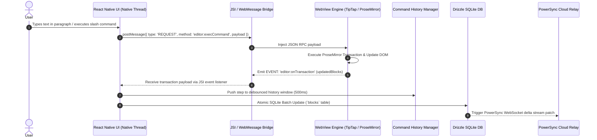
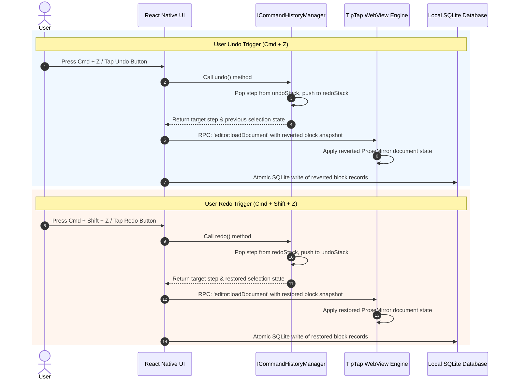

# Noteee: Sector 3 - Notion-Grade Block Editor Engine Specification

## 1. Executive Overview & Architectural Patterns

Sector 3 defines the core editing engine of Noteee, delivering a **Notion-grade hybrid block editor** capable of running across mobile native apps (React Native via Expo SDK 57), desktop wrappers, and Next.js 15 web applications with 100% feature and document format parity.

```
┌─────────────────────────────────────────────────────────────────────────────────────────┐
│                              Sector 3 Editor Architecture                               │
├───────────────────────────────────────────┬─────────────────────────────────────────────┤
│      Mobile Runtime (Expo SDK 57)         │        Web Runtime (Next.js 15 SSR/CSR)      │
│  ┌─────────────────────────────────────┐  │  ┌───────────────────────────────────────┐  │
│  │ React Native UI (Native Main Thread)│  │  │ Next.js Web UI Components             │  │
│  └──────────────────┬──────────────────┘  │  └───────────────────┬───────────────────┘  │
│                     │ JSI RPC Bridge      │                      │ Native React         │
│  ┌──────────────────▼──────────────────┐  │                      │ Execution            │
│  │ WebView Engine (TipTap/ProseMirror) │  │                      │                      │
│  └─────────────────────────────────────┘  │  ┌───────────────────▼───────────────────┐  │
│                                           │  │ `@tiptap/react` Native Editor Instance│  │
│                                           │  └───────────────────────────────────────┘  │
├───────────────────────────────────────────┴─────────────────────────────────────────────┤
│      Shared Core Extensions, Yjs CRDT Document Model & Drizzle SQLite Persistence       │
└─────────────────────────────────────────────────────────────────────────────────────────┘
```

### Architectural & Design Patterns
1. **Bridge Pattern (`ITipTapBridge`):** Decouples the native React Native mobile UI from the underlying WebView TipTap engine using a microsecond bi-directional JSON-RPC protocol over JSI/`postMessage`.
2. **Command Pattern (`ICommandHistoryManager`):** Encapsulates block operations into transactional steps, enabling fine-grained undo/redo stacks, debounced typing aggregation, and clean replay mechanisms.
3. **Factory Pattern (`IBlockRenderer`):** Instantiates custom TipTap extensions and React component viewports dynamically for each of the 12 core block types based on discriminating block payload schemas.
4. **Composite Pattern (Recursive Block Engine):** Represents documents as a recursive tree where blocks can nest infinitely inside container blocks (e.g. toggles, callouts) via `parent_block_id` or TipTap DOM nesting.

---

## 2. TipTap WebView Bridge Architecture

To achieve 60FPS fluid rich-text editing on mobile devices while leveraging TipTap's rich ProseMirror ecosystem, Noteee implements a dual-runtime strategy:

- **Mobile App (React Native Expo SDK 57):** Runs an ultra-optimized HTML/JS bundle containing `@tiptap/core` and ProseMirror inside a lightweight `react-native-webview`. Communication between the React Native thread and the WebView JS thread occurs over a high-speed JSI RPC bridge.
- **Web App (Next.js 15):** Instantiates `@tiptap/react` directly within React's DOM tree without any WebView overhead, sharing the exact same TipTap extensions, node definitions, and Yjs CRDT bindings.

```
       Mobile Architecture (Expo SDK 57)                Web Architecture (Next.js 15)

┌───────────────────────────────────────────┐      ┌───────────────────────────────────┐
│     React Native Thread (Native UI)       │      │        Next.js React Client       │
│  - Floating Formatting Toolbar            │      │  - Built-in TipTap Toolbar        │
│  - Slash Command Popover Overlay          │      │  - Slash Command Popover          │
│  - Image/Audio Picker Wrappers            │      │  - Native HTML5 Drag & Drop       │
└─────────────────────┬─────────────────────┘      └─────────────────┬─────────────────┘
                      │                                              │
         RPC Messages │ (JSON over JSI/postMessage)                  │ Direct Props
                      ▼                                              ▼
┌───────────────────────────────────────────┐      ┌───────────────────────────────────┐
│     WebView Engine (Embedded TipTap)      │      │     TipTap Core / ProseMirror     │
│  - TipTap Extension Registry              │      │  - TipTap Extension Registry      │
│  - ProseMirror Schema & State             │      │  - ProseMirror Schema & State     │
│  - Yjs `y-prosemirror` Binding            │      │  - Yjs `y-prosemirror` Binding    │
└───────────────────────────────────────────┘      └───────────────────────────────────┘
```

### 2.1 Microsecond RPC Protocol Specification

Communication over the bridge uses a structured, bidirectional RPC protocol (`RPCMessage`).

#### Message Envelope Format
```typescript
export interface RPCMessage<T = unknown> {
  id: string; // UUID v4 for request/response tracking
  type: 'REQUEST' | 'RESPONSE' | 'EVENT';
  method: string; // RPC method name (e.g., 'editor:loadDocument', 'editor:onTransaction')
  payload: T;
  error?: {
    code: string;
    message: string;
  };
  timestamp: number; // UTC Epoch Unix MS
}
```

#### RPC Method Registry

| Direction | RPC Method | Description | Payload Schema |
| :--- | :--- | :--- | :--- |
| **RN $\rightarrow$ WebView** | `editor:loadDocument` | Injects full page block array into editor schema | `{ pageId: string, blocks: BlockRecord[] }` |
| **RN $\rightarrow$ WebView** | `editor:execCommand` | Triggers formatting command (bold, heading, etc.) | `{ command: string, args?: Record<string, unknown> }` |
| **RN $\rightarrow$ WebView** | `editor:focus` | Focuses text cursor at target block / offset | `{ blockId?: string, position?: 'start' \| 'end' }` |
| **RN $\rightarrow$ WebView** | `editor:blur` | Dismisses keyboard and blurs editor | `null` |
| **WebView $\rightarrow$ RN** | `editor:onTransaction` | Emits delta mutation patch after content edit | `{ pageId: string, updatedBlocks: BlockRecord[], deletedBlockIds: string[] }` |
| **WebView $\rightarrow$ RN** | `editor:onSelectionChange` | Emits cursor coordinates & active mark states | `{ activeMarks: string[], cursorCoords: { x: number, y: number }, activeBlockId: string }` |
| **WebView $\rightarrow$ RN** | `editor:onSlashTrigger` | Emits event when `/` typed to trigger menu | `{ query: string, position: { x: number, y: number }, blockId: string }` |
| **WebView $\rightarrow$ RN** | `editor:onFocus` | Notifies native layer that editor gained focus | `{ blockId: string }` |

#### Bridge Lifecycle & Resilience Strategy
1. **Cold Initialization:** When the WebView mounts, it emits an `EVENT` (`bridge:ready`). The React Native host receives this event and sends `editor:loadDocument` with the page's block tree.
2. **Crash & Reload Recovery:** If the WebView reloads or crashes, the React Native host detects state reset, re-injects the current document state from the local SQLite cache, and restores cursor position seamlessly.
3. **Queueing Offline Commands:** RPC commands sent while the WebView is initializing are held in an in-memory execution queue (`pendingRPCQueue`) and drained sequentially once `bridge:ready` fires.

---

## 3. All 12 Block Type Renderers & Exact Behaviors

Noteee supports **12 core block types**. Each block type has a dedicated TypeScript schema, TipTap Node extension, and custom visual React renderer.

```
┌────────────────────────────────────────────────────────────────────────────────────────┐
│                                 12 Core Block Types                                    │
├───────────────────┬───────────────────┬───────────────────┬────────────────────────────┤
│ 1. Paragraph      │ 2. Headings (1-3) │ 3. To-Do Item     │ 4. Toggle List             │
│ 5. Callout        │ 6. Code Block     │ 7. LaTeX Math     │ 8. Image Embed             │
│ 9. Audio Player   │ 10. Subpage Link  │ 11. Canvas Embed  │ 12. Flashcard (Cloze/Q&A)  │
└───────────────────┴───────────────────┴───────────────────┴────────────────────────────┘
```

---

### 3.1 Paragraph Block (`paragraph`)

The fundamental text block supporting rich inline text styling via text spans.

- **JSON Payload Schema:**
```typescript
export interface TextSpan {
  text: string;
  bold?: boolean;
  italic?: boolean;
  underline?: boolean;
  strikethrough?: boolean;
  code?: boolean;
  link?: string | null;
  color?: string | null;
}

export interface ParagraphBlockContent {
  spans: TextSpan[];
}
```

- **Render Component Specs:** Renders as a fluid ProseMirror `p` tag with inline mark decorations (`span`, `strong`, `em`, `u`, `s`, `code`, `a`).
- **Interactive Behaviors:**
  - `Enter`: Splits current paragraph at cursor offset into a new `paragraph` block.
  - `Backspace` at start of block: Merges content into the preceding block if available; otherwise converts block type to paragraph.
  - Auto-linking: Automatically converts text matching HTTP/HTTPS regex into interactive clickable hyperlinked spans.

---

### 3.2 Heading Blocks (`heading_1`, `heading_2`, `heading_3`)

Structural section headers with built-in folding toggle support.

- **JSON Payload Schema:**
```typescript
export interface HeadingBlockContent {
  level: 1 | 2 | 3;
  spans: TextSpan[];
  isCollapsed?: boolean; // Toggles folding of subordinate child blocks
}
```

- **Render Component Specs:** Renders as `h1`, `h2`, or `h3` with an inline folding triangle chevron toggle on hover/focus. Font scaling: H1 (28px bold), H2 (22px bold), H3 (18px semi-bold).
- **Interactive Behaviors:**
  - Folding Toggle: Clicking the chevron toggles `isCollapsed`. When `isCollapsed = true`, all sibling blocks following this heading until the next heading of equal or higher level are hidden (`display: none`).
  - `Enter`: Always inserts a new `paragraph` block below the heading (does not create another heading).
  - Markdown Shortcut: Typing `# `, `## `, or `### ` at the start of a paragraph transforms it immediately into the corresponding heading level.

---

### 3.3 To-Do Item Block (`todo_item`)

Interactive task item integrated with the Sector 1 To-Do Anchor database queries.

- **JSON Payload Schema:**
```typescript
export interface TodoItemBlockContent {
  spans: TextSpan[];
  checked: boolean;
  dueDate: string | null; // ISO-8601 YYYY-MM-DD
  assignee?: string | null;
}
```

- **Render Component Specs:** Renders a custom checkbox component alongside editable rich text. Checked state triggers line-through decoration on text spans with a smooth CSS transition. Includes a date badge indicator if `dueDate` is set.
- **Interactive Behaviors:**
  - Toggling Checkbox: Tap/Click toggles `checked`. Updates block JSON and triggers background SQLite index update so the task immediately reflects in the central **To-Do & Planner System Anchor**.
  - `Enter`: Pressing Enter at the end of a `todo_item` automatically spawns another `todo_item` block with `checked = false`.
  - Date Picker: Tapping the date badge opens a native date picker modal to set or clear `dueDate`.

---

### 3.4 Toggle List Block (`toggle`)

Foldable container block for collapsing multi-block content hierarchies.

- **JSON Payload Schema:**
```typescript
export interface ToggleListBlockContent {
  spans: TextSpan[];
  isExpanded: boolean;
}
```

- **Render Component Specs:** Renders an expandable header line with an animated rotating arrow icon ($\triangleright$ to $\triangledown$) and an indented nested block dropzone.
- **Interactive Behaviors:**
  - Expand/Collapse: Tapping the arrow toggles `isExpanded`.
  - Nested Children: Child blocks maintain `parent_block_id` pointing to the toggle block's `id`.
  - Keyboard Shortcut: `Cmd + Enter` or `Ctrl + Enter` while inside the header toggles expansion state.

---

### 3.5 Callout Block (`callout`)

Highlighted message container for key notes, warnings, and highlights.

- **JSON Payload Schema:**
```typescript
export interface CalloutBlockContent {
  spans: TextSpan[];
  icon: string; // Emoji character or Lucide icon identifier (default: "💡")
  color: 'info' | 'warning' | 'success' | 'error' | 'neutral'; // Preset accent themes
}
```

- **Render Component Specs:** Renders a rounded container box with a light background tint matching `color`, a subtle accent left border (3px solid), a clickable icon button on the left, and an inline rich text editor area.
- **Interactive Behaviors:**
  - Icon Selector: Clicking the icon opens a popover emoji picker to customize the callout icon.
  - Theme Switcher: Context toolbar allows changing background color preset (`info` = soft blue, `warning` = soft yellow, `success` = soft green, `error` = soft red, `neutral` = soft gray).

---

### 3.6 Code Block (`code_block`)

Monospace code container with syntax highlighting and copying utilities.

- **JSON Payload Schema:**
```typescript
export interface CodeBlockContent {
  code: string;
  language: string; // e.g. 'typescript', 'python', 'sql', 'json', 'html', 'css', 'bash'
  caption?: string | null;
  showLineNumbers?: boolean;
}
```

- **Render Component Specs:** Renders inside a styled dark/light code container (`Fira Code` / `JetBrains Mono` font stack). Displays a top bar with language dropdown, line numbers toggle, and a 1-tap "Copy Code" button. Syntax highlighting powered by `lowlight` / `highlight.js`.
- **Interactive Behaviors:**
  - `Tab` Key: Inserts 2 spaces (does not change focus out of code block).
  - Language Change: Selecting a new language triggers instant re-highlighting without resetting code selection.
  - `Mod + Copy`: Copy button copies raw `code` string to system clipboard via `expo-clipboard` / Web Clipboard API and displays a "Copied!" checkmark toast.

---

### 3.7 LaTeX Math Block (`latex_math`)

Mathematical equation block powered by KaTeX engine parsing.

- **JSON Payload Schema:**
```typescript
export interface LatexMathBlockContent {
  formula: string; // e.g. "E = mc^2" or "\frac{-b \pm \sqrt{b^2 - 4ac}}{2a}"
  displayMode: boolean; // true = centered block formula, false = inline formula
}
```

- **Render Component Specs:** Renders equations visually using KaTeX (`katex` package). Clicking the formula switches into interactive LaTeX edit mode with a live preview split pane.
- **Interactive Behaviors:**
  - Click to Edit: Clicking a rendered LaTeX formula opens an inline input popover.
  - Error Handling: If KaTeX fails to parse invalid LaTeX syntax, it renders a soft red warning indicator (`Invalid LaTeX formula`) with exact error position without breaking editor layout.

---

### 3.8 Image Embed Block (`image`)

Media block for local device images and cloud image links with resizable boundaries.

- **JSON Payload Schema:**
```typescript
export interface ImageEmbedBlockContent {
  url: string; // Local file URI (file://...) or HTTPS cloud URL
  caption?: string | null;
  altText?: string | null;
  width?: number | null; // Display width in pixels or percentage
  height?: number | null;
}
```

- **Render Component Specs:** Renders an `` element with aspect-ratio constraint, drag-resize corner handles, editable caption bar beneath, and full-screen light-box preview tap target.
- **Interactive Behaviors:**
  - Resize Handles: Dragging side handles adjusts `width` property dynamically with proportional height scaling.
  - Offline Caching: On mobile native apps, remote URLs are cached to local disk via `expo-file-system` to guarantee offline availability.

---

### 3.9 Audio Player Block (`audio`)

Embedded audio player with waveform visualizer and optional Whisper STT transcript.

- **JSON Payload Schema:**
```typescript
export interface AudioPlayerBlockContent {
  url: string; // Local audio file URI (.m4a, .mp3, .wav)
  duration: number; // Duration in seconds
  transcript?: string | null; // Whisper STT transcribed text payload
  playbackSpeed?: number; // Default 1.0 (supports 1.0, 1.25, 1.5, 2.0)
}
```

- **Render Component Specs:** Custom visual player card featuring Play/Pause button, interactive scrubbable audio waveform bar, current timestamp / total duration display, speed cycle toggle (1x $\rightarrow$ 1.25x $\rightarrow$ 1.5x $\rightarrow$ 2x), and a collapsible "Transcript" drawer.
- **Interactive Behaviors:**
  - Playback: Uses native audio playback driver (`expo-av` / HTML5 Audio).
  - Transcript Toggle: Expanding transcript drawer displays time-stamped text output generated by Sector 2's Whisper offline engine.

---

### 3.10 Subpage Link Block (`subpage_link`)

Nested page-in-page link pointing to a child document.

- **JSON Payload Schema:**
```typescript
export interface SubpageLinkBlockContent {
  targetPageId: string; // Target page UUID in pages table
  title: string; // Target page title snapshot
  icon?: string | null; // Target page emoji icon
}
```

- **Render Component Specs:** Renders as an inline interactive card (`📄 Linear Algebra - Lecture 3`) with page icon, title, and a right arrow indicator ($\rightarrow$).
- **Interactive Behaviors:**
  - Single Tap/Click: Navigates immediately to `targetPageId` document via Expo Router (`router.push('/page/[id]')`) or Next.js router (`router.push('/notes/[id]')`).
  - Auto-Sync Title: When target page title is renamed, all `subpage_link` references to `targetPageId` update automatically via database join or event trigger.

---

### 3.11 Canvas Embed Block (`canvas_embed`)

Embedded inline view of an infinite Skia GPU drawing canvas.

- **JSON Payload Schema:**
```typescript
export interface CanvasEmbedBlockContent {
  canvasDataId: string; // References stroke vector record in Sector 5 database
  previewUrl?: string | null; // Cached PNG/SVG thumbnail preview URI
  height: number; // Viewport block height (default: 300px)
  readOnly: boolean;
}
```

- **Render Component Specs:** Renders an inline viewport displaying the rendered vector strokes from `@shopify/react-native-skia` or Web Canvas. Contains an "Edit Canvas" floating action button.
- **Interactive Behaviors:**
  - Expand to Full Screen: Tapping "Edit Canvas" opens Sector 5's full-screen 60FPS Skia GPU infinite drawing canvas interface.
  - Live Thumbnail Refresh: Exiting the drawing canvas regenerates `previewUrl` and updates the block thumbnail instantly.

---

### 3.12 Flashcard Cloze / Q&A Block (`flashcard_cloze`)

Active recall flashcard block integrated with Sector 4's FSRS spaced repetition engine.

- **JSON Payload Schema:**
```typescript
export interface FlashcardClozeBlockContent {
  cardType: 'cloze' | 'qa';
  frontText: string; // Question text or sentence containing {{c1::answer::hint}}
  backText?: string | null; // Answer text for QA type cards
  deckCategory?: string | null;
  fsrsState?: {
    stability: number;
    difficulty: number;
    due: string; // ISO-8601 YYYY-MM-DD
    reps: number;
  } | null;
}
```

- **Render Component Specs:** Renders in **Editor Mode** as a highlighted interactive card with cloze bracket syntax highlighting (`{{c1::hidden text::hint}}`). Renders in **Preview/Review Mode** as a interactive flip card with "Show Answer" button.
- **Interactive Behaviors:**
  - Cloze Syntax Parser: Automatically highlights cloze deletions in editor view.
  - Sector 4 Sync: Creating or modifying a flashcard block automatically registers/updates the card record in Sector 4's FSRS scheduler engine database tables.

---

## 4. Slash Command Menu (/) System

The Slash Command Menu (`/`) provides keyboard-driven block creation and transformation without taking hands off the keyboard.

```
┌──────────────────────────────────────────────────────────────────┐
│ Slash Menu Trigger Flow                                          │
│                                                                  │
│  User types "/" ──► Trigger Detection ──► Popover Menu Opened    │
│                                                   │              │
│  Block Inserted ◄── Command Executed ◄── Fuzzy Search Filtering  │
└──────────────────────────────────────────────────────────────────┘
```

### 4.1 Trigger Rules & Calculus
- **Trigger Condition:** Menu opens when the character `/` is typed:
  1. At the very beginning of an empty block.
  2. Following a whitespace character (` `) within text.
- **Dismissal Conditions:** Menu closes automatically when:
  - User presses `Escape`.
  - User deletes the trigger `/` character.
  - User clicks outside the popover menu.
  - User executes a command selection.
- **Popover Positioning Calculus:** Popover coordinates $(X, Y)$ are calculated relative to the active cursor position bounds emitted via `editor:onSlashTrigger`. On mobile native apps, popover positions above the virtual keyboard view.

### 4.2 Fuzzy Search Filtering Algorithm
Fuzzy search uses a weighted score matching algorithm (powered by Fuse.js / custom string distance scorer) comparing the search query string following `/` against slash command registry items:

$$\text{Score} = (W_{\text{title}} \times S_{\text{title}}) + (W_{\text{alias}} \times S_{\text{alias}}) + (W_{\text{category}} \times S_{\text{category}})$$

Where weights are tuned to: $W_{\text{title}} = 0.5$, $W_{\text{alias}} = 0.3$, $W_{\text{category}} = 0.2$.

### 4.3 Navigation & Selection Behavior
- **Keyboard Navigation (Desktop & Tablet with Physical Keyboard):**
  - `ArrowDown` / `Ctrl + N`: Moves active selection highlight to next command item.
  - `ArrowUp` / `Ctrl + P`: Moves active selection highlight to previous command item.
  - `Enter` / `Tab`: Executes currently highlighted slash command.
- **Mobile Touch Navigation:**
  - Renders a horizontal or grid scrollable floating command bar immediately attached above the mobile virtual keyboard accessory view for fast 1-tap block selection.

### 4.4 Complete Slash Command Registry

| Category | Slash Command | Trigger Keywords | Executed Action |
| :--- | :--- | :--- | :--- |
| **Basic Text** | Text | `/text`, `/p`, `/paragraph` | Converts block to standard `paragraph` |
| **Basic Text** | Heading 1 | `/h1`, `/title`, `/heading1` | Converts block to `heading_1` |
| **Basic Text** | Heading 2 | `/h2`, `/subtitle`, `/heading2` | Converts block to `heading_2` |
| **Basic Text** | Heading 3 | `/h3`, `/subhead`, `/heading3` | Converts block to `heading_3` |
| **Lists & Container**| To-Do List | `/todo`, `/check`, `/task` | Converts block to `todo_item` |
| **Lists & Container**| Toggle List | `/toggle`, `/fold`, `/collapse` | Converts block to `toggle` |
| **Lists & Container**| Callout Box | `/callout`, `/info`, `/note` | Inserts `callout` block with icon picker |
| **Code & Math** | Code Block | `/code`, `/js`, `/python` | Inserts monospace `code_block` |
| **Code & Math** | LaTeX Math | `/math`, `/latex`, `/formula` | Inserts KaTeX `latex_math` block |
| **Media & Embeds** | Image | `/image`, `/photo`, `/img` | Opens media library picker for `image` block |
| **Media & Embeds** | Audio Note | `/audio`, `/voice`, `/record` | Inserts `audio` player block |
| **Media & Embeds** | Drawing Canvas | `/canvas`, `/draw`, `/skia` | Inserts GPU Skia `canvas_embed` block |
| **Interactive** | Sub-page Link | `/page`, `/subpage`, `/link` | Spawns new sub-page and inserts `subpage_link` |
| **Interactive** | Flashcard Cloze | `/card`, `/flashcard`, `/cloze` | Converts block to `flashcard_cloze` card |

---

## 5. Undo/Redo Command History & Transactional Editing

Noteee manages editor modifications through an explicit **Transactional Command History Architecture** (`ICommandHistoryManager`), bridging ProseMirror transactions with local SQLite persistence and cloud CRDT streams.

```
┌─────────────────────────────────────────────────────────────────────────────────────────┐
│                           Transactional History Flow                                    │
│                                                                                         │
│  Editor Action ──► ProseMirror Transaction ──► History Manager (Stack Batching)         │
│                                                       │                                 │
│  PowerSync Cloud Stream ◄── Local SQLite Write ◄──────┴──► Debounced Typing Window (500ms)│
└─────────────────────────────────────────────────────────────────────────────────────────┘
```

### 5.1 ProseMirror Transaction Pipeline Model
Every document edit (text entry, deletion, node insertion, attribute change) generates a ProseMirror `Transaction`. A transaction contains zero or more `Step` objects representing structural document mutations.

1. **Local Intent Capture:** When the user types or executes a command, a transaction is applied to current editor `EditorState`.
2. **Delta Extraction:** The history manager inspects the transaction steps to construct a clean `TransactionStep` payload.
3. **SQLite Persistence Batch:** Mutated blocks are serialized into JSON and written atomically to local SQLite (`blocks` table) within a single database transaction.

### 5.2 History Stack & Debounced Typing Aggregation
- **Undo / Redo Stacks:** Maintained as two separate arrays (`undoStack` and `redoStack`) containing `TransactionStep` batches.
- **500ms Debounced Typing Window:** Sequential text keypresses within a **500ms sliding window** are aggregated into a **single consolidated history step**. This prevents requiring 50 separate undo presses to undo typing a single word or sentence.
- **Discrete Action Boundaries:** Structural modifications (such as inserting a code block, deleting a heading, toggling a checkbox, or reordering blocks) immediately force-close the current debounced typing window, establishing a discrete history step boundary.

### 5.3 Selection State Preservation
Each step recorded in the undo/redo stack captures cursor positioning metadata before and after transaction execution:

```typescript
export interface EditorSelectionState {
  anchorBlockId: string;
  anchorOffset: number;
  headBlockId: string;
  headOffset: number;
}
```

When an `undo()` or `redo()` command executes, the `ICommandHistoryManager` restores both the exact block structural state and the user's cursor selection state (`EditorSelectionState`) to ensure zero visual jumpiness.

### 5.4 CRDT & Local History Isolation
To prevent conflict loops during multi-user collaboration or background cloud sync:
- **Remote Transaction Tagging:** Incoming updates streamed from Yjs CRDT or PowerSync sync relay are marked with `{ isRemote: true }`.
- **History Stack Bypass:** Remote transactions update the ProseMirror document state and SQLite cache directly, but **are never pushed to the local user's undo stack**. Pressing `Cmd + Z` undoes only the local user's own edits, fulfilling standard CRDT collaboration expectations.

---

## 6. Real-Time Collaboration Readiness

Noteee is engineered from the ground up for zero-friction real-time collaboration using **Yjs CRDT** (`yjs`) document structures.

```
┌─────────────────────────────────────────────────────────────────────────────────────────┐
│                              Yjs CRDT Synchronization                                   │
│                                                                                         │
│ ┌───────────────────────┐   y-prosemirror   ┌────────────────────────────────────────┐ │
│ │  TipTap ProseMirror   │ ◄───────────────► │  Y.Doc (`Y.XmlFragment` Block Tree)    │ │
│ └───────────────────────┘                   └───────────────────┬────────────────────┘ │
│                                                                 │                      │
│                                           Awareness Protocol    ▼                      │
│                                      ┌───────────────────────────────────────────────┐ │
│                                      │ Yjs Awareness (Cursors, User Badges, Focus)   │ │
│                                      └───────────────────────────────────────────────┘ │
└─────────────────────────────────────────────────────────────────────────────────────────┘
```

### 6.1 Yjs `Y.Doc` Document Model & XML Fragment Mapping
Document content is mapped into a Yjs root document (`Y.Doc`). The block collection for each page resides inside a top-level `Y.XmlFragment` named `prosemirror`:

```typescript
// Yjs Document Structure for a Noteee Page
const ydoc = new Y.Doc();
const xmlFragment = ydoc.getXmlFragment('prosemirror');
```

- **Block Element Mapping:** Each block in the `blocks` SQLite table corresponds directly to a `Y.XmlElement` inside the XML Fragment.
- **Attributes & Payloads:** Block types and JSON content properties map to XML element attributes (`blockId`, `type`, `updatedAt`).

### 6.2 `y-prosemirror` Binding Integration
The TipTap editor binds to the Yjs `Y.Doc` using the official `y-prosemirror` extension:

```typescript
import { Collaboration } from '@tiptap/extension-collaboration';

const editor = new Editor({
  extensions: [
    Collaboration.configure({
      document: ydoc,
      field: 'prosemirror',
    }),
  ],
});
```

This guarantees conflict-free deterministic merging of concurrent edits across devices without needing a central lock server.

### 6.3 Yjs Awareness Protocol (Presence & Cursors)
Multiplayer user presence is handled via `y-protocols/awareness`:

- **Shared Awareness State:**
```typescript
export interface YjsAwarenessState {
  clientHolderId: number; // Unique Yjs client ID
  user: {
    name: string;
    avatarUrl?: string;
    color: string; // Distinct cursor highlight hex color (e.g. "#FF5733")
  };
  cursor: {
    anchorBlockId: string;
    anchorOffset: number;
    headBlockId: string;
    headOffset: number;
  } | null;
}
```

- **Cursor Caret Rendering:** Remote cursors render in real time with custom caret flags displaying the remote user's name and color avatar.

### 6.4 Offline-First Local State Merging
1. **Offline Queuing:** When a device goes offline, edits continue writing instantly to local SQLite with local Yjs updates saved to disk.
2. **State Vector Sync:** Upon network reconnection, the client exchanges Yjs state vectors (`Y.encodeStateVector`) with the cloud WebSocket server.
3. **CRDT Merge Execution:** Only missing delta updates are transmitted and merged using Yjs vector clock algorithms, ensuring offline edits reconcile seamlessly with concurrent cloud edits.

---

## 7. Sequence Diagrams

### 7.1 Mobile WebView RPC Bridge Communication Flow



### 7.2 Block Transaction Auto-Save & Undo/Redo Execution Flow



---

## 8. Complete TypeScript Interface Definitions

Below are the production-grade, strict TypeScript interface definitions for Sector 3.

```typescript
import { ReactNode } from 'react';

// ============================================================================
// 1. Block Payload & Content Interfaces
// ============================================================================

export type BlockType =
  | 'paragraph'
  | 'heading_1'
  | 'heading_2'
  | 'heading_3'
  | 'todo_item'
  | 'toggle'
  | 'callout'
  | 'code_block'
  | 'latex_math'
  | 'image'
  | 'audio'
  | 'subpage_link'
  | 'canvas_embed'
  | 'flashcard_cloze';

export interface TextSpan {
  text: string;
  bold?: boolean;
  italic?: boolean;
  underline?: boolean;
  strikethrough?: boolean;
  code?: boolean;
  link?: string | null;
  color?: string | null;
}

export interface ParagraphBlockContent { spans: TextSpan[]; }
export interface HeadingBlockContent { level: 1 | 2 | 3; spans: TextSpan[]; isCollapsed?: boolean; }
export interface TodoItemBlockContent { spans: TextSpan[]; checked: boolean; dueDate: string | null; assignee?: string | null; }
export interface ToggleListBlockContent { spans: TextSpan[]; isExpanded: boolean; }
export interface CalloutBlockContent { spans: TextSpan[]; icon: string; color: 'info' | 'warning' | 'success' | 'error' | 'neutral'; }
export interface CodeBlockContent { code: string; language: string; caption?: string | null; showLineNumbers?: boolean; }
export interface LatexMathBlockContent { formula: string; displayMode: boolean; }
export interface ImageEmbedBlockContent { url: string; caption?: string | null; altText?: string | null; width?: number | null; height?: number | null; }
export interface AudioPlayerBlockContent { url: string; duration: number; transcript?: string | null; playbackSpeed?: number; }
export interface SubpageLinkBlockContent { targetPageId: string; title: string; icon?: string | null; }
export interface CanvasEmbedBlockContent { canvasDataId: string; previewUrl?: string | null; height: number; readOnly: boolean; }
export interface FlashcardClozeBlockContent { cardType: 'cloze' | 'qa'; frontText: string; backText?: string | null; deckCategory?: string | null; }

export type BlockContentPayload =
  | ParagraphBlockContent
  | HeadingBlockContent
  | TodoItemBlockContent
  | ToggleListBlockContent
  | CalloutBlockContent
  | CodeBlockContent
  | LatexMathBlockContent
  | ImageEmbedBlockContent
  | AudioPlayerBlockContent
  | SubpageLinkBlockContent
  | CanvasEmbedBlockContent
  | FlashcardClozeBlockContent;

export interface BlockRecord {
  id: string;
  pageId: string;
  parentBlockId: string | null;
  type: BlockType;
  orderIndex: number;
  content: BlockContentPayload;
  createdAt: string;
  updatedAt: string;
}

// ============================================================================
// 2. IBlockRenderer Interface
// ============================================================================

export interface BlockRendererProps<T extends BlockContentPayload = BlockContentPayload> {
  block: BlockRecord;
  content: T;
  isFocused: boolean;
  readOnly: boolean;
  onUpdateContent: (updatedContent: Partial<T>) => void;
  onDeleteBlock: (blockId: string) => void;
}

export interface IBlockRenderer<T extends BlockContentPayload = BlockContentPayload> {
  type: BlockType;
  name: string;
  icon: string;
  renderComponent: (props: BlockRendererProps<T>) => ReactNode;
  toProseMirrorNodeSchema: () => Record<string, unknown>;
  validatePayload: (payload: unknown) => payload is T;
}

// ============================================================================
// 3. ITipTapBridge Interface
// ============================================================================

export interface RPCMessage<T = unknown> {
  id: string;
  type: 'REQUEST' | 'RESPONSE' | 'EVENT';
  method: string;
  payload: T;
  error?: { code: string; message: string };
  timestamp: number;
}

export type BridgeEventHandler<T = unknown> = (payload: T) => void;

export interface ITipTapBridge {
  isReady: boolean;
  initialize: (webViewRef: unknown) => Promise<void>;
  sendRPCRequest: <TReq, TRes>(method: string, payload: TReq) => Promise<TRes>;
  subscribeEvent: <TPayload>(event: string, handler: BridgeEventHandler<TPayload>) => () => void;
  loadDocument: (pageId: string, blocks: BlockRecord[]) => Promise<void>;
  focusEditor: (blockId?: string) => Promise<void>;
  blurEditor: () => Promise<void>;
  dispose: () => void;
}

// ============================================================================
// 4. ISlashCommandRegistry Interface
// ============================================================================

export interface SlashCommandContext {
  editorBridge: ITipTapBridge;
  activeBlockId: string;
  query: string;
}

export interface SlashCommandItem {
  id: string;
  title: string;
  subtitle: string;
  category: 'Basic Text' | 'Lists & Container' | 'Code & Math' | 'Media & Embeds' | 'Interactive';
  keywords: string[];
  icon: string;
  execute: (context: SlashCommandContext) => void | Promise<void>;
}

export interface ISlashCommandRegistry {
  registerCommand: (command: SlashCommandItem) => void;
  unregisterCommand: (commandId: string) => void;
  searchCommands: (query: string) => SlashCommandItem[];
  getAllCommands: () => SlashCommandItem[];
}

// ============================================================================
// 5. ICommandHistoryManager Interface
// ============================================================================

export interface EditorSelectionState {
  anchorBlockId: string;
  anchorOffset: number;
  headBlockId: string;
  headOffset: number;
}

export interface TransactionStep {
  id: string;
  timestamp: number;
  description: string;
  beforeBlocks: BlockRecord[];
  afterBlocks: BlockRecord[];
  selectionBefore: EditorSelectionState | null;
  selectionAfter: EditorSelectionState | null;
}

export interface ICommandHistoryManager {
  canUndo: boolean;
  canRedo: boolean;
  recordStep: (step: Omit<TransactionStep, 'id' | 'timestamp'>) => void;
  undo: () => TransactionStep | null;
  redo: () => TransactionStep | null;
  clearHistory: () => void;
}

// ============================================================================
// 6. IYjsSyncProvider Interface
// ============================================================================

export interface YjsAwarenessUser {
  name: string;
  avatarUrl?: string;
  color: string;
}

export interface YjsAwarenessState {
  clientId: number;
  user: YjsAwarenessUser;
  cursor: EditorSelectionState | null;
}

export interface SyncStatusEvent {
  status: 'DISCONNECTED' | 'CONNECTING' | 'CONNECTED' | 'SYNCED' | 'ERROR';
  error?: string;
}

export interface IYjsSyncProvider {
  isConnected: boolean;
  syncStatus: SyncStatusEvent['status'];
  connect: (documentId: string, websocketUrl: string) => void;
  disconnect: () => void;
  setAwarenessCursor: (cursor: EditorSelectionState | null) => void;
  onSyncStatusChange: (handler: (status: SyncStatusEvent) => void) => () => void;
  onAwarenessChange: (handler: (states: YjsAwarenessState[]) => void) => () => void;
}
```
