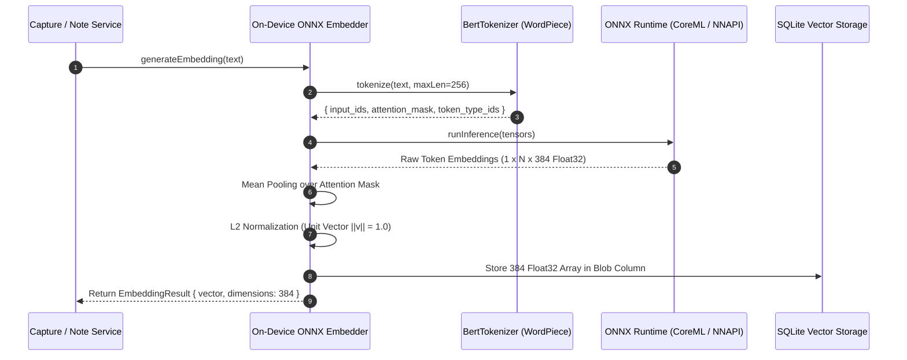
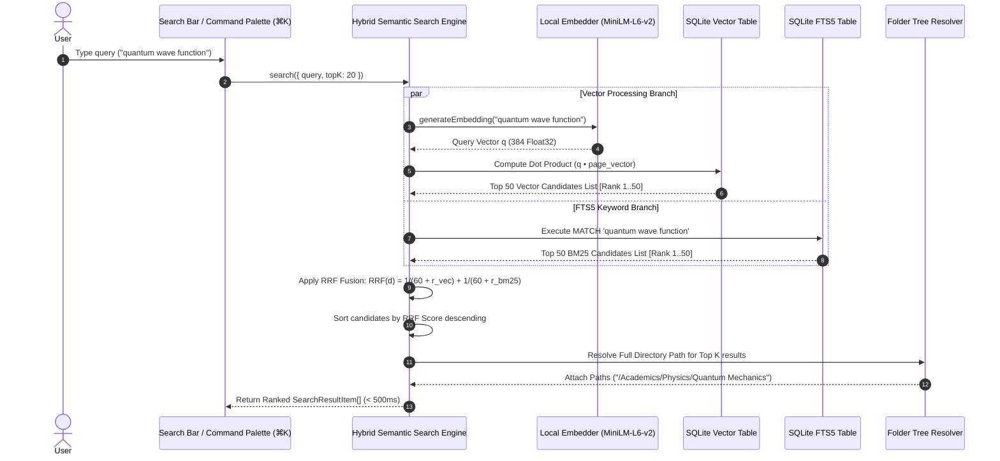
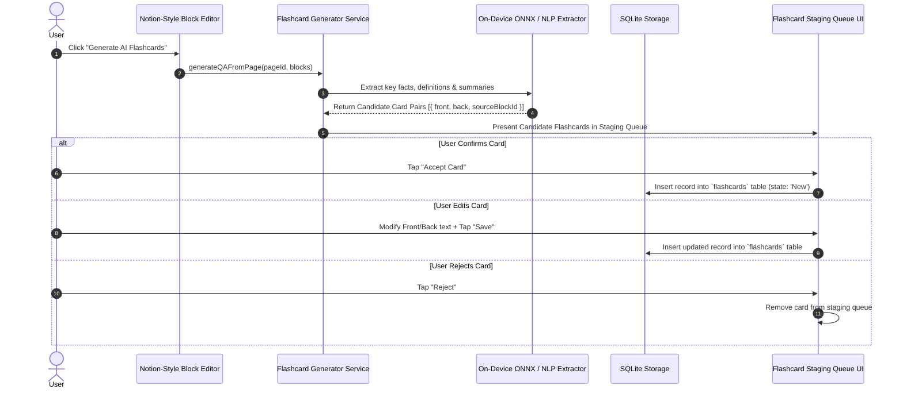
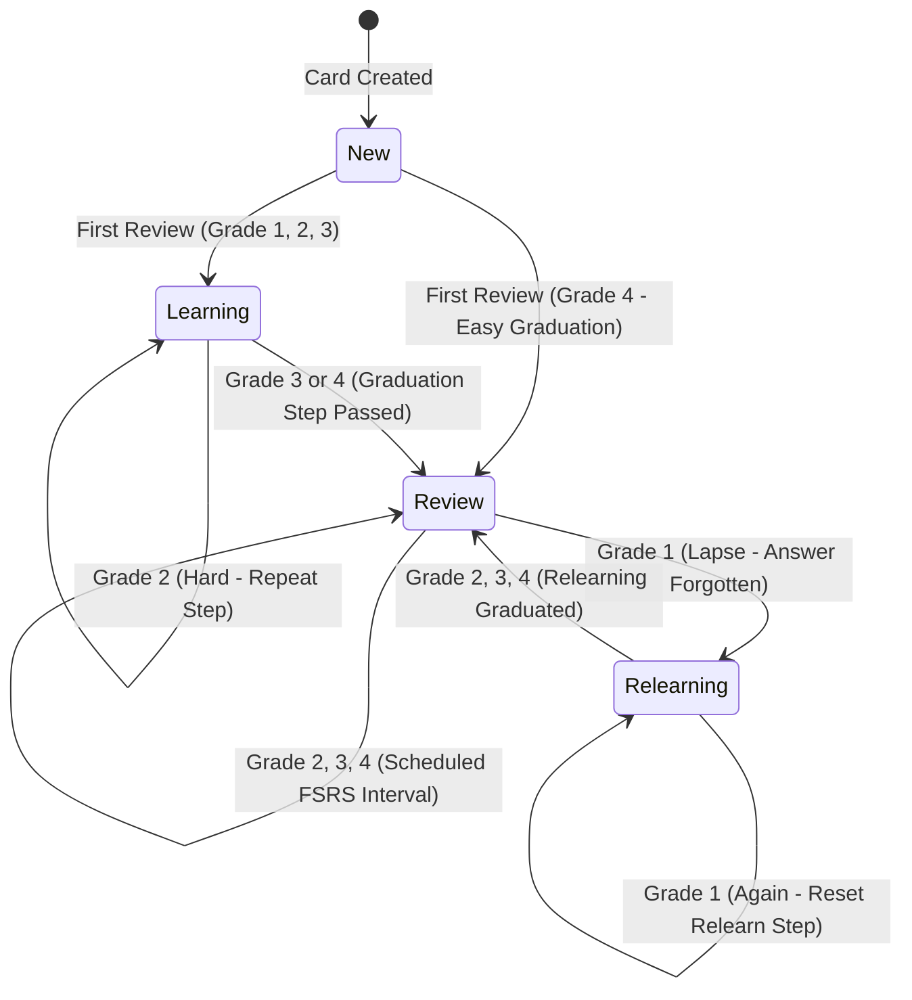
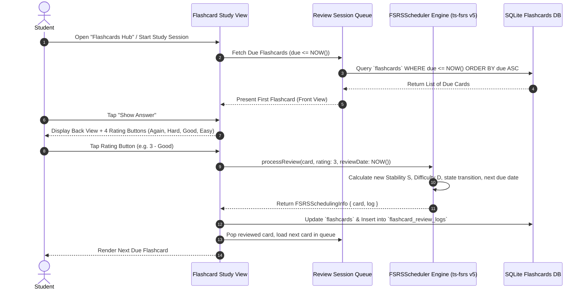

# Noteee: Sector 4 - On-Device AI Auto-Filing, Vector DB, Hybrid Semantic Search & Spaced Repetition (FSRS) Specification

## 1. Executive Summary & Architectural Scope

Sector 4 defines Noteee's intelligence and learning acceleration engine. Operating under Noteee's core philosophy—ultra-fast capture with zero manual friction and 100% offline local privacy—this sector encapsulates three interconnected domains:

1. **On-Device Vector Embedding & AI Placement Engine**: Local execution of `all-MiniLM-L6-v2` via `onnxruntime-react-native` generating 384-dimensional dense vectors to power automated note filing into 3 distinct placement pathways (Fallback Default, Cosine Similarity Suggestions, and New Branch Creation).
2. **Unified Hybrid Semantic Search Architecture**: Multi-modal search combining high-dimensional vector similarity with full-text keyword retrieval (SQLite FTS5 BM25) using Reciprocal Rank Fusion (RRF) to deliver sub-500ms query resolution across up to 10,000 notes.
3. **Smart Flashcards & FSRS Spaced Repetition Core**: Automated Cloze deletion and Q&A flashcard extraction from block editor content, scheduled by the Free Spaced Repetition Scheduler (`ts-fsrs` v5.0.x) algorithm across a 4-state lifecycle machine (`New` $\rightarrow$ `Learning` $\rightarrow$ `Review` $\rightarrow$ `Relearning`).

```
┌──────────────────────────────────────────────────────────────────────────────────────────────────┐
│                                   SECTOR 4 INTELLIGENCE & FLASHCARDS                             │
├───────────────────────────────────┬──────────────────────────────────┬───────────────────────────┤
│    ON-DEVICE EMBEDDING & AI       │     HYBRID SEMANTIC SEARCH      │  FSRS SPACED REPETITION   │
│                                   │                                  │                           │
│  ┌─────────────────────────────┐  │  ┌────────────────────────────┐  │  ┌─────────────────────┐  │
│  │   all-MiniLM-L6-v2 ONNX     │  │  │   SQLite Vector Cosine     │  │  │   ts-fsrs v5.0.x    │  │
│  │  CoreML (iOS) / NNAPI (Android)│ │  │   (384-dim Dense Vector)  │  │  │  Retention & Interval │  │
│  └──────────────┬──────────────┘  │  └─────────────┬──────────────┘  │  └──────────┬──────────┘  │
│                 │                 │                │                 │             │             │
│                 ▼                 │                ▼                 │             ▼             │
│  ┌─────────────────────────────┐  │  ┌────────────────────────────┐  │  ┌─────────────────────┐  │
│  │   3 AI Placement Pathways   │  │  │  SQLite FTS5 BM25 Keyword  │  │  │ Card State Machine  │  │
│  │  (Fallback, Match, Branch)  │  │  │  (Sparse Text Match)       │  │  │ (New/Learn/Rev/Relearn)││
│  └─────────────────────────────┘  │  └─────────────┬──────────────┘  │  └─────────────────────┘  │
│                                   │                │                 │                           │
│                                   │                ▼                 │                           │
│                                   │  ┌────────────────────────────┐  │                           │
│                                   │  │  Reciprocal Rank Fusion    │  │                           │
│                                   │  │  RRF(d) = Σ 1 / (60 + r)   │  │                           │
│                                   │  └────────────────────────────┘  │                           │
└───────────────────────────────────┴──────────────────────────────────┴───────────────────────────┘
```

---

## 2. On-Device Local Embedding Pipeline

### 2.1 Model Choice & Operational Rationale
Noteee executes all vector generation locally on the user's mobile or desktop hardware. 

- **Model Identity**: `all-MiniLM-L6-v2` (Sentence-Transformers).
- **Dimensionality**: 384-dimensional Float32 vector embeddings.
- **Model Footprint**: Quantized ONNX weights (~22.9 MB INT8 ONNX payload).
- **Context Length**: 256 tokens max sequence length (truncation with sliding window for longer note documents).
- **Latency Target**: $< 45\text{ms}$ per block, $< 150\text{ms}$ per full capture document on mid-tier mobile hardware (Apple A14 / Snapdragon 888).

### 2.2 Execution Engine: `onnxruntime-react-native`
To achieve near-native performance on mobile devices without relying on cloud APIs or heavy Python runtimes, vector inference runs via direct C++ JSI bindings to ONNX Runtime Native SDK (`onnxruntime-react-native` v1.20.x).

- **iOS / macOS Execution Provider**: `CoreML` (Neural Engine acceleration with fallback to CPU).
- **Android Execution Provider**: `NNAPI` / `Android NN API` (NPU acceleration with fallback to CPU).
- **Web Execution Provider**: `ONNX Runtime Web` (WebAssembly / WebGPU execution).

### 2.3 Pre-Processing & Tokenization Pipeline
The raw note text undergoes tokenization prior to ONNX model invocation:

1. **Text Normalization**: Lowercasing, Unicode NFKD normalization, stripping unprintable control characters.
2. **WordPiece Tokenization**: Utilizes a lightweight JavaScript/C++ BertTokenizer executing vocabulary lookups against the 30,522-entry `all-MiniLM-L6-v2` vocab.
3. **Tensor Input Generation**:
   - `input_ids`: Int32Array of token indices, bounded by `[101]` (`[CLS]`) and `[102]` (`[SEP]`).
   - `attention_mask`: Int32Array of 1s (valid tokens) and 0s (padding tokens).
   - `token_type_ids`: Int32Array of 0s (single sequence context).

### 2.4 Post-Processing: Mean Pooling & L2 Normalization
The raw ONNX model outputs token-level embeddings $E \in \mathbb{R}^{B \times N \times 384}$, where $B=1$ is batch size and $N$ is sequence length.

1. **Mean Pooling**: Extracts sentence-level vector $v_{\text{raw}}$ by averaging token embeddings weighted by the attention mask:
   $$v_{\text{raw}} = \frac{\sum_{i=1}^{N} E_i \cdot \text{mask}_i}{\sum_{i=1}^{N} \text{mask}_i}$$
2. **L2 Normalization**: Normalizes $v_{\text{raw}}$ to unit length ($|v|_2 = 1.0$), ensuring that Cosine Similarity reduces directly to a dot product computation:
   $$v = \frac{v_{\text{raw}}}{\|v_{\text{raw}}\|_2} = \frac{v_{\text{raw}}}{\sqrt{\sum_{j=1}^{384} (v_{\text{raw}, j})^2}}$$



### 2.5 Micro-Batching & Caching Strategy
- **LRU In-Memory Vector Cache**: Retains up to 500 recently generated embeddings in memory to prevent re-tokenizing and re-running inference during active user editing.
- **Background Micro-Batching**: When importing or processing continuous multi-photo/audio sessions, embeddings are queued and executed in background micro-batches of size $B=4$ during CPU idle time.

### 2.6 Database Schema for Vector Tables
Vector embeddings are persisted in `@op-engineering/op-sqlite` using binary IEEE 754 Float32 arrays (`blob` columns).

```typescript
import { sqliteTable, text, blob } from 'drizzle-orm/sqlite-core';
import { folders, pages, blocks } from './foundation-schema';

// 1. Folder Vector Embeddings (Stores centroid representation of folder contents)
export const folderVectors = sqliteTable('folder_vectors', {
  folderId: text('folder_id').primaryKey().references(() => folders.id, { onDelete: 'cascade' }),
  embedding: blob('embedding').notNull(), // 384-dim Float32 Array (1536 bytes)
  updatedAt: text('updated_at').notNull(),
});

// 2. Page Vector Embeddings (Stores consolidated page embedding)
export const pageVectors = sqliteTable('page_vectors', {
  pageId: text('page_id').primaryKey().references(() => pages.id, { onDelete: 'cascade' }),
  embedding: blob('embedding').notNull(), // 384-dim Float32 Array (1536 bytes)
  updatedAt: text('updated_at').notNull(),
});

// 3. Block Vector Embeddings (Optional granular block vector indexing)
export const blockVectors = sqliteTable('block_vectors', {
  blockId: text('block_id').primaryKey().references(() => blocks.id, { onDelete: 'cascade' }),
  pageId: text('page_id').notNull().references(() => pages.id, { onDelete: 'cascade' }),
  embedding: blob('embedding').notNull(), // 384-dim Float32 Array (1536 bytes)
  updatedAt: text('updated_at').notNull(),
});
```

---

## 3. 3 AI Placement Pathways & Auto-Filing Engine

### 3.1 Mathematical Similarity Calculation
Given a newly captured note embedding vector $u \in \mathbb{R}^{384}$ and a candidate folder embedding vector $v_k \in \mathbb{R}^{384}$ (both L2 normalized), Cosine Similarity $S(u, v_k)$ is calculated as:

$$S(u, v_k) = u \cdot v_k = \sum_{i=1}^{384} u_i \cdot v_{k, i}$$

The placement engine compares $u$ against all active non-system folders $F = \{f_1, f_2, \dots, f_M\}$.

### 3.2 The 3 AI Placement Pathways

| Pathway | Name | Trigger Condition | System Behavior & UX Action |
| :---: | :--- | :--- | :--- |
| **1** | **Fallback Default** | User selects *"Place Later"* **OR** $S_{\text{max}} < 0.40$ | Note routes directly to the **`Miscellaneous`** system anchor folder (`id = 'sys-folder-miscellaneous'`). An unfiled badge is logged to `Inbox`. |
| **2** | **Existing Suggestion** | Highest similarity score $S_{\text{max}} \ge 0.60$ | Displays **Top 2–3 Candidate Folders/Pages** sorted by confidence percentage $C = S \times 100\%$. Provides 1-Tap confirmation modal or inline section insertion. |
| **3** | **New Branch Creation** | Ambiguous score range $0.40 \le S_{\text{max}} < 0.60$ | Identifies semantic novelty. Prompts: *"New topic detected: '[Proposed Name]'. Create a new subfolder branch under '[Parent Path]'?"* |

```
                              ┌────────────────────────────────────────┐
                              │  New Note Captured (Embedding u)      │
                              └───────────────────┬────────────────────┘
                                                  │
                                                  ▼
                              ┌────────────────────────────────────────┐
                              │ Calculate Cosine Sim S(u, v_k) vs      │
                              │ All Folder Embeddings v_k in SQLite    │
                              └───────────────────┬────────────────────┘
                                                  │
                                                  ▼
                              ┌────────────────────────────────────────┐
                              │ Find Maximum Score S_max = max(S_k)    │
                              └───────────────────┬────────────────────┘
                                                  │
                 ┌────────────────────────────────┼────────────────────────────────┐
                 │                                │                                │
                 ▼                                ▼                                ▼
    [ S_max < 0.40 OR "Place Later" ]    [ 0.40 <= S_max < 0.60 ]             [ S_max >= 0.60 ]
                 │                                │                                │
                 ▼                                ▼                                ▼
    ┌─────────────────────────┐      ┌─────────────────────────┐      ┌─────────────────────────┐
    │ PATHWAY 1: FALLBACK     │      │ PATHWAY 3: NEW BRANCH   │      │ PATHWAY 2: SUGGESTION   │
    │ Route to Miscellaneous  │      │ Prompt: "Create subfolder│      │ Display top 2-3 folders │
    │ System Anchor Folder    │      │ 'Quantum' under /Physics?"│      │ with 1-Tap Confirm UI   │
    └─────────────────────────┘      └─────────────────────────┘      └─────────────────────────┘
```

### 3.3 Folder Centroid Updating Algorithm
When a folder $f_k$ receives a confirmed note $p_{\text{new}}$ with vector $u$, the folder's representative vector $v_k$ is updated using a exponential moving average centroid:

$$v_{k, \text{new}} = \text{L2Norm}\left( \alpha \cdot v_{k, \text{old}} + (1 - \alpha) \cdot u \right)$$

where $\alpha = 0.85$ prioritizes historical context while adapting to recent notes.

---

## 4. Unified Hybrid Semantic Search Architecture

### 4.1 Hybrid Architecture (Vector + BM25 FTS5)
Search in Noteee combines semantic conceptual understanding (Vector Similarity) with exact term precision (FTS5 Keyword Search):

1. **Dense Vector Search**: Captures synonyms, conceptual relationships, and cross-lingual meaning via 384-dim ONNX query vector comparison.
2. **Sparse FTS5 BM25 Search**: Matches exact keywords, proper nouns, technical acronyms, and code snippets via SQLite FTS5 extension using Okapi BM25 scoring:
   $$\text{Score}_{\text{BM25}}(D, Q) = \sum_{i=1}^{n} \text{IDF}(q_i) \cdot \frac{f(q_i, D) \cdot (k_1 + 1)}{f(q_i, D) + k_1 \cdot \left(1 - b + b \cdot \frac{|D|}{\text{avgdl}}\right)}$$
   with standard SQLite parameters $k_1 = 1.2$ and $b = 0.75$.

### 4.2 Reciprocal Rank Fusion (RRF) Integration
To combine scores from disparate distributions (cosine similarity in $[0, 1]$ vs unbounded BM25 scores), Noteee uses **Reciprocal Rank Fusion**:

$$RRF(d) = \sum_{m \in M} \frac{1}{k + r_m(d)}$$

where:
- $M = \{\text{Vector\_List}, \text{BM25\_List}\}$ is the set of search rankers.
- $r_m(d) \in \{1, 2, 3, \dots\}$ is the 1-based rank position of document $d$ in result list $m$. If document $d$ is absent from list $m$, $r_m(d) = \infty$ and its reciprocal term is $0$.
- $k = 60$ is the standard RRF smoothing constant preventing over-weighting top-ranked items in a single list.



### 4.3 FTS5 Database Table Schema
```sql
-- SQLite FTS5 Virtual Table for Full-Text Search
CREATE VIRTUAL TABLE IF NOT EXISTS page_fts USING fts5(
  page_id UNINDEXED,
  title,
  content_text,
  ocr_text,
  audio_transcript,
  tags_text,
  tokenize = 'porter unicode61 remove_diacritics 2'
);
```

### 4.4 Sub-500ms Performance Plan across 10,000 Notes
1. **Asynchronous Parallel Execution**: ONNX inference and SQLite FTS5 query execute concurrently via Promise.all.
2. **SQLite Vector Chunking & JSI Acceleration**: Direct C++ JSI memory transfers eliminate JSON serialization overhead.
3. **Query Debouncing**: 150ms debounce on search input prevents query flooding.
4. **Result Caching**: LRU query result cache for top 20 queries.

---

## 5. FSRS Spaced Repetition Algorithm Integration (`ts-fsrs` v5.0.x)

### 5.1 Overview & Mathematical Foundations
Noteee replaces legacy SM-2 with the state-of-the-art **Free Spaced Repetition Scheduler (FSRS v5.0.x)** implemented via `ts-fsrs`. FSRS models memory retention as a function of **Stability ($S$)** and **Difficulty ($D$)**.

### 5.2 Retention Mathematical Decay Formula
The probability of successful memory recall $R$ after $t$ elapsed days since the last review is modeled as:

$$R(t, S) = \left( 1 + F \cdot \frac{t}{S} \right)^{-1}$$

where $F = \frac{1}{9} \approx 0.11111$ is the FSRS decay constant such that when $t = S$, retention exactly equals $90\%$ ($R = 0.90$):

$$R(S, S) = \left(1 + \frac{1}{9} \cdot 1\right)^{-1} = \left(\frac{10}{9}\right)^{-1} = \frac{9}{10} = 0.90$$

### 5.3 Optimal Review Interval Formula
Given a target retention probability $R_{\text{target}}$ (default $0.90$ or $90\%$), the scheduled interval $I$ in days is calculated by inverting the retention formula:

$$I(R_{\text{target}}, S) = \frac{S}{F} \cdot \left( R_{\text{target}}^{-1} - 1 \right) = \frac{S}{1/9} \cdot \left( \frac{1}{0.90} - 1 \right) = 9S \cdot \frac{1}{9} = S$$

### 5.4 4-Point Rating Scale Definitions

| Grade | Rating Name | Numeric Value | User Intent & Evaluation |
| :---: | :--- | :---: | :--- |
| **1** | **Again** | `1` | Complete recall failure (Lapse). Card answer forgotten. Reset stability; increment lapse counter. |
| **2** | **Hard** | `2` | Correct recall achieved with significant effort or dynamic hesitation. Small stability increase. |
| **3** | **Good** | `3` | Standard successful recall with normal response latency. Expected stability growth. |
| **4** | **Easy** | `4` | Perfect, instant recall without effort. Maximum stability boost. |

### 5.5 Stability & Difficulty Update Equations (FSRS v5.0.x)

#### 1. Initial Values for First Review (New Cards):
For initial grade $r \in \{1, 2, 3, 4\}$, initial stability $S_0$ and initial difficulty $D_0$ are defined by FSRS parameters $w$:

$$S_0(r) = w_{r-1}$$
$$D_0(r) = w_4 - (r - 3) \cdot w_5$$

clamped strictly to $1.0 \le D_0 \le 10.0$.

#### 2. Difficulty Update on Subsequent Reviews:
$$D_{\text{new}}(D, r) = D - w_6 \cdot (r - 3)$$
$$D_{\text{reverted}} = w_7 \cdot D_0(3) + (1 - w_7) \cdot D_{\text{new}}$$

clamped strictly to $1.0 \le D_{\text{reverted}} \le 10.0$.

#### 3. Stability Update on Successful Recall ($r \ge 2$):
$$S_{\text{new}}(S, D, R, r) = S \cdot \left( 1 + e^{w_8} \cdot (11 - D) \cdot S^{-w_9} \cdot \left( e^{w_{10} \cdot (1 - R)} - 1 \right) \cdot w_{11} \right)$$

where $w_{11}$ acts as a rating modifier coefficient for Hard ($r=2$) vs Easy ($r=4$).

#### 4. Stability Update on Recall Failure / Lapse ($r = 1$):
$$S_{\text{new\_forget}}(S, D, R) = w_{11} \cdot D^{-w_{12}} \cdot (S + 1)^{w_{13}} \cdot e^{w_{14} \cdot (1 - R)}$$

### 5.6 Database Schema for Flashcards & Review Logs

```typescript
import { sqliteTable, text, real, integer } from 'drizzle-orm/sqlite-core';
import { pages, blocks } from './foundation-schema';

// Flashcards Table
export const flashcards = sqliteTable('flashcards', {
  id: text('id').primaryKey(), // UUID
  pageId: text('page_id').notNull().references(() => pages.id, { onDelete: 'cascade' }),
  sourceBlockId: text('source_block_id').references(() => blocks.id, { onDelete: 'set null' }),
  type: text('type').notNull(), // 'cloze' | 'qa' | 'image_occlusion'
  front: text('front').notNull(), // Front question / Cloze prompt text
  back: text('back').notNull(), // Back answer text
  clozeHint: text('cloze_hint'), // Optional hint for cloze cards
  
  // FSRS State Fields
  due: text('due').notNull(), // ISO-8601 Timestamp of next review
  stability: real('stability').notNull().default(0.0),
  difficulty: real('difficulty').notNull().default(0.0),
  elapsedDays: integer('elapsed_days').notNull().default(0),
  scheduledDays: integer('scheduled_days').notNull().default(0),
  repetition: integer('repetition').notNull().default(0),
  lapses: integer('lapses').notNull().default(0),
  state: text('state').notNull().default('New'), // 'New' | 'Learning' | 'Review' | 'Relearning'
  lastReview: text('last_review'), // ISO-8601 Timestamp
  
  createdAt: text('created_at').notNull(),
  updatedAt: text('updated_at').notNull(),
});

// Flashcard Review Logs Table (Historical Audit Trail)
export const flashcardReviewLogs = sqliteTable('flashcard_review_logs', {
  id: text('id').primaryKey(), // UUID
  cardId: text('card_id').notNull().references(() => flashcards.id, { onDelete: 'cascade' }),
  rating: integer('rating').notNull(), // 1, 2, 3, 4
  state: text('state').notNull(), // State prior to review
  due: text('due').notNull(),
  stability: real('stability').notNull(),
  difficulty: real('difficulty').notNull(),
  elapsedDays: integer('elapsed_days').notNull(),
  lastElapsedDays: integer('last_elapsed_days').notNull(),
  scheduledDays: integer('scheduled_days').notNull(),
  review: text('review').notNull(), // ISO-8601 Timestamp of review execution
});
```

---

## 6. Cloze Deletion & Q&A Flashcard Generation Flow

### 6.1 Instant Cloze Deletion in Block Editor
Users can transform any text selection inside a TipTap rich text block into a Cloze flashcard with a single keyboard shortcut (`Cmd+Shift+C` / `Ctrl+Shift+C`) or block floating toolbar menu:

1. **Syntax Format**: Selected text `[target]` is wrapped in cloze deletion syntax:
   `{{c1::target::optional_hint}}`
2. **Multi-Cloze Indexing**: Re-highlighting another selection in the same block automatically increments index `{{c2::second_target}}`.
3. **Database Sync**: The editor bridge parses cloze syntax and executes an `UPSERT` into the `flashcards` table linked via `source_block_id`.

```typescript
// Regex for parsing cloze deletions: {{c1::answer::hint}}
export const CLOZE_REGEX = /\{\{c(\d+)::([^:]+)(?:::([^}]+))?\}\}/g;
```

### 6.2 On-Device AI Q&A Card Generation Flow
Upon saving a page or clicking **"Generate Smart Flashcards"**:

1. **Content Extraction**: System reads all paragraph, heading, quote, and code blocks within the page.
2. **Local AI Extraction**: Content is processed through lightweight rule-based NLP extraction and local ONNX model key-concept identification.
3. **Staging Queue UI**: Proposed cards are presented in a bottom sheet / drawer where the user can:
   - 🟢 **Accept**: Saves card directly to active FSRS deck.
   - ✏️ **Edit**: Modifies question/answer text before saving.
   - 🔴 **Reject**: Discards proposed card.



---

## 7. Flashcard Review Session State Machine

### 7.1 Lifecycle State Definitions



| State | Description & Behavior |
| :--- | :--- |
| **`New`** | Freshly created card that has never been reviewed by the user. |
| **`Learning`** | Card undergoing short-term initial learning steps (e.g., 1 min, 10 min) before graduating to the main FSRS review queue. |
| **`Review`** | Graduated card scheduled dynamically according to FSRS stability $S$ and target retention intervals. |
| **`Relearning`** | Card that failed recall during a `Review` session (graded `Again=1`), undergoing short relearning steps before resuming `Review` status. |

### 7.2 State Transition Matrix

| Current State | Rating Applied | Next State | Stability Update Action | Difficulty Update Action |
| :---: | :---: | :---: | :--- | :--- |
| **`New`** | **1 (Again)** | `Learning` | Set initial $S_0(1)$ | Set $D_0(1)$ |
| **`New`** | **2 (Hard)** | `Learning` | Set initial $S_0(2)$ | Set $D_0(2)$ |
| **`New`** | **3 (Good)** | `Learning` | Set initial $S_0(3)$ | Set $D_0(3)$ |
| **`New`** | **4 (Easy)** | `Review` | Set initial $S_0(4)$ (Immediate Graduation) | Set $D_0(4)$ |
| **`Learning`** | **1 (Again)** | `Learning` | Reset step index to 0 | Increase Difficulty |
| **`Learning`** | **3/4 (Good/Easy)**| `Review` | Graduate card; calculate initial $I = S_0$ | Apply FSRS graduation parameters |
| **`Review`** | **1 (Again)** | `Relearning` | Apply Lapse formula $S_{\text{new\_forget}}$ | Increment `lapses` count; update $D$ |
| **`Review`** | **2/3/4 (Hard/Good/Easy)** | `Review` | Apply recall formula $S_{\text{new}}$ | Update $D_{\text{reverted}}$; calculate next interval $I$ |
| **`Relearning`**| **1 (Again)** | `Relearning` | Reset relearning step index | Increase Difficulty |
| **`Relearning`**| **2/3/4 (Hard/Good/Easy)** | `Review` | Re-graduate card to `Review` | Resume normal FSRS scheduling |



---

## 8. Complete TypeScript Interface Definitions

```typescript
/**
 * Noteee Sector 4 Core TypeScript Interfaces
 * Package: @noteee/core & @noteee/intelligence
 */

// ============================================================================
// 1. EMBEDDER INTERFACE (ONNX Local Vector Generation)
// ============================================================================

export interface EmbeddingResult {
  vector: Float32Array; // 384-dimensional normalized vector
  dimensions: number; // 384
  tokenCount: number; // Number of input tokens processed
  executionTimeMs: number; // Execution duration in milliseconds
}

export interface TokenizerOutput {
  inputIds: Int32Array;
  attentionMask: Int32Array;
  tokenTypeIds: Int32Array;
}

export interface IEmbedder {
  /** Initializes the ONNX runtime model and loads vocabulary into memory */
  initialize(): Promise<void>;
  
  /** Generates a normalized 384-dimensional vector embedding for a given text string */
  generateEmbedding(text: string): Promise<EmbeddingResult>;
  
  /** Generates vector embeddings for a micro-batch of text strings */
  generateBatchEmbeddings(texts: string[]): Promise<EmbeddingResult[]>;
  
  /** Tokenizes raw text into ONNX-compatible input tensors */
  tokenize(text: string, maxLength?: number): Promise<TokenizerOutput>;
  
  /** Releases ONNX runtime session resources and clears LRU caches */
  dispose(): Promise<void>;
}

// ============================================================================
// 2. AI CLASSIFICATION & PLACEMENT ENGINE INTERFACE
// ============================================================================

export interface FolderSuggestion {
  folderId: string;
  folderPath: string;
  folderName: string;
  confidenceScore: number; // 0.0 to 1.0 (Cosine Similarity)
  matchReason: string;
}

export interface NewBranchSuggestion {
  suggestedParentId: string | null;
  suggestedParentPath: string;
  proposedFolderName: string;
  fullProposedPath: string;
  confidenceScore: number;
  reasoning: string;
}

export type PlacementPathway = 
  | { type: 'FALLBACK_DEFAULT'; folderId: string; folderPath: string }
  | { type: 'EXISTING_SUGGESTION'; suggestions: FolderSuggestion[] }
  | { type: 'NEW_BRANCH_CREATION'; suggestion: NewBranchSuggestion };

export interface IClassificationEngine {
  /** Evaluates a note's text and embedding against workspace folders to determine placement pathway */
  evaluatePlacement(noteText: string, noteEmbedding: Float32Array): Promise<PlacementPathway>;
  
  /** Re-calculates and updates the exponential moving average centroid vector for a folder */
  updateFolderVector(folderId: string): Promise<void>;
  
  /** Re-indexes all folder centroid vectors across the workspace */
  reindexWorkspaceVectors(): Promise<void>;
}

// ============================================================================
// 3. UNIFIED HYBRID SEMANTIC SEARCH ENGINE INTERFACE
// ============================================================================

export interface SearchQueryOptions {
  query: string;
  topK?: number; // Maximum results to return (default: 20)
  filterFolderId?: string; // Optional folder scope filter
  filterTags?: string[]; // Optional tag filter array
  includeVault?: boolean; // Requires biometric unlock verification if true
  minScoreThreshold?: number; // Minimum RRF score filter
}

export interface SearchResultItem {
  pageId: string;
  title: string;
  snippet: string;
  folderId: string;
  folderPath: string;
  vectorScore: number; // Cosine similarity score [0.0, 1.0]
  bm25Score: number; // FTS5 BM25 score
  rrfScore: number; // Reciprocal Rank Fusion score
  matchedBlockId?: string;
}

export interface ISemanticSearchEngine {
  /** Executes hybrid vector + FTS5 search combined via Reciprocal Rank Fusion */
  search(options: SearchQueryOptions): Promise<SearchResultItem[]>;
  
  /** Indexes or updates a page's content in both FTS5 tables and vector stores */
  indexPage(pageId: string, title: string, contentBlocks: Array<{ id: string; text: string }>): Promise<void>;
  
  /** Removes a page and its associated vectors/FTS entries from the search index */
  removePageFromIndex(pageId: string): Promise<void>;
}

// ============================================================================
// 4. FSRS SPACED REPETITION SCHEDULER INTERFACE (ts-fsrs v5.0.x)
// ============================================================================

export type FSRSRating = 1 | 2 | 3 | 4; // 1: Again, 2: Hard, 3: Good, 4: Easy
export type FlashcardState = 'New' | 'Learning' | 'Review' | 'Relearning';

export interface FSRSCard {
  id: string;
  due: Date;
  stability: number;
  difficulty: number;
  elapsedDays: number;
  scheduledDays: number;
  repetition: number;
  lapses: number;
  state: FlashcardState;
  lastReview?: Date;
}

export interface FSRSReviewLog {
  rating: FSRSRating;
  state: FlashcardState;
  due: Date;
  stability: number;
  difficulty: number;
  elapsedDays: number;
  lastElapsedDays: number;
  scheduledDays: number;
  review: Date;
}

export interface FSRSSchedulingInfo {
  card: FSRSCard;
  log: FSRSReviewLog;
}

export interface FSRSNextSchedules {
  1: FSRSSchedulingInfo; // Again
  2: FSRSSchedulingInfo; // Hard
  3: FSRSSchedulingInfo; // Good
  4: FSRSSchedulingInfo; // Easy
}

export interface IFSRSScheduler {
  /** Computes candidate next scheduling options for all 4 ratings (Again, Hard, Good, Easy) */
  calculateNextSchedules(card: FSRSCard, reviewDate?: Date): FSRSNextSchedules;
  
  /** Processes a user review rating, updating card stability, difficulty, and next due date */
  processReview(card: FSRSCard, rating: FSRSRating, reviewDate?: Date): FSRSSchedulingInfo;
  
  /** Creates a default new card instance initialized with FSRS baseline values */
  createNewCard(id: string): FSRSCard;
}

// ============================================================================
// 5. FLASHCARD GENERATOR INTERFACE (Cloze & AI Q&A)
// ============================================================================

export interface ClozeDeletion {
  index: number; // c1, c2, etc.
  answer: string;
  hint?: string;
  rawText: string;
}

export interface GeneratedQACard {
  front: string;
  back: string;
  sourceBlockId: string;
  confidenceScore: number;
}

export interface IFlashcardGenerator {
  /** Parses text string to extract all Cloze deletions {{c1::answer::hint}} */
  extractClozeDeletions(text: string): ClozeDeletion[];
  
  /** Uses local NLP / ONNX models to auto-generate candidate Q&A cards from page blocks */
  generateQAFromPage(pageId: string, blocks: Array<{ id: string; text: string }>): Promise<GeneratedQACard[]>;
  
  /** Creates a flashcard record in the database from an extracted Cloze deletion */
  createFlashcardFromCloze(pageId: string, blockId: string, cloze: ClozeDeletion): Promise<string>;
}
```
