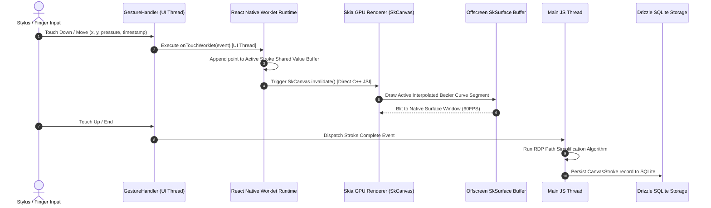
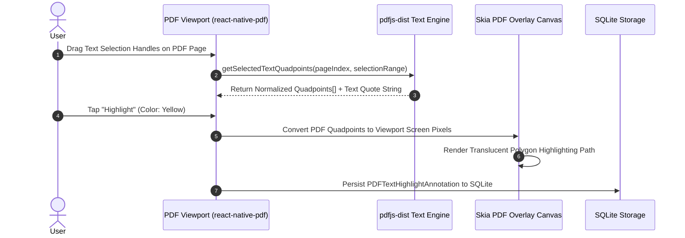
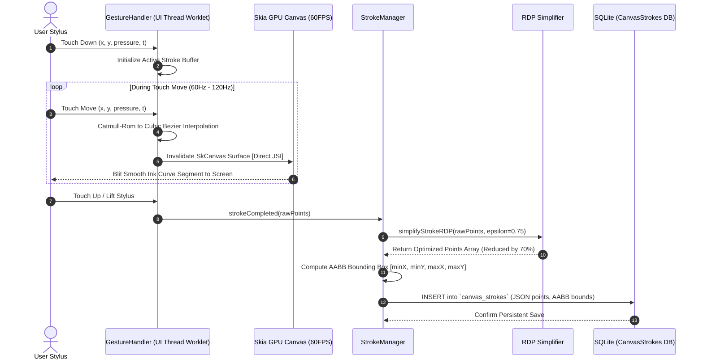
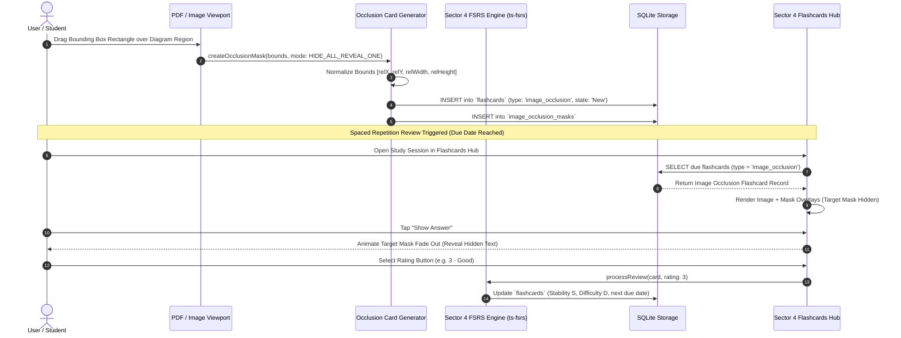

# Noteee: Sector 5 - PDF Annotations & Infinite Canvas Specification

## 1. Executive Summary & Architectural Scope

Sector 5 defines Noteee's visual drawing, infinite canvas, and PDF document markup engine. Fulfilling Noteee's promise of ultra-responsive digital notebook capabilities alongside structured block editing, Sector 5 delivers a 60FPS hardware-accelerated drawing environment that bridges hand-drawn vector graphics, interactive PDF markup, and active recall study workflows.

```
┌─────────────────────────────────────────────────────────────────────────────────────────────────────────┐
│                               SECTOR 5: INFINITE CANVAS & PDF MARKUP ENGINE                             │
├─────────────────────────────────────┬────────────────────────────────────┬──────────────────────────────┤
│    SKIA GPU DRAWING PIPELINE        │     PDF READER & MARKUP ENGINE     │   IMAGE OCCLUSION ENGINE     │
│                                     │                                    │                              │
│  ┌──────────────────────────────┐   │  ┌──────────────────────────────┐  │  ┌────────────────────────┐  │
│  │ @shopify/react-native-skia   │   │  │ react-native-pdf (v6.7.x)    │  │  │ Bounding Box Masking   │  │
│  │ (v1.5.x Direct GPU Pipeline) │   │  │ Native Document Viewport     │  │  │ Rect / Poly Overlays   │  │
│  └──────────────┬───────────────┘   │  └──────────────┬───────────────┘  │  └───────────┬────────────┘  │
│                 │                   │                 │                  │              │               │
│                 ▼                   │                 ▼                  │              ▼               │
│  ┌──────────────────────────────┐   │  ┌──────────────────────────────┐  │  ┌────────────────────────┐  │
│  │ 60FPS Worklet Gesture Engine │   │  │ pdfjs-dist Text Quadpoints   │  │  │ Sector 4 FSRS Engine  │  │
│  │ Bezier & RDP Smoothers       │   │  │ Freehand & Highlight Layer   │  │  │ ts-fsrs v5.0.x Cards   │  │
│  └──────────────┬───────────────┘   │  └──────────────┬───────────────┘  │  └───────────┬────────────┘  │
│                 │                   │                 │                  │              │               │
│                 └───────────────────┼─────────────────┴──────────────────┘              │               │
│                                     ▼                                                   ▼               │
│                     ┌───────────────────────────────┐                  ┌──────────────────────────────┐ │
│                     │ 2D Affine Transform Matrix    │                  │  Drizzle SQLite Vector DB    │ │
│                     │ [a, b, c, d, tx, ty] System   │                  │  Strokes & Annotations Tables│ │
│                     └──────────────┬────────────────┘                  └──────────────────────────────┘ │
│                                    │                                                                    │
│                                    ▼                                                                    │
│                     ┌───────────────────────────────┐                                                   │
│                     │ Notion Block Embedding        │                                                   │
│                     │ (`canvas_embed` Sector 3)     │                                                   │
│                     └───────────────────────────────┘                                                   │
└─────────────────────────────────────────────────────────────────────────────────────────────────────────┘
```

### Key Functional Domains:
1. **Skia GPU Drawing Pipeline (`@shopify/react-native-skia` v1.5.x):** 60FPS low-latency stylus and freehand drawing, real-time Bezier interpolation, pressure sensitivity curve mapping, and Ramer-Douglas-Peucker (RDP) path simplification.
2. **PDF Reader & Freehand/Text Markup Engine (`react-native-pdf` v6.7.x & `pdfjs-dist` v4.10.x):** Native PDF rendering, text glyph quadpoint extraction, text highlighting (underline, strikethrough, background mark), and multi-page vector stroke overlays.
3. **Image Occlusion Card Generator:** Interactive masking of bounding box regions over PDF diagrams or standalone images, serializing directly into Sector 4's FSRS flashcard engine (`ts-fsrs` v5.0.x) for spaced repetition testing ("Hide All, Reveal One" / "Hide One, Reveal One").
4. **2D Transformation Matrix & Canvas Embedding:** Affine transformation matrix $[a, b, c, d, tx, ty]$ handling viewport scaling ($s$) and translation ($(tx, ty)$), spatial chunking for offscreen stroke culling, and 2-way sync with Sector 3 Notion-style block editor (`canvas_embed`).
5. **Drizzle SQLite Vector Persistence:** Complete type-safe database schemas for canvas documents, layers, raw point stroke streams, PDF text/area highlights, and image occlusion masks.

---

## 2. Skia GPU Drawing Pipeline (`@shopify/react-native-skia` v1.5.x)

### 2.1 Low-Latency Touch Architecture & Thread Separation
To achieve smooth, zero-lag drawing on mobile displays (60Hz–120Hz ProMotion), touch event processing is completely isolated from React's JavaScript reconciliation thread.

- **Touch Handling Engine:** Driven by `react-native-gesture-handler` (v2.24+) attached to `@shopify/react-native-skia` canvas primitives.
- **UI Thread Worklets (`react-native-worklets` / Reanimated v4.x):** Touch coordinates $(x, y, p, t)$ are captured directly on the native UI thread inside a dedicated Worklet callback. Raw points are pushed to a C++ Shared Value array without crossing the asynchronous JS bridge.
- **Direct GPU Frame Dispatch:** Skia's native C++ surface (`SkCanvas`) consumes UI Shared Values directly during frame rendering, eliminating frame drops during active stylus stroke execution.



### 2.2 Smooth Path Interpolation & Fitting

Raw touch inputs present jagged edges and non-uniform sampling intervals. Noteee uses a 3-stage mathematical smoothing pipeline to convert raw points into continuous vector paths:

#### 1. Catmull-Rom Spline to Cubic Bezier Conversion
Given 4 consecutive touch points $P_0, P_1, P_2, P_3$, Noteee converts the curve segment between $P_1$ and $P_2$ into a Cubic Bezier curve defined by control points $C_1$ and $C_2$:

$$C_1 = P_1 + \frac{P_2 - P_0}{6 \cdot \tau}$$
$$C_2 = P_2 - \frac{P_3 - P_1}{6 \cdot \tau}$$

where $\tau = 0.5$ is the tension coefficient.

#### 2. Pressure-Sensitive Variable Width Curves
Stylus pressure $p \in [0.0, 1.0]$ scales the stroke width dynamically along the stroke path using a quadratic easing function:

$$W(p) = W_{\text{min}} + (W_{\text{max}} - W_{\text{min}}) \cdot p^2$$

For smooth width transitions, width values between adjacent points $P_i$ and $P_{i+1}$ are interpolated using a low-pass filter:

$$W_{i+1}^{\text{filtered}} = \alpha \cdot W(p_{i+1}) + (1 - \alpha) \cdot W_i^{\text{filtered}}$$

where $\alpha = 0.35$ dampens sudden pressure spikes.

#### 3. Ramer-Douglas-Peucker (RDP) Stroke Simplification
To optimize memory footprint and rendering speed without losing visual fidelity, completed strokes undergo Ramer-Douglas-Peucker (RDP) point reduction:

Given a curve segment bounded by endpoints $P_{\text{start}}$ and $P_{\text{end}}$, the perpendicular distance $d$ of any intermediate point $P_i$ to the line segment $\overline{P_{\text{start}} P_{\text{end}}}$ is calculated as:

$$d(P_i, \overline{P_{\text{start}} P_{\text{end}}}) = \frac{|(y_{\text{end}} - y_{\text{start}})x_i - (x_{\text{end}} - x_{\text{start}})y_i + x_{\text{end}} y_{\text{start}} - y_{\text{end}} x_{\text{start}}|}{\sqrt{(y_{\text{end}} - y_{\text{start}})^2 + (x_{\text{end}} - x_{\text{start}})^2}}$$

If $\max(d(P_i)) < \epsilon$ (where default threshold $\epsilon = 0.75\text{px}$ in canvas space), all intermediate points are discarded, reducing point count by up to $70\%$.

```typescript
// Ramer-Douglas-Peucker (RDP) Point Simplification Implementation
export interface StrokePoint {
  x: number;
  y: number;
  pressure: number;
  timestamp: number;
}

export function simplifyStrokeRDP(points: StrokePoint[], epsilon: number = 0.75): StrokePoint[] {
  if (points.length <= 2) return points;

  let maxDistance = 0;
  let index = 0;
  const start = points[0];
  const end = points[points.length - 1];

  for (let i = 1; i < points.length - 1; i++) {
    const d = perpendicularDistance(points[i], start, end);
    if (d > maxDistance) {
      maxDistance = d;
      index = i;
    }
  }

  if (maxDistance > epsilon) {
    const recursiveResults1 = simplifyStrokeRDP(points.slice(0, index + 1), epsilon);
    const recursiveResults2 = simplifyStrokeRDP(points.slice(index), epsilon);
    return recursiveResults1.slice(0, recursiveResults1.length - 1).concat(recursiveResults2);
  } else {
    return [start, end];
  }
}

function perpendicularDistance(p: StrokePoint, lineStart: StrokePoint, lineEnd: StrokePoint): number {
  const dx = lineEnd.x - lineStart.x;
  const dy = lineEnd.y - lineStart.y;
  const lineSqLen = dx * dx + dy * dy;
  
  if (lineSqLen === 0) {
    return Math.hypot(p.x - lineStart.x, p.y - lineStart.y);
  }

  const t = Math.max(0, Math.min(1, ((p.x - lineStart.x) * dx + (p.y - lineStart.y) * dy) / lineSqLen));
  const projX = lineStart.x + t * dx;
  const projY = lineStart.y + t * dy;
  return Math.hypot(p.x - projX, p.y - projY);
}
```

### 2.3 Skia GPU Rendering Engine & Tool Pipeline

Noteee's drawing engine utilizes `@shopify/react-native-skia` primitives rendered to a double-buffered offscreen GPU surface (`SkSurface` / `SkPicture`).

```
┌────────────────────────────────────────────────────────────────────────────────────────┐
│                                   SKIA TOOL PIPELINE                                   │
├───────────────────┬───────────────────┬───────────────────┬────────────────────────────┤
│ 1. Gel Pen        │ 2. Pencil         │ 3. Highlighter    │ 4. Vector / Pixel Eraser   │
│ BlendMode: SrcOver│ BlendMode: SrcOver│ BlendMode:Multiply│ BlendMode: Clear           │
│ Solid Alpha 1.0   │ Textured / Grain  │ Alpha: 0.35 - 0.50│ Stroke / Area Intersection │
└───────────────────┴───────────────────┴───────────────────┴────────────────────────────┘
```

#### Tool Specification Table:

| Tool | Skia Paint Configurations | Path Rendering Strategy | Pressure / Velocity Effect |
| :--- | :--- | :--- | :--- |
| **Gel Pen** | `color`: Solid Hex<br>`style`: Stroke<br>`strokeCap`: Round<br>`strokeJoin`: Round<br>`blendMode`: `SrcOver` | Cubic Bezier curves with quadratic width expansion. | Pressure scales width $W(p) = W_{\text{base}} \cdot (0.4 + 1.2p)$. |
| **Pencil** | `color`: RGBA (Alpha 0.85)<br>`style`: Stroke<br>`imageFilter`: Subtle Noise Shader<br>`blendMode`: `SrcOver` | Multi-pass micro-offset paths simulating graphite texture on paper. | Pressure scales opacity and noise amplitude. |
| **Highlighter** | `color`: Soft Pastel (Alpha 0.40)<br>`style`: Stroke<br>`strokeCap`: Square<br>`blendMode`: `Multiply` | Flat wide ribbon path rendered *underneath* ink strokes in z-stack. | Constant width; preserves underlying text visibility via `Multiply` blend mode. |
| **Vector Eraser** | `style`: Stroke / Fill<br>`blendMode`: N/A (Algorithmic) | Calculates spatial intersection against stored canvas stroke paths. | Touched stroke IDs are deleted instantly from the database model. |
| **Pixel Eraser** | `style`: Stroke<br>`strokeCap`: Round<br>`blendMode`: `Clear` | Renders mask into offscreen Skia buffer using `Skia.BlendMode.Clear`. | Erases specific canvas surface pixels inside eraser radius. |
| **Lasso Tool** | `style`: Dash Stroke (2px dot)<br>`color`: `#3B82F6`<br>`blendMode`: `SrcOver` | Closed loop polygon test checking whether stroke bounding boxes lie within selection. | Selected strokes display transform handles (translate, scale, rotate). |

---

## 3. PDF Reader, Text/Area Highlighter, & Freehand Markup Engine

### 3.1 Dual PDF Architecture (`react-native-pdf` + `pdfjs-dist`)

Noteee decouples visual document rendering from text geometry extraction to support smooth scrolling and precise text annotations.

- **Visual Viewport Renderer:** `react-native-pdf` (v6.7.x) handles native PDF rendering (iOS `PDFKit` / Android `PdfRenderer`), delivering hardware-accelerated page rendering, pinch-to-zoom, and smooth multi-page virtual scrolling.
- **Text & Quadpoint Engine:** `pdfjs-dist` (v4.10.x) runs in a background Web Worker or webview thread to parse PDF DOM structures, extract text content streams, and compute precise bounding quadpoints for text selection.

```
┌────────────────────────────────────────────────────────────────────────────────────────┐
│                                DUAL PDF ARCHITECTURE                                   │
├───────────────────────────────────────────┬────────────────────────────────────────────┤
│     Native Viewport (react-native-pdf)    │     Text & Geometry Engine (pdfjs-dist)    │
│  - iOS PDFKit / Android PdfRenderer       │  - Worker Thread PDF Parsing               │
│  - Multi-Page Virtualized Scroll Window   │  - Glyph Bounding Boxes & Quadpoints       │
│  - Hardware-Accelerated Zoom/Pan          │  - Full-Text Extraction & Search Indexing  │
└───────────────────────────────────────────┴────────────────────────────────────────────┘
```

### 3.2 PDF Text Selection & Quadpoint Extraction

When a user selects text within a PDF document, `pdfjs-dist` calculates the exact spatial quadpoints (4-point polygon bounding coordinates) for each selected glyph line in normalized PDF page coordinates ($1.0 \times 1.0$ unscaled space):

$$\text{QuadPoints} = [x_1, y_1, x_2, y_2, x_3, y_3, x_4, y_4]$$

```typescript
// PDF Text Quadpoint Alignment Schema
export interface PDFTextQuadpoint {
  x1: number; // Top-Left X (PDF points, 72 DPI)
  y1: number; // Top-Left Y
  x2: number; // Top-Right X
  y2: number; // Top-Right Y
  x3: number; // Bottom-Left X
  y3: number; // Bottom-Left Y
  x4: number; // Bottom-Right X
  y4: number; // Bottom-Right Y
}

export interface PDFTextHighlightAnnotation {
  id: string; // UUID v4
  pageIndex: number; // 0-based PDF page index
  textQuote: string; // Extracted raw text string
  quadpoints: PDFTextQuadpoint[];
  color: string; // Hex color (e.g., "#FDE047" yellow, "#86EFAC" green)
  style: 'highlight' | 'underline' | 'strikethrough';
  createdAt: string;
}
```



### 3.3 Multi-Page Freehand Vector Markup Overlay

Overlaid directly above the `react-native-pdf` viewport is a transparent Skia canvas (`@shopify/react-native-skia`) synchronized with the PDF's zoom and scroll transformation matrix.

- **Page-Relative Coordinate System:** Freehand ink strokes drawn over a PDF page are stored in normalized page-space coordinates $[x_{\text{pdf}}, y_{\text{pdf}}]$ relative to that page's top-left origin $(0, 0)$.
- **Viewport Matrix Synchronization:** As the user scrolls or pinches to zoom the PDF view, the Skia overlay canvas applies the active viewport scale $s$ and translation $(tx, ty)$, ensuring freehand vector markup remains pinned to PDF content.

---

## 4. Image Occlusion Card Generation & FSRS Engine Integration

### 4.1 Concept & Active Recall Learning Strategy
Image Occlusion is a powerful learning technique that hides specific regions of a diagram, map, anatomical drawing, or PDF textbook page behind solid color masks. During review sessions, the student attempts to recall the hidden information before tapping to reveal the answer.

Noteee integrates Image Occlusion directly into Sector 4's Free Spaced Repetition Scheduler (`ts-fsrs` v5.0.x) engine.

```
                  ORIGINAL IMAGE / PDF DIAGRAM
          ┌──────────────────────────────────────────┐
          │  Human Brain Architecture                │
          │  ┌────────────────────────────────────┐  │
          │  │ [ Mask 1: Frontal Lobe          ] │  │
          │  └────────────────────────────────────┘  │
          │  ┌────────────────────────────────────┐  │
          │  │ [ Mask 2: Parietal Lobe         ] │  │
          │  └────────────────────────────────────┘  │
          └──────────────────────────────────────────┘
                                │
                                ▼
                       FLASHCARD REVIEW SESSION
          ┌──────────────────────────────────────────┐
          │  Card 1 of 2 (FSRS State: Learning)      │
          │  ┌────────────────────────────────────┐  │
          │  │ ❓ [ HIDDEN MASK 1 - REVEAL? ]     │  │
          │  └────────────────────────────────────┘  │
          │  ┌────────────────────────────────────┐  │
          │  │ 👁️ Mask 2: Parietal Lobe (Visible)  │  │
          │  └────────────────────────────────────┘  │
          │                                          │
          │  [ Show Answer ]                         │
          └──────────────────────────────────────────┘
```

### 4.2 Occlusion Mask Geometry & Serialization Schema

Occlusion masks are created by dragging rectangular or polygonal bounding boxes over an image block or PDF page section.

```typescript
export interface OcclusionMask {
  id: string; // Mask UUID
  maskIndex: number; // 1-based mask index (e.g. Mask 1, Mask 2)
  x: number; // Relative X coordinate (0.0 to 1.0 ratio of image width)
  y: number; // Relative Y coordinate (0.0 to 1.0 ratio of image height)
  width: number; // Relative width (0.0 to 1.0)
  height: number; // Relative height (0.0 to 1.0)
  label?: string; // Optional prompt hint / label
  color?: string; // Mask background color (default: "#3B82F6")
}

export type OcclusionMode = 'HIDE_ALL_REVEAL_ONE' | 'HIDE_ONE_REVEAL_ONE';

export interface ImageOcclusionPayload {
  sourceType: 'image_block' | 'pdf_page';
  imageUri: string; // Image file URI or PDF page render snapshot URI
  pdfPageId?: string;
  pdfPageIndex?: number;
  mode: OcclusionMode;
  masks: OcclusionMask[];
  targetMaskId: string; // The active mask being tested for this card
}
```

### 4.3 Occlusion Modes:
1. **Hide All, Reveal One:** All occlusion masks defined on the image are rendered as opaque solid blocks during review. Only the target mask being tested reveals its text when "Show Answer" is tapped.
2. **Hide One, Reveal One:** Only the single target mask being tested is hidden behind an opaque block. All non-target masks remain unoccluded (visible) to provide surrounding context.

### 4.4 Sector 4 FSRS Engine Integration (`ts-fsrs` v5.0.x)

When an image occlusion suite with $N$ masks is saved, Noteee automatically generates $N$ distinct entries in Sector 4's `flashcards` database table with `type = 'image_occlusion'`:

```typescript
// Example Flashcard Record Created for Mask #1 in an Image Occlusion Set
const occlusionFlashcardRecord = {
  id: 'card-uuid-occlusion-1',
  pageId: 'page-uuid-123',
  sourceBlockId: 'block-uuid-canvas-456',
  type: 'image_occlusion',
  front: JSON.stringify({
    imageUri: 'file:///storage/images/brain_diagram.png',
    mode: 'HIDE_ALL_REVEAL_ONE',
    masks: allMasksArray,
    targetMaskId: 'mask-1-uuid',
  } as ImageOcclusionPayload),
  back: 'Frontal Lobe', // Target mask label / text answer
  clozeHint: 'Responsible for executive function & decision making',
  
  // Initial FSRS State Fields (Sector 4 Specification)
  due: new Date().toISOString(),
  stability: 0.0,
  difficulty: 0.0,
  elapsedDays: 0,
  scheduledDays: 0,
  repetition: 0,
  lapses: 0,
  state: 'New',
  lastReview: null,
  createdAt: new Date().toISOString(),
  updatedAt: new Date().toISOString(),
};
```

---

## 5. Canvas Block Embedding & 2D Transformation Coordinate System

### 5.1 2D Affine Transformation Matrix Representation

All spatial coordinates within the infinite drawing canvas undergo continuous 2D affine matrix transformation between **Screen Space** (device pixel coordinates $(x_s, y_s)$) and **Canvas Space** (infinite world coordinates $(x_c, y_c)$).

The transformation matrix $M$ is represented as a 6-element vector $[a, b, c, d, tx, ty]$, corresponding to the $3 \times 3$ affine matrix:

$$M = \begin{bmatrix} a & c & tx \\ b & d & ty \\ 0 & 0 & 1 \end{bmatrix}$$

For standard uniform viewport scaling $s$ (zoom factor) without rotation ($b = 0, c = 0$):

$$M = \begin{bmatrix} s & 0 & tx \\ 0 & s & ty \\ 0 & 0 & 1 \end{bmatrix}$$

#### 1. Forward Transform (Canvas $\rightarrow$ Screen):
$$\begin{bmatrix} x_s \\ y_s \\ 1 \end{bmatrix} = M \cdot \begin{bmatrix} x_c \\ y_c \\ 1 \end{bmatrix} = \begin{bmatrix} s \cdot x_c + tx \\ s \cdot y_c + ty \\ 1 \end{bmatrix}$$

#### 2. Inverse Transform (Screen $\rightarrow$ Canvas):
To convert a touch position $(x_s, y_s)$ on the mobile screen into the exact coordinate $(x_c, y_c)$ on the infinite canvas:

$$x_c = \frac{x_s - tx}{s}$$
$$y_c = \frac{y_s - ty}{s}$$

```typescript
// 2D Affine Transformation Matrix Class
export class Matrix2D {
  public a: number;  // Scale X (s)
  public b: number;  // Skew Y
  public c: number;  // Skew X
  public d: number;  // Scale Y (s)
  public tx: number; // Translate X
  public ty: number; // Translate Y

  constructor(a = 1, b = 0, c = 0, d = 1, tx = 0, ty = 0) {
    this.a = a;
    this.b = b;
    this.c = c;
    this.d = d;
    this.tx = tx;
    this.ty = ty;
  }

  public toArray(): [number, number, number, number, number, number] {
    return [this.a, this.b, this.c, this.d, this.tx, this.ty];
  }

  public screenToCanvas(screenX: number, screenY: number): { x: number; y: number } {
    // Inverse matrix computation assuming b=0, c=0 (standard scale + translate)
    const scale = this.a;
    return {
      x: (screenX - this.tx) / scale,
      y: (screenY - this.ty) / scale,
    };
  }

  public canvasToScreen(canvasX: number, canvasY: number): { x: number; y: number } {
    return {
      x: canvasX * this.a + this.tx,
      y: canvasY * this.d + this.ty,
    };
  }

  public zoomAtPoint(zoomFactorDelta: number, focalScreenX: number, focalScreenY: number, minZoom = 0.1, maxZoom = 5.0): void {
    const currentZoom = this.a;
    const newZoom = Math.max(minZoom, Math.min(maxZoom, currentZoom * zoomFactorDelta));
    const effectiveFactor = newZoom / currentZoom;

    // Adjust pan translation to anchor zoom centered at focal screen point
    this.tx = focalScreenX - (focalScreenX - this.tx) * effectiveFactor;
    this.ty = focalScreenY - (focalScreenY - this.ty) * effectiveFactor;
    this.a = newZoom;
    this.d = newZoom;
  }
}
```

### 5.2 Spatial Partitioning & Offscreen Culling (Grid Chunking)

To maintain 60FPS when rendering canvases containing over 10,000 vector strokes, Noteee implements a spatial grid chunking index:

1. **Spatial Grid Breakdown:** Infinite canvas space is divided into discrete $512\text{px} \times 512\text{px}$ spatial chunks.
2. **Stroke Bounding Box Indexing:** Every stroke calculated during RDP simplification is assigned an axis-aligned bounding box $\text{AABB} = [x_{\text{min}}, y_{\text{min}}, x_{\text{max}}, y_{\text{max}}]$ and indexed under all spatial chunks it intersects.
3. **Viewport Culling:** During each Skia frame render, the system converts the visible screen bounds into a Canvas Viewport AABB. Only strokes belonging to visible spatial grid chunks are submitted to the GPU draw queue.

```
                 INFINITE CANVAS SPATIAL GRID (512x512 Chunks)
        ┌───────────────────┬───────────────────┬───────────────────┐
        │ Chunk (0, 0)      │ Chunk (1, 0)      │ Chunk (2, 0)      │
        │ [Culled]          │ [Culled]          │ [Culled]          │
        ├───────────────────┼───────────────────┼───────────────────┤
        │ Chunk (0, 1)      │ Chunk (1, 1)      │ Chunk (2, 1)      │
        │ [Culled]          │ ┌───────────────┐ │ ┌───────────────┐ │
        │                   │ │ VISIBLE       │ │ │ VISIBLE       │ │
        ├───────────────────┼─┼───────────────┼─┼─┼───────────────┼─┤
        │ Chunk (0, 2)      │ │ VIEWPORT      │ │ │ VIEWPORT      │ │
        │ [Culled]          │ └───────────────┘ │ └───────────────┘ │
        │                   │ Chunk (1, 2)      │ Chunk (2, 2)      │
        └───────────────────┴───────────────────┴───────────────────┘
```

### 5.3 Notion Block Embedding Integration (`canvas_embed`)

In Sector 3's Notion-style block editor, infinite drawing canvases are embedded as native rich-text blocks via the `canvas_embed` block type.

- **Block Payload Schema:**
```typescript
export interface CanvasEmbedBlockContent {
  canvasDataId: string; // Foreign key pointing to canvas_documents record
  previewUrl?: string | null; // Base64 or local file URI png thumbnail
  height: number; // Embedded block height (default: 300px)
  readOnly: boolean;
}
```

- **Two-Way Synchronization Workflow:**
  1. **Inline Viewport:** The Notion document page renders an inline preview container showing a rendered PNG/SVG thumbnail of the canvas.
  2. **Full-Screen Edit Launch:** Tapping "Edit Canvas" opens Sector 5's full-screen Skia GPU drawing canvas editor with pan/zoom gesture controls.
  3. **Auto-Thumbnail Refresh:** Closing the full-screen canvas triggers a background Skia surface snapshot (`SkImage.encodeToBase64()`), updating the `previewUrl` thumbnail inside the block payload in real time.

---

## 6. Complete Stroke Data Model & Drizzle SQLite Schemas

Noteee stores vector graphics, freehand ink paths, PDF highlights, and image occlusion records in `@op-engineering/op-sqlite` using `drizzle-orm` v0.38.x.

```typescript
import { sqliteTable, text, real, integer, blob } from 'drizzle-orm/sqlite-core';
import { pages, blocks, flashcards } from './foundation-schema';

// 1. Canvas Documents Table (Container for drawing canvases)
export const canvasDocuments = sqliteTable('canvas_documents', {
  id: text('id').primaryKey(), // UUID v4
  pageId: text('page_id').references(() => pages.id, { onDelete: 'cascade' }),
  sourceBlockId: text('source_block_id').references(() => blocks.id, { onDelete: 'set null' }),
  title: text('title').notNull().default('Untitled Canvas'),
  matrixTransform: text('matrix_transform').notNull().default('[1,0,0,1,0,0]'), // [a,b,c,d,tx,ty]
  width: real('width'), // Optional fixed bounding width (null for infinite canvas)
  height: real('height'), // Optional fixed bounding height
  backgroundColor: text('background_color').notNull().default('#FFFFFF'),
  gridStyle: text('grid_style').notNull().default('dots'), // 'none' | 'dots' | 'grid' | 'lines'
  createdAt: text('created_at').notNull(),
  updatedAt: text('updated_at').notNull(),
});

// 2. Canvas Layers Table (Z-ordered drawing layers)
export const canvasLayers = sqliteTable('canvas_layers', {
  id: text('id').primaryKey(), // UUID v4
  canvasId: text('canvas_id').notNull().references(() => canvasDocuments.id, { onDelete: 'cascade' }),
  name: text('name').notNull().default('Layer 1'),
  zIndex: integer('z_index').notNull().default(0),
  isVisible: integer('is_visible', { mode: 'boolean' }).notNull().default(true),
  isLocked: integer('is_locked', { mode: 'boolean' }).notNull().default(false),
  opacity: real('opacity').notNull().default(1.0),
  createdAt: text('created_at').notNull(),
  updatedAt: text('updated_at').notNull(),
});

// 3. Canvas Strokes Table (Individual vector stroke primitives)
export const canvasStrokes = sqliteTable('canvas_strokes', {
  id: text('id').primaryKey(), // UUID v4
  canvasId: text('canvas_id').notNull().references(() => canvasDocuments.id, { onDelete: 'cascade' }),
  layerId: text('layer_id').notNull().references(() => canvasLayers.id, { onDelete: 'cascade' }),
  toolType: text('tool_type').notNull(), // 'pen' | 'pencil' | 'highlighter' | 'eraser' | 'shape'
  color: text('color').notNull().default('#000000'), // Hex color string
  size: real('size').notNull().default(3.0), // Base stroke width in canvas points
  opacity: real('opacity').notNull().default(1.0),
  blendMode: text('blend_mode').notNull().default('SrcOver'), // 'SrcOver' | 'Multiply' | 'Clear'
  strokeCap: text('stroke_cap').notNull().default('round'), // 'round' | 'butt' | 'square'
  strokeJoin: text('stroke_join').notNull().default('round'), // 'round' | 'bevel' | 'miter'
  
  // Point Data Payload (Compressed JSON string array or binary blob of StrokePoint[])
  points: text('points').notNull(), // JSON string: [{x, y, pressure, timestamp}, ...]
  
  // Spatial Axis-Aligned Bounding Box (AABB) for Fast Offscreen Culling
  minX: real('min_x').notNull(),
  minY: real('min_y').notNull(),
  maxX: real('max_x').notNull(),
  maxY: real('max_y').notNull(),
  
  createdAt: text('created_at').notNull(),
  updatedAt: text('updated_at').notNull(),
});

// 4. PDF Annotations Table (PDF Highlights, Underlines, & Text Quotes)
export const pdfAnnotations = sqliteTable('pdf_annotations', {
  id: text('id').primaryKey(), // UUID v4
  pageId: text('page_id').notNull().references(() => pages.id, { onDelete: 'cascade' }),
  pdfSourceUri: text('pdf_source_uri').notNull(),
  pdfPageIndex: integer('pdf_page_index').notNull(), // 0-based page index
  annotationType: text('annotation_type').notNull(), // 'highlight' | 'underline' | 'strikethrough' | 'freehand'
  color: text('color').notNull().default('#FDE047'),
  textQuote: text('text_quote'), // Selected raw text snippet
  quadpoints: text('quadpoints'), // JSON serialized array of PDFTextQuadpoint[]
  strokeId: text('stroke_id').references(() => canvasStrokes.id, { onDelete: 'cascade' }), // Optional link if freehand ink
  createdAt: text('created_at').notNull(),
  updatedAt: text('updated_at').notNull(),
});

// 5. Image Occlusion Masks Table (Mask Overlays linked to Sector 4 Flashcards)
export const imageOcclusionMasks = sqliteTable('image_occlusion_masks', {
  id: text('id').primaryKey(), // UUID v4
  cardId: text('card_id').notNull().references(() => flashcards.id, { onDelete: 'cascade' }),
  canvasId: text('canvas_id').references(() => canvasDocuments.id, { onDelete: 'set null' }),
  maskIndex: integer('mask_index').notNull(), // 1, 2, 3...
  relX: real('rel_x').notNull(), // 0.0 - 1.0 bounding box ratio
  relY: real('rel_y').notNull(),
  relWidth: real('rel_width').notNull(),
  relHeight: real('rel_height').notNull(),
  label: text('label'),
  color: text('color').default('#3B82F6'),
  createdAt: text('created_at').notNull(),
});
```

---

## 7. Sequence Diagrams (Mermaid)

### 7.1 Sequence Diagram: Freehand Drawing Rendering & Persistence Pipeline



### 7.2 Sequence Diagram: PDF Image Occlusion Card Generation & FSRS Review Loop



---

## 8. Complete TypeScript Interface Definitions

```typescript
/**
 * Noteee Sector 5 Core TypeScript Interfaces
 * Package: @noteee/canvas & @noteee/pdf
 */

import { Matrix2D } from './matrix-2d';

// ============================================================================
// 1. STROKE DATA MODELS & MANAGER INTERFACE
// ============================================================================

export interface StrokePoint {
  x: number;
  y: number;
  pressure: number;
  timestamp: number;
}

export type CanvasToolType = 'pen' | 'pencil' | 'highlighter' | 'eraser' | 'lasso';

export interface CanvasStrokeStyle {
  toolType: CanvasToolType;
  color: string; // Hex color string
  size: number; // Base stroke width
  opacity: number; // 0.0 to 1.0
  blendMode: 'SrcOver' | 'Multiply' | 'Clear';
  strokeCap: 'round' | 'butt' | 'square';
  strokeJoin: 'round' | 'bevel' | 'miter';
}

export interface CanvasStrokeData {
  id: string;
  canvasId: string;
  layerId: string;
  style: CanvasStrokeStyle;
  points: StrokePoint[];
  bounds: {
    minX: number;
    minY: number;
    maxX: number;
    maxY: number;
  };
  createdAt: string;
}

export interface IStrokeManager {
  /** Starts a new stroke buffer with initial touch point */
  beginStroke(layerId: string, style: CanvasStrokeStyle, startPoint: StrokePoint): void;
  
  /** Appends streaming touch point to active in-flight stroke */
  appendPoint(point: StrokePoint): void;
  
  /** Finalizes stroke, runs RDP simplification, and persists stroke to SQLite */
  endStroke(): Promise<CanvasStrokeData>;
  
  /** Erases all strokes intersecting a given spatial boundary */
  eraseStrokesAt(layerId: string, erasePoint: { x: number; y: number }, radius: number): Promise<string[]>; // Returns erased stroke IDs
  
  /** Retrieves all strokes belonging to visible spatial grid chunks within a viewport bounding box */
  getVisibleStrokes(canvasId: string, viewportBounds: { minX: number; minY: number; maxX: number; maxY: number }): Promise<CanvasStrokeData[]>;
}

// ============================================================================
// 2. SKIA GPU CANVAS RENDERER INTERFACE
// ============================================================================

export interface RenderViewportConfig {
  width: number; // Viewport width in screen pixels
  height: number; // Viewport height in screen pixels
  matrix: Matrix2D; // Active 2D affine transformation matrix
  pixelRatio: number; // Device pixel ratio (e.g. 2.0 or 3.0)
}

export interface ICanvasRenderer {
  /** Initializes Skia GPU rendering surface */
  initializeSurface(width: number, height: number): Promise<void>;
  
  /** Updates view transform matrix for scaling and panning */
  setTransformMatrix(matrix: Matrix2D): void;
  
  /** Renders a complete frame containing all active layers and visible strokes */
  renderFrame(strokes: CanvasStrokeData[], activeStroke?: CanvasStrokeData): void;
  
  /** Encodes current canvas surface into a PNG thumbnail image string (Base64 URI) */
  exportThumbnail(maxWidth?: number, maxHeight?: number): Promise<string>;
  
  /** Releases Skia GPU surface buffers and native memory resources */
  dispose(): void;
}

// ============================================================================
// 3. PDF ANNOTATION ENGINE INTERFACE
// ============================================================================

export interface PDFSelectionRange {
  pageIndex: number;
  startOffset: number;
  endOffset: number;
}

export interface PDFTextQuadpoint {
  x1: number;
  y1: number;
  x2: number;
  y2: number;
  x3: number;
  y3: number;
  x4: number;
  y4: number;
}

export interface PDFHighlightRequest {
  pageId: string;
  pdfSourceUri: string;
  pageIndex: number;
  textQuote: string;
  quadpoints: PDFTextQuadpoint[];
  color: string;
  style: 'highlight' | 'underline' | 'strikethrough';
}

export interface IPDFAnnotationEngine {
  /** Loads PDF document via pdfjs-dist worker for text & geometry parsing */
  loadDocument(pdfSourceUri: string): Promise<{ totalPages: number }>;
  
  /** Extracts text quadpoints for a user-selected text range on a PDF page */
  getTextQuadpoints(pageIndex: number, selection: PDFSelectionRange): Promise<PDFTextQuadpoint[]>;
  
  /** Adds a text highlight annotation over PDF text and persists to SQLite */
  addTextHighlight(request: PDFHighlightRequest): Promise<string>; // Returns annotation ID
  
  /** Attaches freehand ink stroke markup over a specific PDF page */
  addFreehandMarkup(pageIndex: number, strokeData: CanvasStrokeData): Promise<void>;
  
  /** Fetches all text highlights and ink annotations for a specific PDF page */
  getPageAnnotations(pdfSourceUri: string, pageIndex: number): Promise<unknown[]>;
}

// ============================================================================
// 4. IMAGE OCCLUSION CARD GENERATOR INTERFACE
// ============================================================================

export interface CreateOcclusionMaskParams {
  pageId: string;
  sourceBlockId?: string;
  imageUri: string;
  pdfPageId?: string;
  pdfPageIndex?: number;
  mode: 'HIDE_ALL_REVEAL_ONE' | 'HIDE_ONE_REVEAL_ONE';
  masks: Array<{
    maskIndex: number;
    relX: number;
    relY: number;
    relWidth: number;
    relHeight: number;
    label?: string;
    color?: string;
  }>;
}

export interface IOcclusionCardGenerator {
  /** Creates an Image Occlusion suite and generates corresponding Sector 4 FSRS flashcard records */
  createOcclusionSuite(params: CreateOcclusionMaskParams): Promise<{ createdCardIds: string[] }>;
  
  /** Updates existing occlusion mask coordinates or mode */
  updateOcclusionMask(cardId: string, maskId: string, updatedMask: Partial<CreateOcclusionMaskParams['masks'][0]>): Promise<void>;
  
  /** Renders occlusion masks over a source image view during study review session */
  renderOcclusionOverlay(imageUri: string, masks: CreateOcclusionMaskParams['masks'], targetMaskId: string, isAnswerRevealed: boolean): JSX.Element;
}
```
