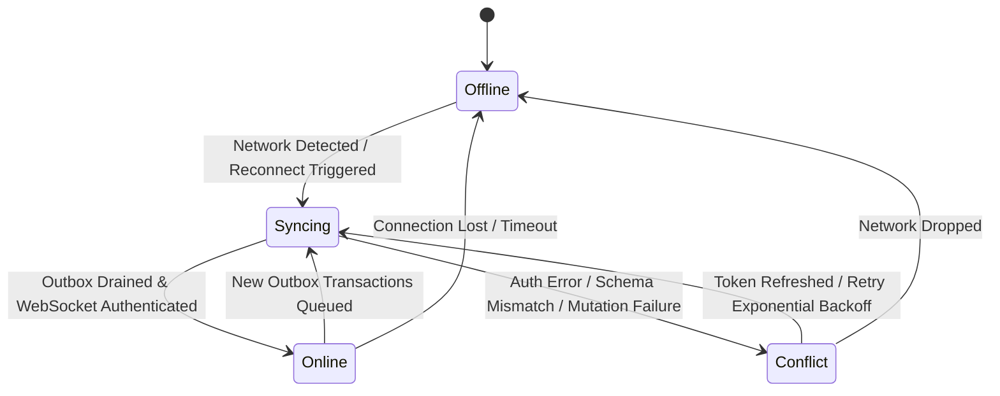
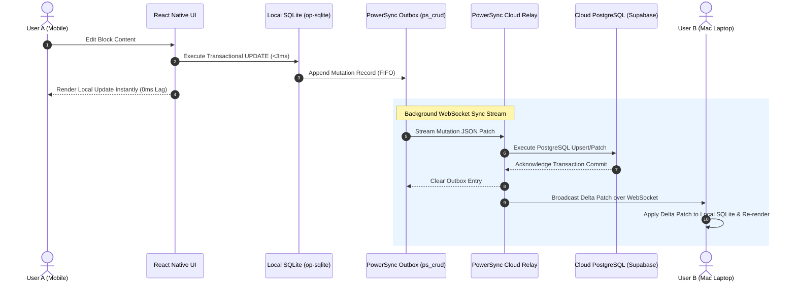
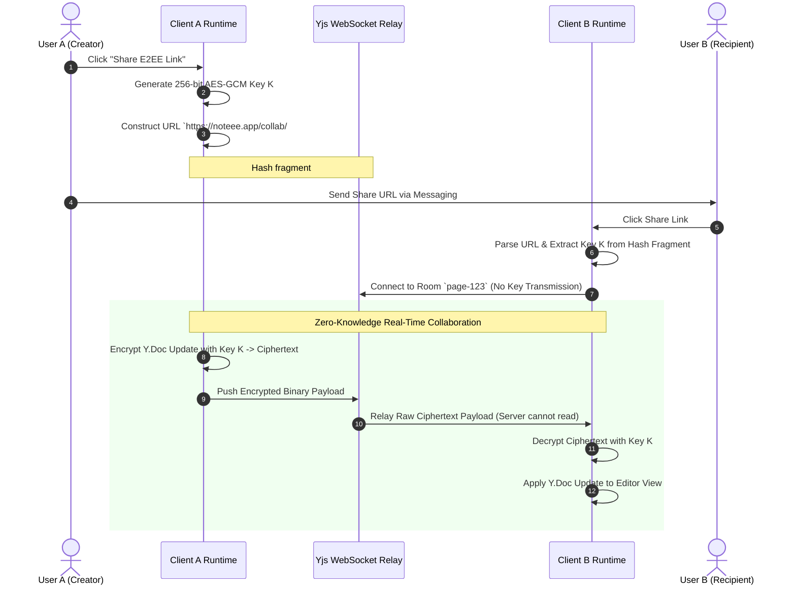
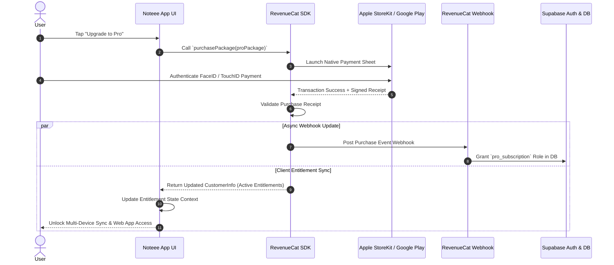

# Noteee: Sector 6 — Cloud Sync, Real-Time Collaboration, E2EE, TTS & Revenue Specification

## 1. PowerSync Local-First Sync Pipeline (@powersync/react-native v1.8.x)

### 1.1 Local-First DIP Architecture Overview
Noteee implements a **Local-First Cloud Synchronization Architecture** leveraging `@powersync/react-native` (v1.8.x) and direct C++ JSI SQLite bindings (`@op-engineering/op-sqlite` v10.3.x). Local SQLite acts as the single source of truth for all application reads and writes, delivering sub-3ms local UI operations with zero network dependency.

When network connectivity is available, the PowerSync client establishes a continuous WebSocket streaming connection to the PowerSync Sync Service, which mirrors local SQLite table mutations to a primary Cloud PostgreSQL database running Supabase.

```
┌────────────────────────────────────────────────────────────────────────────────────────┐
│                              Sector 6 Local-First Architecture                         │
├────────────────────────────────────────────────────────────────────────────────────────┤
│ 📱 Native Mobile App / 💻 Desktop / 🌐 Web App                                          │
│                                                                                        │
│  ┌────────────────────────┐      Direct JSI      ┌──────────────────────────────────┐  │
│  │  React Native / Web UI ├─────────────────────►│  Local SQLite DB (op-sqlite)    │  │
│  └────────────────────────┘                      └────────────────┬─────────────────┘  │
│                                                                   │ Transactional Log  │
│                                                                   ▼                    │
│                                                  ┌──────────────────────────────────┐  │
│                                                  │ PowerSync Outbox (ps_crud)       │  │
│                                                  └────────────────┬─────────────────┘  │
└───────────────────────────────────────────────────────────────────┼────────────────────┘
                                                                    │ WebSocket Stream
                                                                    ▼
                                                   ┌──────────────────────────────────┐
                                                   │ PowerSync Cloud Relay Service    │
                                                   └────────────────┬─────────────────┘  │
                                                                    │ Delta Sync
                                                                    ▼
                                                   ┌──────────────────────────────────┐
                                                   │ Cloud PostgreSQL DB (Supabase)   │
                                                   └──────────────────────────────────┘
```

---

### 1.2 PowerSync Schema Definition
The PowerSync client schema mirrors the Drizzle SQLite schema defined in Sector 1 (`03_sector_1_foundation_spec.md`), declaring all synced tables, columns, indexes, and relationships.

```typescript
import { Schema, Table, Column, ColumnType } from '@powersync/react-native';

export const AppPowerSyncSchema = new Schema([
  new Table({
    name: 'folders',
    columns: [
      new Column({ name: 'parent_id', type: ColumnType.TEXT }),
      new Column({ name: 'name', type: ColumnType.TEXT }),
      new Column({ name: 'icon', type: ColumnType.TEXT }),
      new Column({ name: 'color', type: ColumnType.TEXT }),
      new Column({ name: 'path', type: ColumnType.TEXT }),
      new Column({ name: 'is_system_anchor', type: ColumnType.INTEGER }),
      new Column({ name: 'is_vault', type: ColumnType.INTEGER }),
      new Column({ name: 'created_at', type: ColumnType.TEXT }),
      new Column({ name: 'updated_at', type: ColumnType.TEXT }),
    ],
  }),

  new Table({
    name: 'pages',
    columns: [
      new Column({ name: 'folder_id', type: ColumnType.TEXT }),
      new Column({ name: 'parent_page_id', type: ColumnType.TEXT }),
      new Column({ name: 'title', type: ColumnType.TEXT }),
      new Column({ name: 'icon', type: ColumnType.TEXT }),
      new Column({ name: 'cover_image', type: ColumnType.TEXT }),
      new Column({ name: 'is_vault', type: ColumnType.INTEGER }),
      new Column({ name: 'created_at', type: ColumnType.TEXT }),
      new Column({ name: 'updated_at', type: ColumnType.TEXT }),
    ],
  }),

  new Table({
    name: 'blocks',
    columns: [
      new Column({ name: 'page_id', type: ColumnType.TEXT }),
      new Column({ name: 'parent_block_id', type: ColumnType.TEXT }),
      new Column({ name: 'type', type: ColumnType.TEXT }),
      new Column({ name: 'order_index', type: ColumnType.REAL }),
      new Column({ name: 'content', type: ColumnType.TEXT }), // JSON payload string
      new Column({ name: 'created_at', type: ColumnType.TEXT }),
      new Column({ name: 'updated_at', type: ColumnType.TEXT }),
    ],
  }),

  new Table({
    name: 'capture_sessions',
    columns: [
      new Column({ name: 'status', type: ColumnType.TEXT }),
      new Column({ name: 'target_folder_id', type: ColumnType.TEXT }),
      new Column({ name: 'target_page_id', type: ColumnType.TEXT }),
      new Column({ name: 'media_type', type: ColumnType.TEXT }),
      new Column({ name: 'session_data', type: ColumnType.TEXT }), // JSON payload
      new Column({ name: 'created_at', type: ColumnType.TEXT }),
      new Column({ name: 'updated_at', type: ColumnType.TEXT }),
    ],
  }),

  new Table({
    name: 'tags',
    columns: [
      new Column({ name: 'name', type: ColumnType.TEXT }),
      new Column({ name: 'color', type: ColumnType.TEXT }),
    ],
  }),

  new Table({
    name: 'page_tags',
    columns: [
      new Column({ name: 'page_id', type: ColumnType.TEXT }),
      new Column({ name: 'tag_id', type: ColumnType.TEXT }),
      new Column({ name: 'is_auto_tag', type: ColumnType.INTEGER }),
    ],
  }),
]);
```

---

### 1.3 PowerSync Connector Implementation
The `PowerSyncBackendConnector` handles Supabase JWT authentication and outbox data uploading to PostgreSQL via Supabase PostgREST edge endpoints.

```typescript
import {
  PowerSyncBackendConnector,
  PowerSyncCredentials,
  AbstractPowerSyncDatabase,
  CrudEntry,
} from '@powersync/react-native';
import { SupabaseClient } from '@supabase/supabase-js';

export class NoteeePowerSyncConnector implements PowerSyncBackendConnector {
  constructor(
    private supabase: SupabaseClient,
    private powersyncUrl: string
  ) {}

  /**
   * Fetches valid Supabase JWT access token for PowerSync WebSocket handshake.
   */
  async fetchCredentials(): Promise<PowerSyncCredentials> {
    const { data: { session }, error } = await this.supabase.auth.getSession();
    if (error || !session) {
      throw new Error(`Authentication token missing for PowerSync: ${error?.message}`);
    }

    return {
      endpoint: this.powersyncUrl,
      token: session.access_token,
      expiresAt: session.expires_at ? new Date(session.expires_at * 1000) : undefined,
    };
  }

  /**
   * Uploads local SQLite transactional outbox entries to backend Cloud PostgreSQL database.
   */
  async uploadData(db: AbstractPowerSyncDatabase): Promise<void> {
    const transaction = await db.getNextCrudTransaction();
    if (!transaction) return;

    try {
      for (const op of transaction.crud) {
        await this.processCrudEntry(op);
      }
      await transaction.complete();
    } catch (err) {
      console.error('Failed uploading PowerSync CRUD transaction batch:', err);
      throw err;
    }
  }

  private async processCrudEntry(entry: CrudEntry): Promise<void> {
    const table = entry.table;
    const id = entry.id;

    switch (entry.op) {
      case 'PUT': {
        const { error } = await this.supabase
          .from(table)
          .upsert({ id, ...entry.opData });
        if (error) throw new Error(`Supabase UPSERT failed on ${table}: ${error.message}`);
        break;
      }
      case 'PATCH': {
        const { error } = await this.supabase
          .from(table)
          .update(entry.opData)
          .eq('id', id);
        if (error) throw new Error(`Supabase PATCH failed on ${table}: ${error.message}`);
        break;
      }
      case 'DELETE': {
        const { error } = await this.supabase
          .from(table)
          .delete()
          .eq('id', id);
        if (error) throw new Error(`Supabase DELETE failed on ${table}: ${error.message}`);
        break;
      }
    }
  }
}
```

---

### 1.4 Offline Mutation Queue & Retry Strategy
When offline, PowerSync buffers local database modifications inside a system outbox table (`ps_crud`). 
1. **Outbox Durability:** Every local write (`INSERT`, `UPDATE`, `DELETE`) executed by Drizzle/op-sqlite wraps inside a single SQLite transaction with an outbox record append.
2. **Sequential Draining:** When connectivity resumes, the mutation log drains sequentially (FIFO order) to ensure causal transaction ordering.
3. **Exponential Backoff with Jitter:** On network timeout or 5xx server responses, the retry interval calculates as:
   $$T_{\text{retry}} = \min\left(T_{\text{max}}, T_{\text{base}} \times 2^{\text{attempt}}\right) \pm \text{random\_jitter}$$
   where $T_{\text{base}} = 1000\text{ms}$, $T_{\text{max}} = 60000\text{ms}$, and $\text{jitter} = \pm 200\text{ms}$.

---

### 1.5 Conflict Resolution Protocol
1. **Document & Folder Metadata:** Resolved via **Last-Write-Wins (LWW)** using high-precision ISO-8601 timestamps (`updated_at`). Tie-breakers compare client UUID strings lexicographically.
2. **Block-Level Independent CRDT Merges:** Because each block in Noteee is represented by a unique UUID record in the `blocks` table, modifications to separate blocks within the same page never generate conflicts.
3. **Fractional Indexing Rebalancing:** Drag-and-drop reordering updates `order_index` using string-based fractional keys (`fractional-indexing` v3.2.x). Insertion between positions $A$ and $B$ calculates a deterministic midpoint string $M$, avoiding index recalculation collisions across devices.

---

## 2. Yjs CRDT Real-Time Collaboration Architecture (yjs v13.6.x, y-websocket v0.2.x)

### 2.1 Hybrid Architecture
Noteee combines **PowerSync** for offline multi-device sync with **Yjs** (`yjs` v13.6.x & `y-websocket` v0.2.x) for high-frequency multiplayer real-time collaboration. 

- **State Sync (PowerSync):** Manages structural persistence, page hierarchy, metadata, and single-user device updates.
- **Multiplayer Session (Yjs):** When 2+ users edit the same page concurrently, a peer-to-peer/relay WebSocket session connects all active collaborators.

```
┌────────────────────────────────────────────────────────────────────────────────────────┐
│                              Yjs Real-Time Collaboration                               │
├────────────────────────────────────────────────────────────────────────────────────────┤
│ User A Client (Mobile)                           User B Client (Web)                   │
│ ┌────────────────────────┐                      ┌────────────────────────┐             │
│ │ TipTap / Y.Doc State   │                      │ TipTap / Y.Doc State   │             │
│ └───────────┬────────────┘                      └───────────┬────────────┘             │
│             │ Encrypted Binary Delta                        │ Encrypted Binary Delta   │
│             ▼                                               ▼                          │
│ ┌────────────────────────────────────────────────────────────────────────┐             │
│ │                       y-websocket Collaboration Relay                  │             │
│ │   - Room ID: `page_id`                                                 │             │
│ │   - Awareness Broadcast (User cursors, names, selection ranges)      │             │
│ └────────────────────────────────────────────────────────────────────────┘             │
└────────────────────────────────────────────────────────────────────────────────────────┘
```

---

### 2.2 Y.Doc Structure for Pages and Blocks
The Yjs document model integrates directly with ProseMirror / TipTap via `y-prosemirror`. A single `Y.Doc` represents an active page session.

```typescript
import * as Y from 'yjs';
import { WebsocketProvider } from 'y-websocket';

export interface CollaborationSession {
  doc: Y.Doc;
  provider: WebsocketProvider;
  xmlFragment: Y.XmlFragment;
}

export function initYjsSession(
  pageId: string,
  serverUrl: string,
  authToken: string
): CollaborationSession {
  const doc = new Y.Doc();
  
  const provider = new WebsocketProvider(serverUrl, `page-${pageId}`, doc, {
    params: { auth_token: authToken },
    connect: true,
  });

  // Root ProseMirror document fragment for TipTap block editor integration
  const xmlFragment = doc.getXmlFragment('prosemirror');

  return { doc, provider, xmlFragment };
}
```

---

### 2.3 Awareness & Presence Protocol
The Yjs Awareness protocol broadcasts cursor positions, active selections, user profile metadata, and connection liveness.

```typescript
export interface UserPresenceState {
  user: {
    id: string;
    name: string;
    color: string;
    avatarUrl?: string;
  };
  cursor: {
    blockId: string;
    anchorOffset: number;
    headOffset: number;
  } | null;
  lastActive: number; // UTC Unix Epoch MS
}

export function setupPresence(
  provider: WebsocketProvider,
  user: UserPresenceState['user']
): void {
  const awareness = provider.awareness;

  // Set local client awareness state
  awareness.setLocalStateField('user', user);
  awareness.setLocalStateField('cursor', null);
  awareness.setLocalStateField('lastActive', Date.now());

  // Heartbeat loop every 10 seconds to keep connection alive
  setInterval(() => {
    awareness.setLocalStateField('lastActive', Date.now());
  }, 10_000);
}
```

---

### 2.4 Reconnection & Snapshot Flushing Protocol
1. **State Vector Exchange:** Upon establishing a WebSocket connection, the client sends its state vector (`Y.encodeStateVector(doc)`). The server returns only missing binary delta updates (`Y.encodeStateAsUpdate(serverDoc, clientStateVector)`).
2. **Offline Buffering:** If the connection drops during multiplayer editing, Yjs delta updates accumulate locally in memory and write to a temporary SQLite table (`yjs_updates`).
3. **Snapshot Flushing to SQLite:** When all active collaborators leave the room or after 5 seconds of typing idle time, the host client serializes the `Y.Doc` ProseMirror tree into block JSON payloads and updates local SQLite `blocks` records, triggering a clean PowerSync sync upload.

---

## 3. Zero-Knowledge E2EE Link Sharing Framework

### 3.1 Hash Fragment Key Security Model
Noteee provides zero-knowledge end-to-end encrypted (E2EE) collaboration links following the Excalidraw security paradigm:

$$\text{Share URL} = \texttt{https://noteee.app/collab/\#key=}\langle \text{Base64URL-Encoded 256-Bit AES Key} \rangle$$

**Security Guarantee:** Per W3C URL specification (RFC 3986), the hash fragment (`#key=...`) is strictly processed client-side by the browser/native app runtime and is **NEVER sent to backend servers** in HTTP request headers or WebSocket handshakes. The server acts purely as a zero-knowledge relay of encrypted ciphertext.

```
┌────────────────────────────────────────────────────────────────────────────────────────┐
│                              Zero-Knowledge E2EE Architecture                          │
├────────────────────────────────────────────────────────────────────────────────────────┤
│ Client A (Creator)                                 Client B (Recipient)                │
│ 1. Generates 256-bit AES-GCM Key K                1. Receives URL with #key=K         │
│ 2. Encrypts Y.Doc binary delta payload            2. Extracts Key K in client RAM only│
│ 3. Sends Encrypted Ciphertext Blob                3. Decrypts Y.Doc binary delta blob │
│                      │                                     ▲                           │
│                      └─────────────────┬───────────────────┘                           │
│                                        ▼                                               │
│                     ┌──────────────────────────────────────┐                           │
│                     │ Zero-Knowledge Yjs WebSocket Relay   │                           │
│                     │ (Sees ONLY encrypted ciphertext)     │                           │
│                     └──────────────────────────────────────┘                           │
└────────────────────────────────────────────────────────────────────────────────────────┘
```

---

### 3.2 Client-Side AES-GCM Cryptographic Implementation
Uses the standard Web Crypto API (`crypto.subtle` / `react-native-quick-crypto`) operating in AES-GCM mode with 256-bit key length and 96-bit (12-byte) initialization vectors (IV).

```typescript
export interface EncryptedPayload {
  iv: string; // Base64 encoded 12-byte IV
  ciphertext: string; // Base64 encoded ciphertext
}

export class E2ECryptoEngine {
  /**
   * Generates a new 256-bit AES-GCM symmetric encryption key.
   */
  static async generateKey(): Promise<CryptoKey> {
    return await crypto.subtle.generateKey(
      { name: 'AES-GCM', length: 256 },
      true,
      ['encrypt', 'decrypt']
    );
  }

  /**
   * Exports CryptoKey to URL-safe Base64 string for URL hash fragment.
   */
  static async exportKey(key: CryptoKey): Promise<string> {
    const rawKey = await crypto.subtle.exportKey('raw', key);
    return Buffer.from(rawKey).toString('base64url');
  }

  /**
   * Imports URL Base64 string back into CryptoKey instance.
   */
  static async importKey(base64Key: string): Promise<CryptoKey> {
    const rawKey = Buffer.from(base64Key, 'base64url');
    return await crypto.subtle.importKey(
      'raw',
      rawKey,
      { name: 'AES-GCM', length: 256 },
      true,
      ['encrypt', 'decrypt']
    );
  }

  /**
   * Encrypts plain Uint8Array Yjs binary update into AES-GCM payload.
   */
  static async encrypt(data: Uint8Array, key: CryptoKey): Promise<EncryptedPayload> {
    const iv = crypto.getRandomValues(new Uint8Array(12)); // 96-bit random IV
    const encryptedBuffer = await crypto.subtle.encrypt(
      { name: 'AES-GCM', iv },
      key,
      data
    );

    return {
      iv: Buffer.from(iv).toString('base64'),
      ciphertext: Buffer.from(encryptedBuffer).toString('base64'),
    };
  }

  /**
   * Decrypts AES-GCM payload back into plain Uint8Array Yjs binary update.
   */
  static async decrypt(payload: EncryptedPayload, key: CryptoKey): Promise<Uint8Array> {
    const iv = Buffer.from(payload.iv, 'base64');
    const ciphertext = Buffer.from(payload.ciphertext, 'base64');

    const decryptedBuffer = await crypto.subtle.decrypt(
      { name: 'AES-GCM', iv },
      key,
      ciphertext
    );

    return new Uint8Array(decryptedBuffer);
  }
}
```

---

### 3.3 Session Revocation & Key Rotation
- **Session Revocation:** Document owners can revoke a shared collaboration link by issuing a key rotation command.
- **Key Rotation Steps:**
  1. Generate a new 256-bit AES key $K_{\text{new}}$.
  2. Terminate active WebSocket room connection on the relay server.
  3. Re-encrypt local document state using $K_{\text{new}}$ and update the local database.
  4. Generate a new share link containing $\#\text{key}=K_{\text{new}}$. Old link holders are permanently locked out because the server rejects connections with invalid room signature hashes.

---

## 4. TTS Audio Playback Engine Architecture

### 4.1 Hybrid Dual-Engine Architecture
Noteee features a **Dual-Tier Text-to-Speech (TTS) Engine**:
- **Tier 1 (MVP Offline):** `expo-speech` (Expo SDK 57) utilizing system native speech synthesis engines (AVSpeechSynthesizer on iOS, TextToSpeech on Android, SpeechSynthesisUtterance on Web). Provides zero-cost, 100% offline playback.
- **Tier 2 (v3+ Premium Cloud AI Voices):** Neural AI Cloud Voices (e.g. ElevenLabs, Azure Speech SDK) delivering hyper-realistic human voice timbre, streaming MP3/AAC audio over HTTPS.

```
┌────────────────────────────────────────────────────────────────────────────────────────┐
│                              Text-to-Speech Engine Pipeline                            │
├────────────────────────────────────────────────────────────────────────────────────────┤
│ Page Content Blocks ──► Extract Plain Text Spans ──► Audio Chunk Indexer               │
│                                                            │                           │
│                 ┌──────────────────────────────────────────┴────────────────────────┐  │
│                 ▼                                                                   ▼  │
│ ┌────────────────────────────────┐                ┌──────────────────────────────────┐ │
│ │ Local System Voice Engine      │                │ Premium Cloud AI Voice API       │ │
│ │ (expo-speech / AVSpeech)       │                │ (ElevenLabs / Azure Speech SDK)  │ │
│ └───────────────┬────────────────┘                └────────────────┬─────────────────┘ │
│                 │                                                  │                   │
│                 └──────────────────────────┬───────────────────────┘                   │
│                                            ▼                                           │
│                     ┌──────────────────────────────────────────────┐                   │
│                     │ Synchronized Editor Highlight RPC Dispatcher │                   │
│                     └──────────────────────────────────────────────┘                   │
└────────────────────────────────────────────────────────────────────────────────────────┘
```

---

### 4.2 Playback Control State & Block Text Synchronization
To sync audio playback with visual block rendering in the TipTap editor, text is extracted into indexed `SpeechChunk` units containing `blockId`, text content, and word boundary ranges.

```typescript
export interface SpeechChunk {
  blockId: string;
  text: string;
  charOffset: number;
}

export interface TTSPlaybackState {
  status: 'IDLE' | 'PLAYING' | 'PAUSED' | 'STOPPED';
  currentBlockId: string | null;
  currentWordIndex: number;
  rate: number; // 0.5x, 1.0x, 1.25x, 1.5x, 2.0x
  voiceUri: string | null;
}
```

---

### 4.3 Lock Screen & Background Audio Playback Configuration
Background playback keeps speech active when the user locks their screen or switches apps.

```typescript
import { Audio } from 'expo-av';
import * as Speech from 'expo-speech';

export async function configureAudioSession(): Promise<void> {
  await Audio.setAudioModeAsync({
    allowsRecordingIOS: false,
    staysActiveInBackground: true,
    playsInSilentModeIOS: true,
    shouldDuckAndroid: true,
    playThroughEarpieceAndroid: false,
  });
}

export function playNoteTTS(
  chunks: SpeechChunk[],
  onBlockChange: (blockId: string) => void
): void {
  let index = 0;

  function speakNext() {
    if (index >= chunks.length) return;

    const chunk = chunks[index];
    onBlockChange(chunk.blockId);

    Speech.speak(chunk.text, {
      rate: 1.0,
      onDone: () => {
        index++;
        speakNext();
      },
      onError: (err) => console.error('TTS playback error:', err),
    });
  }

  speakNext();
}
```

---

## 5. Supabase Authentication & Vault Hardware Integration (@supabase/supabase-js v2.48.x)

### 5.1 Auth Adapter & JWT Session Lifecycle
Authentication is managed via `@supabase/supabase-js` (v2.48.x). Tokens are securely stored in mobile hardware enclaves using `react-native-keychain` (v9.0.x) or `expo-secure-store`.

```typescript
import { createClient, SupabaseClient, Session } from '@supabase/supabase-js';
import * as Keychain from 'react-native-keychain';

const SUPABASE_URL = 'https://xyzcompany.supabase.co';
const SUPABASE_ANON_KEY = 'eyJhbGciOiJIUzI1NiIsInR5cCI6IkpXVCJ9...';

export const CustomKeychainStorage = {
  getItem: async (key: string): Promise<string | null> => {
    const creds = await Keychain.getGenericPassword({ service: key });
    return creds ? creds.password : null;
  },
  setItem: async (key: string, value: string): Promise<void> => {
    await Keychain.setGenericPassword('supabase_token', value, { service: key });
  },
  removeItem: async (key: string): Promise<void> => {
    await Keychain.resetGenericPassword({ service: key });
  },
};

export const supabase: SupabaseClient = createClient(SUPABASE_URL, SUPABASE_ANON_KEY, {
  auth: {
    storage: CustomKeychainStorage,
    autoRefreshToken: true,
    persistSession: true,
    detectSessionInUrl: false,
  },
});
```

---

### 5.2 Linking Identity with Biometric Vault Hardware Security
The local Encrypted Vault Folder uses hardware biometric authentication (`expo-local-authentication` v15.x & `react-native-keychain` v9.0.x) to protect Vault folder contents.

```typescript
import * as LocalAuthentication from 'expo-local-authentication';
import * as Keychain from 'react-native-keychain';

export class VaultHardwareManager {
  private static VAULT_KEY_SERVICE = 'noteee_vault_master_key';

  /**
   * Authenticates user via FaceID / TouchID biometric prompt.
   */
  static async authenticateBiometrics(reason: string): Promise<boolean> {
    const hasHardware = await LocalAuthentication.hasHardwareAsync();
    const isEnrolled = await LocalAuthentication.isEnrolledAsync();

    if (!hasHardware || !isEnrolled) {
      throw new Error('Biometric hardware authentication unavailable or not enrolled.');
    }

    const result = await LocalAuthentication.authenticateAsync({
      promptMessage: reason,
      fallbackLabel: 'Enter Passcode',
      disableDeviceFallback: false,
    });

    return result.success;
  }

  /**
   * Retrieves AES-GCM Vault Master Key from Hardware Keychain upon successful biometric auth.
   */
  static async getVaultMasterKey(): Promise<string> {
    const authenticated = await this.authenticateBiometrics('Unlock Encrypted Vault');
    if (!authenticated) throw new Error('Biometric authentication failed.');

    const credentials = await Keychain.getGenericPassword({
      service: this.VAULT_KEY_SERVICE,
      authenticationPrompt: { title: 'Vault Unlock' },
    });

    if (!credentials) throw new Error('Vault Master Key not found in Secure Enclave.');
    return credentials.password;
  }
}
```

---

## 6. RevenueCat Billing & Monetization Integration (react-native-purchases v8.5.x)

### 6.1 Entitlement Hierarchy & Feature Access Matrix

| Feature / Capability | Free Tier (Ad-Supported) | 90-Day Unlimited Free Trial | Pro Cloud Subscription | Lifetime Unlock Tier |
| :--- | :---: | :---: | :---: | :---: |
| **Local SQLite Notes & Capture** | ✅ Unlimited | ✅ Unlimited | ✅ Unlimited | ✅ Unlimited |
| **FSRS Flashcards & AI Creation** | ✅ Unlimited | ✅ Unlimited | ✅ Unlimited | ✅ Unlimited |
| **Encrypted Vault & Biometrics** | ✅ Unlimited | ✅ Unlimited | ✅ Unlimited | ✅ Unlimited |
| **Banner Advertisements** | ⚠️ Yes (Non-intrusive) | ❌ Ads Removed | ❌ Ads Removed | ❌ Ads Removed |
| **PowerSync Multi-Device Sync** | ❌ Local Only | ✅ Enabled | ✅ Enabled | ✅ Enabled |
| **Zero-Knowledge E2EE Link Share**| ❌ Local Only | ✅ Enabled | ✅ Enabled | ✅ Enabled |
| **Premium Cloud AI Voices (TTS)** | ❌ System Voice | ✅ Included | ✅ Included (Quota) | ⚠️ System Voice / BYOK |
| **Next.js Web Application Access**| ❌ Mobile Only | ✅ Full Access | ✅ Full Access | ✅ Full Access |

---

### 6.2 RevenueCat Billing SDK Implementation
Uses `react-native-purchases` (v8.5.x) to manage Apple App Store and Google Play subscriptions, 90-day trials, and entitlement status verification.

```typescript
import Purchases, { CustomerInfo, PurchasesOffering } from 'react-native-purchases';

export const ENTITLEMENT_PRO = 'pro_subscription';
export const ENTITLEMENT_LIFETIME = 'lifetime_unlock';

export class BillingManager {
  static async configure(apiKey: string, userId: string): Promise<void> {
    Purchases.configure({ apiKey, appUserID: userId });
  }

  static async checkEntitlements(): Promise<{ isPro: boolean; isLifetime: boolean }> {
    const customerInfo: CustomerInfo = await Purchases.getCustomerInfo();
    const isPro = typeof customerInfo.entitlements.active[ENTITLEMENT_PRO] !== 'undefined';
    const isLifetime = typeof customerInfo.entitlements.active[ENTITLEMENT_LIFETIME] !== 'undefined';

    return { isPro, isLifetime };
  }

  static async purchaseProPackage(offeringId: string): Promise<boolean> {
    const offerings = await Purchases.getOfferings();
    if (!offerings.current) throw new Error('No current offerings available.');

    const pkg = offerings.current.availablePackages.find(p => p.identifier === offeringId);
    if (!pkg) throw new Error(`Package ${offeringId} not found.`);

    const { customerInfo } = await Purchases.purchasePackage(pkg);
    return typeof customerInfo.entitlements.active[ENTITLEMENT_PRO] !== 'undefined';
  }
}
```

---

### 6.3 Ad SDK Integration & Strict Isolation Rules
Free Tier users see non-intrusive banner ads rendered via `react-native-google-mobile-ads` (v14.x).

```typescript
import React from 'react';
import { BannerAd, BannerAdSize, TestIds } from 'react-native-google-mobile-ads';

const adUnitId = __DEV__ ? TestIds.BANNER : 'ca-app-pub-xxxxxxxxxxxxxxxx/yyyyyyyyyy';

export const NonIntrusiveAdBanner: React.FC<{ isProUser: boolean }> = ({ isProUser }) => {
  if (isProUser) return null; // Pro and Lifetime users see zero ads

  return (
    <BannerAd
      unitId={adUnitId}
      size={BannerAdSize.ANCHORED_ADAPTIVE_BANNER}
      requestOptions={{ requestNonPersonalizedAdsOnly: true }}
    />
  );
};
```

**Ad SDK Sandboxing Guarantee:**
1. Banner ads are restricted strictly to the **Home View** and **Global Search View**.
2. Ads are **STRICTLY BARRED** from inside the Notion Rich Text Editor, Encrypted Vault Folders, Flashcard Study View, and Infinite Canvas.
3. The Ad SDK executes inside isolated UI components with **zero access** to local SQLite files, user credentials, text buffers, or encryption keys.

---

## 7. Sync Connection State Machine & Lifecycle

### 7.1 State Definitions
- **`Offline`:** Network interface disconnected or backend unreachable. Local SQLite buffer accepts writes.
- **`Syncing`:** WebSocket handshake active; draining local outbox queue (`ps_crud`) or applying server delta patches.
- **`Online`:** Streaming sync fully up-to-date; delta latencies $< 100\text{ms}$.
- **`Conflict`:** Schema mismatch, JWT expiration failure, or unresolvable write transaction conflict requiring intervention.



---

### 7.2 State Transition Logic & Backoff Reconnection Algorithm

```typescript
export type SyncState = 'OFFLINE' | 'SYNCING' | 'ONLINE' | 'CONFLICT';

export class SyncStateMachine {
  private currentState: SyncState = 'OFFLINE';
  private retryAttempt = 0;
  private maxRetryIntervalMs = 60_000;

  constructor(private onStateChange: (state: SyncState) => void) {}

  public transition(newState: SyncState): void {
    if (this.currentState === newState) return;
    this.currentState = newState;
    this.onStateChange(newState);
  }

  public handleNetworkFailure(): void {
    this.transition('OFFLINE');
    this.scheduleReconnect();
  }

  private scheduleReconnect(): void {
    this.retryAttempt++;
    const delay = Math.min(
      this.maxRetryIntervalMs,
      Math.pow(2, this.retryAttempt) * 1000 + Math.random() * 200
    );

    setTimeout(() => {
      this.transition('SYNCING');
    }, delay);
  }

  public resetRetry(): void {
    this.retryAttempt = 0;
  }
}
```

---

## 8. End-to-End System Sequence Diagrams (Mermaid)

### 8.1 PowerSync Local-First Delta Sync Flow



---

### 8.2 Zero-Knowledge Link Share & Join Flow



---

### 8.3 Subscription Purchase & Entitlement Verification Flow



---

## 9. Core Sector 6 TypeScript Interface Definitions

```typescript
import { PowerSyncCredentials, AbstractPowerSyncDatabase } from '@powersync/react-native';
import { User, Session } from '@supabase/supabase-js';

// ----------------------------------------------------------------------------
// 1. IPowerSyncClient Interface
// ----------------------------------------------------------------------------
export interface IPowerSyncClient {
  init(powersyncUrl: string, dbName: string): Promise<void>;
  connect(connector: IPowerSyncConnector): Promise<void>;
  disconnect(): Promise<void>;
  execute(sql: string, params?: unknown[]): Promise<unknown>;
  getAll<T>(sql: string, params?: unknown[]): Promise<T[]>;
  watch<T>(sql: string, params: unknown[], onChange: (data: T[]) => void): () => void;
  getSyncStatus(): { isConnected: boolean; hasUnsyncedChanges: boolean };
}

export interface IPowerSyncConnector {
  fetchCredentials(): Promise<PowerSyncCredentials>;
  uploadData(db: AbstractPowerSyncDatabase): Promise<void>;
}

// ----------------------------------------------------------------------------
// 2. IYjsCollabServer Interface
// ----------------------------------------------------------------------------
export interface IYjsCollabServer {
  createRoom(pageId: string): Promise<{ roomId: string; websocketUrl: string }>;
  closeRoom(roomId: string): Promise<void>;
  getActivePeerCount(roomId: string): Promise<number>;
  revokeSession(roomId: string): Promise<boolean>;
}

// ----------------------------------------------------------------------------
// 3. IE2EEncryptionProvider Interface
// ----------------------------------------------------------------------------
export interface EncryptedDataPayload {
  iv: string; // Base64 12-byte IV
  ciphertext: string; // Base64 ciphertext
}

export interface IE2EEncryptionProvider {
  generateSymmetricKey(): Promise<string>; // Returns Base64URL key
  encryptBinary(data: Uint8Array, base64Key: string): Promise<EncryptedDataPayload>;
  decryptBinary(payload: EncryptedDataPayload, base64Key: string): Promise<Uint8Array>;
  deriveShareableUrl(baseUrl: string, pageId: string, base64Key: string): string;
  extractKeyFromUrl(url: string): string | null;
}

// ----------------------------------------------------------------------------
// 4. ITextToSpeechEngine Interface
// ----------------------------------------------------------------------------
export interface TTSOptions {
  rate?: number; // 0.5 - 2.0
  pitch?: number; // 0.5 - 1.5
  voiceUri?: string;
  useCloudVoice?: boolean;
}

export interface ITextToSpeechEngine {
  speak(text: string, options?: TTSOptions, onBoundary?: (charIndex: number) => void): Promise<void>;
  pause(): Promise<void>;
  resume(): Promise<void>;
  stop(): Promise<void>;
  getAvailableVoices(): Promise<Array<{ id: string; name: string; language: string; isCloud: boolean }>>;
  isPlaying(): boolean;
}

// ----------------------------------------------------------------------------
// 5. ISupabaseAuthAdapter Interface
// ----------------------------------------------------------------------------
export interface ISupabaseAuthAdapter {
  signInWithOAuth(provider: 'apple' | 'google'): Promise<{ user: User | null; session: Session | null }>;
  signInWithMagicLink(email: string): Promise<{ success: boolean }>;
  signOut(): Promise<void>;
  getSession(): Promise<Session | null>;
  getUser(): Promise<User | null>;
  onAuthStateChange(callback: (user: User | null, session: Session | null) => void): () => void;
  authenticateVaultBiometrics(promptReason: string): Promise<boolean>;
}

// ----------------------------------------------------------------------------
// 6. IBillingProvider Interface
// ----------------------------------------------------------------------------
export interface UserEntitlements {
  isPro: boolean;
  isLifetime: boolean;
  activeOfferings: string[];
}

export interface IBillingProvider {
  initialize(apiKey: string, userId: string): Promise<void>;
  getEntitlements(): Promise<UserEntitlements>;
  purchasePackage(packageIdentifier: string): Promise<UserEntitlements>;
  restorePurchases(): Promise<UserEntitlements>;
  onEntitlementsUpdated(callback: (entitlements: UserEntitlements) => void): () => void;
}
```
