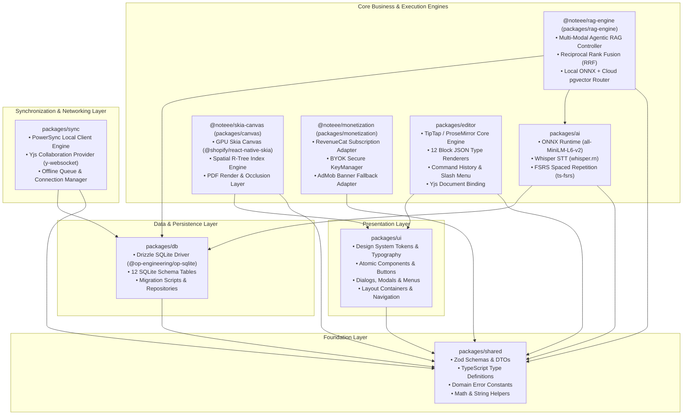
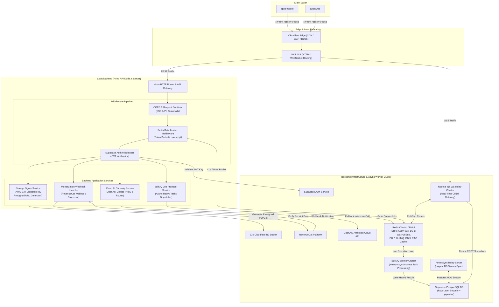
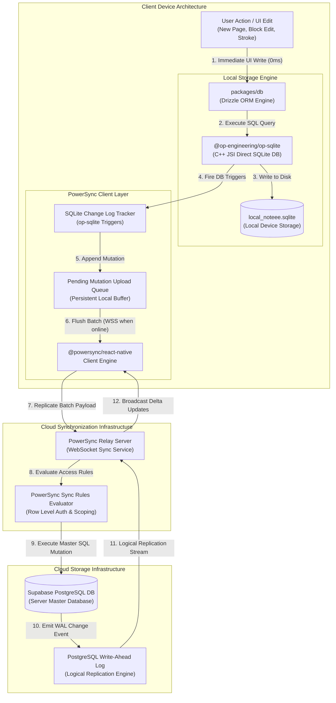
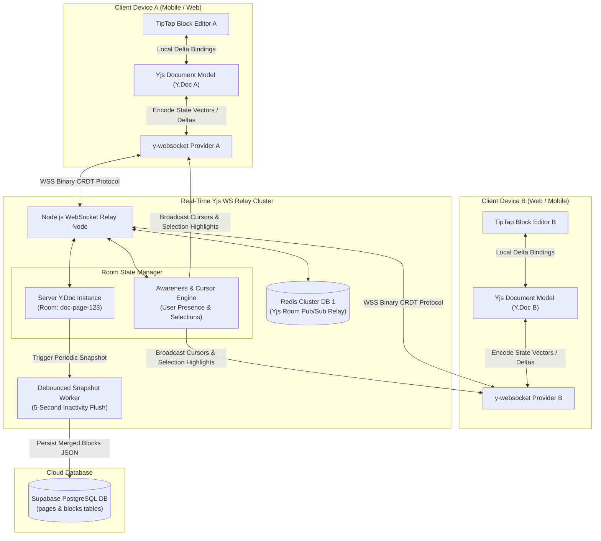

# Noteee: System Component Architecture Specification

## 1. Executive Summary & Monorepo Overview

Noteee is an advanced, capture-first, AI-powered cross-platform notebook application designed for high-performance offline-first usage, multi-modal knowledge capture, Notion-grade block editing, infinite GPU canvas sketching, on-device vector search, multi-modal agentic RAG, and real-time collaboration.

The codebase is organized as a high-efficiency monorepo powered by **Turborepo** (`v2.10.x`) and **Yarn/pnpm**, guaranteeing strict type safety, modular encapsulation, and maximum code sharing across all deployment targets (iOS, Android, macOS desktop, Next.js web, and Node.js server microservices).

### Architectural Core Principles

1. **Local-First Data Supremacy**: All user data resides in a local high-speed JSI SQLite database (`@op-engineering/op-sqlite` via `drizzle-orm`). UI interactions complete with zero network latency ($0\text{ms}$). Cloud synchronization occurs asynchronously in the background.
2. **Offline-First Synchronization Pipeline**: Powered by **PowerSync**, providing continuous bi-directional delta streaming between local SQLite and cloud PostgreSQL without blocking the main render thread.
3. **Decoupled Monorepo Topology**: Clean separation between application entry points (`apps/*`) and domain-logic engines (`packages/*`), ensuring that platform-specific wrappers remain thin while business logic and data structures remain unified.
4. **Hybrid AI & Agentic RAG Architecture**: Primary intelligence tasks (384-dimensional vector embeddings via ONNX Runtime `all-MiniLM-L6-v2`, offline speech-to-text via `whisper.rn`, and memory stability scheduling via `ts-fsrs`) execute 100% on-device. Heavy AI tasks and hybrid Reciprocal Rank Fusion (RRF) fallback seamlessly to cloud endpoints (pgvector + Cloud AI).
5. **High-Availability Cloud Infrastructure**: High-concurrency active-active deployment fronted by Cloudflare Enterprise Edge (CDN/WAF) and AWS Application Load Balancers (ALB), backed by Redis Cluster (DB 0-3), BullMQ asynchronous worker clusters, and Node.js Yjs WebSocket relay clusters.
6. **Real-Time CRDT Collaboration**: Multiplayer editing relies on **Yjs** CRDTs over persistent WebSockets (`y-websocket`), keeping collaborative document state consistent across concurrent multi-user sessions.

---

## 2. Primary System-Wide Component Architecture Diagram

The system-wide component architecture diagram defines all applications, internal monorepo packages, package dependencies, and external cloud services composing Noteee.

```mermaid
flowchart TB
    subgraph EDGE_LAYER["Edge & Load Balancing Layer"]
        EXT_CLOUDFLARE["Cloudflare Enterprise Edge<br/>(Anycast CDN, WAF Engine,<br/>DDoS Mitigation & TLS 1.3)"]
        EXT_ALB["AWS Application Load Balancer (ALB)<br/>(Multi-AZ Routing & Health Checks)"]
    end

    subgraph MONOREPO_APPS["Noteee Monorepo Applications (apps/*)"]
        MOBILE_APP["apps/mobile<br/>(React Native / Expo SDK 57<br/>iOS, Android, macOS)"]
        WEB_APP["apps/web<br/>(Next.js 15 App Router<br/>Web SPA / SSR)"]
        BACKEND_APP["apps/backend<br/>(Hono API / Node.js Server<br/>Microservices & Webhooks)"]
    end

    subgraph MONOREPO_PACKAGES["Noteee Shared Monorepo Packages (packages/*)"]
        PKG_SHARED["packages/shared<br/>(Zod Schemas, Types,<br/>Validation & Constants)"]
        PKG_UI["packages/ui<br/>(Design System,<br/>Theme & UI Primitives)"]
        PKG_DB["packages/db<br/>(Drizzle SQLite, 12 Tables,<br/>Migrations & Repositories)"]
        PKG_EDITOR["packages/editor<br/>(Notion-grade Block Editor,<br/>12 Block JSON Types, Yjs)"]
        PKG_AI["packages/ai<br/>(ONNX MiniLM Embeddings,<br/>Whisper STT, FSRS Engine)"]
        PKG_CANVAS["@noteee/skia-canvas<br/>(packages/canvas - GPU Skia,<br/>Spatial R-Tree, PDF & Occlusion)"]
        PKG_RAG["@noteee/rag-engine<br/>(packages/rag-engine - Hybrid RRF,<br/>ONNX Embeddings & pgvector)"]
        PKG_MONETIZATION["@noteee/monetization<br/>(packages/monetization - RevenueCat,<br/>BYOK KeyManager & AdMob)"]
        PKG_SYNC["packages/sync<br/>(PowerSync Engine,<br/>Yjs Provider & WS Manager)"]
    end

    subgraph CLOUD_INFRASTRUCTURE["External Cloud Infrastructure & Storage"]
        EXT_REDIS["Redis Cluster DB 0-3<br/>(DB 0: Auth/RateLimit, DB 1: Yjs PubSub,<br/>DB 2: BullMQ Queue, DB 3: RAG Cache)"]
        EXT_BULLMQ["BullMQ Job Queue & Workers<br/>(Async Heavy Worker Cluster)"]
        EXT_WS_RELAY["Node.js Yjs WS Relay Cluster<br/>(Real-Time CRDT Room Gateway)"]
        EXT_POSTGRES["PostgreSQL Database<br/>(Supabase Managed DB + pgvector)"]
        EXT_POWERSYNC["PowerSync Relay Server<br/>(Logical Replication Stream)"]
        EXT_AUTH["Supabase Auth Service<br/>(OAuth, JWT & Sessions)"]
        EXT_REVENUECAT["RevenueCat Billing API<br/>(IAP & Subscription Entitlements)"]
        EXT_AI_FALLBACK["External Cloud AI API<br/>(OpenAI GPT-4o / Claude 3.5)"]
        EXT_STORAGE["Cloud Blob Storage<br/>(AWS S3 / Cloudflare R2)"]
    end

    %% Edge Routing
    EXT_CLOUDFLARE --> EXT_ALB
    EXT_ALB --> BACKEND_APP
    EXT_ALB --> EXT_WS_RELAY

    %% Application Dependency Connections
    MOBILE_APP --> PKG_UI
    MOBILE_APP --> PKG_EDITOR
    MOBILE_APP --> PKG_CANVAS
    MOBILE_APP --> PKG_AI
    MOBILE_APP --> PKG_RAG
    MOBILE_APP --> PKG_MONETIZATION
    MOBILE_APP --> PKG_SYNC
    MOBILE_APP --> PKG_DB
    MOBILE_APP --> PKG_SHARED

    WEB_APP --> PKG_UI
    WEB_APP --> PKG_EDITOR
    WEB_APP --> PKG_CANVAS
    WEB_APP --> PKG_RAG
    WEB_APP --> PKG_MONETIZATION
    WEB_APP --> PKG_SYNC
    WEB_APP --> PKG_SHARED

    BACKEND_APP --> PKG_SHARED
    BACKEND_APP --> EXT_POSTGRES
    BACKEND_APP --> EXT_AUTH
    BACKEND_APP --> EXT_REDIS
    BACKEND_APP --> EXT_BULLMQ
    BACKEND_APP --> EXT_AI_FALLBACK
    BACKEND_APP --> EXT_STORAGE
    BACKEND_APP --> EXT_REVENUECAT

    %% Package Cross-Dependencies
    PKG_UI --> PKG_SHARED
    PKG_DB --> PKG_SHARED
    PKG_EDITOR --> PKG_SHARED
    PKG_EDITOR --> PKG_UI
    PKG_AI --> PKG_SHARED
    PKG_AI --> PKG_DB
    PKG_CANVAS --> PKG_SHARED
    PKG_CANVAS --> PKG_UI
    PKG_RAG --> PKG_SHARED
    PKG_RAG --> PKG_AI
    PKG_RAG --> PKG_DB
    PKG_MONETIZATION --> PKG_SHARED
    PKG_SYNC --> PKG_SHARED
    PKG_SYNC --> PKG_DB

    %% External Infrastructure Connections
    PKG_SYNC -->|"Local Sync Stream (WSS)"| EXT_POWERSYNC
    PKG_SYNC -->|"CRDT State Sync (WSS)"| EXT_WS_RELAY
    MOBILE_APP -->|"Auth & JWT Validation"| EXT_AUTH
    MOBILE_APP -->|"In-App Purchases / Subscriptions"| EXT_REVENUECAT
    WEB_APP -->|"Auth & JWT Validation"| EXT_AUTH
    EXT_POWERSYNC -->|"Postgres Logical Replication"| EXT_POSTGRES
    EXT_WS_RELAY -->|"Pub/Sub Rooms"| EXT_REDIS
    EXT_WS_RELAY -->|"Doc Persistence Flushes"| EXT_POSTGRES
    EXT_BULLMQ -->|"Job Stream State"| EXT_REDIS
    EXT_BULLMQ -->|"Async Heavy Tasks"| EXT_POSTGRES
```

### Component Interface & Data Matrix

| Component Name | Layer / Type | Primary Responsibilities | Data Inputs | Data Outputs | External Dependencies |
| :--- | :--- | :--- | :--- | :--- | :--- |
| **`apps/mobile`** | App Entry | Native application shell for iOS, Android, and macOS. Renders UI screens, handles gestures, native hardware features. | User touch inputs, OS events, storage | UI frames, native storage operations | Expo SDK 57, Reanimated v4, Gesture Handler |
| **`apps/web`** | App Entry | Web application client using Next.js 15 App Router. Renders web editor, responsive layouts, web canvas views. | HTTP requests, DOM events, mouse/touch | DOM trees, local web storage | Next.js 15, React 19, TipTap Web |
| **`apps/backend`** | App Entry | Hono-based Node.js API server handling webhooks, token exchanges, presigned S3 URLs, cloud AI proxies, rate limiting, and BullMQ jobs. | HTTP REST/RPC payloads, webhooks | JSON responses, presigned URLs | Hono v4, Node.js 24 LTS, Supabase JS, Redis |
| **`packages/shared`** | Package | Core domain type definitions, Zod validation schemas, API contract interfaces, shared utilities. | Pure TypeScript data structures | Validated DTOs, inferred types | Zod v3.23 |
| **`packages/db`** | Package | Local Drizzle SQLite database layer. Manages database migrations, connection lifecycle, and 12 schema tables. | SQL queries, JSON block structures | Drizzle ORM query results | `@op-engineering/op-sqlite`, Drizzle ORM |
| **`packages/editor`** | Package | Notion-grade hybrid block editor engine supporting 12 core block types, TipTap extension bridge, Yjs bindings. | Block JSON payloads, user key/touch | Document tree deltas, Yjs updates | TipTap v2.11, ProseMirror, Yjs |
| **`packages/ai`** | Package | On-device AI intelligence engine. Runs vector embeddings, Whisper voice STT, FSRS card scheduler. | Text strings, audio buffers, card logs | 384-dim vectors, transcripts, FSRS state | `onnxruntime-react-native`, `whisper.rn`, `ts-fsrs` |
| **`@noteee/skia-canvas`** (`packages/canvas`) | Package | Infinite GPU vector drawing engine, Spatial R-Tree index, multi-page PDF annotation engine, and active recall occlusion masks. | Stylus touches, PDF paths, stroke data | Skia render command buffers, R-Tree queries | `@shopify/react-native-skia`, `react-native-pdf` |
| **`@noteee/rag-engine`** (`packages/rag-engine`) | Package | Multi-modal agentic Retrieval-Augmented Generation engine executing local ONNX, cloud pgvector search, and hybrid Reciprocal Rank Fusion (RRF). | Query strings, multi-modal context | Ranked search chunks, agentic synthesis | ONNX Runtime, pgvector, Zod |
| **`@noteee/monetization`** (`packages/monetization`) | Package | Multi-provider monetization and entitlement adapter managing RevenueCat IAP, BYOK KeyManager encryption, and AdMob fallback banners. | Customer receipt tokens, user API keys | Active entitlement states, ad frames | `react-native-purchases`, AdMob SDK |
| **`packages/sync`** | Package | Local-first cloud synchronization and multiplayer collaboration engine. Wraps PowerSync client and Yjs WS. | SQLite changes, Yjs document deltas | Sync streams, CRDT room events | `@powersync/react-native`, `y-websocket` |
| **`packages/ui`** | Package | Cross-platform design system containing atomic UI components, theme providers, layout primitives. | Props, theme configurations | Renderable React elements | React Native, React DOM, Tailwind |
| **Redis Cluster (DB 0-3)** | Cloud Infra | Multi-database memory store powering Auth token caching & Token Bucket rate limiting (DB 0), Yjs CRDT Pub/Sub (DB 1), BullMQ queues (DB 2), and RAG cache (DB 3). | In-memory key-value reads/writes | Sub-millisecond responses, pub/sub streams | Redis v7.2 Cluster |
| **BullMQ Worker Cluster** | Cloud Worker | Distributed asynchronous job processing cluster executing background PDF rendering, batch vector indexing, OCR extraction, and push notifications. | BullMQ job queue payloads | Job status updates, database records | BullMQ v5.x, Node.js 24 LTS |
| **Node.js Yjs WS Relay Cluster** | Cloud Server | Stateful WebSocket gateway cluster handling real-time Yjs CRDT document synchronization, presence awareness, and debounced database snapshots. | Binary CRDT state vectors | Broadcasted CRDT patches, room updates | `y-websocket`, Redis Pub/Sub |

---

## 3. Client Monorepo Package Topology & Boundaries

The client monorepo topology defines strict dependency direction and boundary constraints across all monorepo packages (`packages/*`) to eliminate cyclic dependencies and promote modular testability.

### Monorepo Package Detailed Breakdown

#### 1. `packages/shared`
- **Purpose**: Low-level foundation containing universal TypeScript types, validation rules, constants, and pure utility functions shared across mobile, web, backend, and all other packages.
- **Key Modules**:
  - `schemas/`: Zod schemas for API payloads, user authentication, subscription states.
  - `types/`: Domain entity models (`Page`, `Block`, `Tag`, `Vector`, `CanvasDocument`, `PDFAnnotation`).
  - `errors/`: Application error hierarchy (`AppError`, `DatabaseError`, `SyncError`, `ValidationError`).
- **Dependencies**: `zod` (`v3.23.x`).

#### 2. `packages/db`
- **Purpose**: Local database abstraction managing direct high-speed JSI execution to SQLite on mobile via `@op-engineering/op-sqlite` (`v10.3.x`) and WebSQL/indexedDB on web via Drizzle ORM (`v0.38.x`).
- **The 12 Schema Tables**:
  1. `pages`: Page hierarchy metadata (`id`, `parent_page_id`, `title`, `icon`, `cover_image`, `is_archived`, `created_at`, `updated_at`).
  2. `blocks`: Rich content blocks (`id`, `page_id`, `parent_block_id`, `type`, `content_json`, `fractional_index`, `created_at`, `updated_at`).
  3. `tags`: Tag definitions (`id`, `name`, `color`, `created_at`).
  4. `page_tags`: Many-to-many junction table linking pages and tags (`page_id`, `tag_id`).
  5. `anchors`: Universal deep-link anchor positions (`id`, `page_id`, `block_id`, `anchor_type`, `position_selector`, `created_at`).
  6. `vectors`: On-device vector embeddings (`id`, `entity_type`, `entity_id`, `embedding_blob`, `dimensions`, `model_name`, `updated_at`).
  7. `capture_sessions`: Rapid multi-modal capture drafts (`id`, `session_type`, `status`, `session_data`, `created_at`, `updated_at`).
  8. `canvas_documents`: Infinite canvas metadata (`id`, `page_id`, `viewport_x`, `viewport_y`, `zoom_level`, `created_at`, `updated_at`).
  9. `canvas_layers`: Layer structures inside infinite canvas (`id`, `canvas_id`, `layer_index`, `is_visible`, `is_locked`, `name`).
  10. `canvas_strokes`: Freehand GPU Skia vector stroke data (`id`, `layer_id`, `stroke_points_blob`, `color`, `stroke_width`, `tool_type`).
  11. `pdf_annotations`: PDF document annotations (`id`, `page_id`, `pdf_url`, `page_number`, `bounding_box_json`, `highlight_color`, `comment_text`).
  12. `image_occlusion_masks`: Active learning image occlusion boxes (`id`, `annotation_id`, `mask_shape_json`, `hidden_text`, `fsrs_state_json`).
- **Dependencies**: `packages/shared`, `drizzle-orm`, `@op-engineering/op-sqlite`, `uuid`.

#### 3. `packages/editor`
- **Purpose**: Notion-grade hybrid block editor powering rich text composition, slash commands, and block transformations.
- **The 12 Core Block JSON Types**:
  1. `paragraph`: Standard formatted rich text paragraph block.
  2. `heading_1`: Level 1 top-level section header block.
  3. `heading_2`: Level 2 subsection header block.
  4. `heading_3`: Level 3 sub-subsection header block.
  5. `todo_item`: Interactive task checkbox block with completion state.
  6. `toggle`: Collapsible container block displaying child blocks when open.
  7. `callout`: Highlighted container block with icon and custom background color.
  8. `code_block`: Monospaced code block with language-specific syntax highlighting.
  9. `latex_math`: KaTeX mathematical formula renderer block ($E=mc^2$).
  10. `image`: Inline media block with caption, alignment, and resizer handle.
  11. `audio`: Audio recording player block with waveform and Whisper transcript player.
  12. `subpage_link`: Deep link reference block pointing to nested note pages.
  *(Supported extensions: `canvas_embed` for inline infinite canvas, `flashcard_cloze` for interactive spaced repetition cards).*
- **Dependencies**: `packages/shared`, `packages/ui`, `@tiptap/react`, `@tiptap/core`, `katex`, `yjs`.

#### 4. `packages/ai`
- **Purpose**: On-device machine learning and local intelligence engine.
- **Key Modules**:
  - **Vector Embeddings Execution**: Runs `all-MiniLM-L6-v2` ONNX model (384 dimensions) via `onnxruntime-react-native` (`v1.20.x`) with CoreML (iOS) and NNAPI (Android) acceleration.
  - **Offline Audio STT**: Executes local voice transcription using C++ `whisper.cpp` via `whisper.rn` (`v1.8.x`).
  - **Spaced Repetition Scheduler**: Computes memory stability, retrievability, and optimal review intervals for flashcards using `ts-fsrs` (`v5.0.x`).
- **Dependencies**: `packages/shared`, `packages/db`, `onnxruntime-react-native`, `whisper.rn`, `ts-fsrs`.

#### 5. `@noteee/skia-canvas` (`packages/canvas`)
- **Purpose**: High-performance 60FPS GPU drawing canvas, Spatial R-Tree index, and multi-page PDF annotation engine.
- **Key Modules**:
  - **Skia Drawing Engine**: Renders vector strokes, shapes, and palm-rejection stylus paths via `@shopify/react-native-skia` (`v1.5.x`).
  - **Spatial R-Tree Index**: Fast spatial querying ($O(\log N)$) for lasso selection and stroke erasure.
  - **PDF Renderer & Quad Snapping**: Embeds PDFs via `react-native-pdf` (`v6.7.x`) and `pdfjs-dist` (`v4.10.x`) with bounding quad snapping.
  - **Image & PDF Occlusion Masks**: Allows users to draw active-recall occlusion boxes over diagrams for FSRS flashcard study.
- **Dependencies**: `packages/shared`, `packages/ui`, `@shopify/react-native-skia`, `react-native-pdf`, `pdfjs-dist`.

#### 6. `@noteee/rag-engine` (`packages/rag-engine`)
- **Purpose**: Multi-modal agentic Retrieval-Augmented Generation subsystem.
- **Key Modules**:
  - **Hybrid RRF Search**: Merges sparse BM25 search with dense vector similarity using Reciprocal Rank Fusion ($k=60$).
  - **Chunking Engine**: Hierarchical document and block chunking preserving context parentage.
  - **Reflective Evaluator**: Evaluates response confidence and executes self-correction re-retrieval loops.
- **Dependencies**: `packages/shared`, `packages/ai`, `packages/db`, `zod`.

#### 7. `@noteee/monetization` (`packages/monetization`)
- **Purpose**: Multi-provider subscription, entitlement, and BYOK security package.
- **Key Modules**:
  - **RevenueCat Adapter**: Wraps `react-native-purchases` for In-App Purchases and subscription entitlement validation.
  - **BYOK KeyManager**: Encrypts and manages user-provided cloud AI API keys stored securely in hardware enclave.
  - **AdMob Banner Adapter**: Manages ad units and fallback banner rendering for Free Tier users.
- **Dependencies**: `packages/shared`, `react-native-purchases`.

#### 8. `packages/sync`
- **Purpose**: Offline-first sync stream and real-time collaboration gateway.
- **Key Modules**:
  - **PowerSync Local Client**: Integrates `@powersync/react-native` (`v1.8.x`) to track local SQLite modifications and replicate deltas with PowerSync Relay.
  - **Yjs Collaboration Provider**: Wraps `y-websocket` (`v0.2.x`) to manage real-time multiplayer editing rooms and document state merge algorithms.
  - **Connection State Machine**: Tracks online/offline status, exponential backoff reconnects, and upload queue status.
- **Dependencies**: `packages/shared`, `packages/db`, `@powersync/react-native`, `yjs`, `y-websocket`.

#### 9. `packages/ui`
- **Purpose**: Unified design system containing atomic components, layout wrappers, and design tokens.
- **Key Modules**:
  - **Design Tokens**: Color palettes, dark/light themes, typography scales, dynamic type scaling.
  - **Base Components**: Button, Input, Modal, Dropdown, Accordion, Tooltip, Icon.
  - **Navigation Layouts**: Sidebar Tree View, Dual-Pane Editor View, Bottom Sheet Drawers.
- **Dependencies**: `packages/shared`, `react-native`, `react-dom`.

---

## 4. Backend Micro-services & Serverless Architecture

The backend architecture (`apps/backend`) is built on **Hono** (`v4.x`), executing on Node.js 24 LTS ("Krypton"). Fronted by Cloudflare Enterprise Edge and AWS Application Load Balancers, it acts as an API gateway, authentication validator, cloud AI proxy, file upload signer, BullMQ job producer, and monetization webhook receiver.

### Backend Component Technical Breakdown

1. **Cloudflare & AWS ALB Routing**: Cloudflare Enterprise Anycast CDN terminates TLS 1.3, blocks DDoS attacks, and enforces WAF rules. AWS ALB balances traffic across backend microservice tasks and WebSocket nodes in multiple AWS Availability Zones.
2. **Hono HTTP Router & API Gateway**: High-speed, lightweight routing engine exposing RESTful endpoints and type-safe RPC definitions for client apps.
3. **Redis Rate Limiter Middleware**: Enforces tiered request quotas (Free vs Pro) using atomic Lua scripts on Redis Cluster DB 0 (Token Bucket algorithm).
4. **Storage Signer Service**: Generates time-limited AWS S3 / Cloudflare R2 presigned upload (`PUT`) and download (`GET`) URLs for user media assets.
5. **BullMQ Job Producer & Worker Cluster**: Dispatches heavy compute tasks (batch OCR, PDF rasterization, RAG index re-indexing) into Redis Cluster DB 2. Asynchronous BullMQ worker nodes consume jobs, enforce safety guardrails, and write results back to PostgreSQL.
6. **Monetization Webhook Handler**: Listens for asynchronous event notifications from RevenueCat (`INITIAL_PURCHASE`, `RENEWAL`, `CANCELLATION`, `EXPIRATION`) and updates PostgreSQL entitlements.
7. **Cloud AI Gateway Service**: Server-side proxy injecting API keys, enforcing tier quotas, and streaming cloud LLM responses back to client apps.

---

## 5. Offline-First Data Pipeline Component Architecture

Noteee guarantees 100% data availability offline. Local write operations execute immediately against SQLite and succeed without network connectivity. Continuous local-to-cloud synchronization is managed asynchronously by PowerSync.

### Data Pipeline Step Breakdown

1. **Local Mutation Capture**: When a user creates a page, updates a block, or draws a stroke, the app executes standard Drizzle ORM operations.
2. **Microsecond Execution**: `@op-engineering/op-sqlite` executes the SQL query via direct C++ JSI bindings into `local_noteee.sqlite` in less than $1\text{ms}$. The UI updates instantly.
3. **Change Log Tracking**: Internal SQLite triggers configured by PowerSync automatically append a change record to an internal tracking table inside the local database.
4. **Queue Buffer & Network Resilience**: The PowerSync client queues local changes. If the device is offline, changes accumulate safely in local SQLite.
5. **WebSocket Replication Stream**: As soon as network connectivity is active, the PowerSync client flushes pending mutations over a secure WebSocket connection (`wss://`) to the PowerSync Relay server.
6. **Postgres Storage & Replication**: PowerSync Relay applies mutations to Supabase PostgreSQL using server-side transactions guarded by Row Level Security (RLS). PostgreSQL writes the change to disk and updates its Write-Ahead Log (WAL).
7. **Multi-Device Sync Broadcast**: PowerSync Relay listens to the PostgreSQL WAL logical replication stream and instantly broadcasts the delta updates to all other online devices registered to the same user.

---

## 6. Real-Time Yjs WebSocket Collaboration Topology

For simultaneous multi-user document editing, Noteee combines TipTap editor block states with **Yjs** Conflict-Free Replicated Data Types (CRDTs) connected over WebSockets through a stateful Node.js Yjs WS Relay Cluster backed by Redis Cluster DB 1.

### Collaboration Engine Technical Specification

1. **Client Yjs Binding**: The `packages/editor` TipTap instance binds directly to a local `Y.Doc`. Every keystroke, formatting change, or block reorganization emits a CRDT transaction patch.
2. **State Vector Encoding**: `y-websocket` encodes document deltas into compact binary format using state vectors, minimizing network bandwidth usage over WebSockets.
3. **Room State Manager & Redis Pub/Sub**: The Node.js WS relay cluster maintains active document rooms in memory. Multi-node cluster synchronization is achieved via Redis Cluster DB 1 Pub/Sub channels.
4. **Awareness & Presence Broadcast**: User cursor coordinates $(X, Y)$, active selection ranges, user names, and avatar colors are managed by the ephemeral Yjs Awareness protocol and broadcast to all connected room peers with zero disk persistence overhead.
5. **Debounced Database Snapshots**: To avoid overwhelming the primary database with raw keystrokes, the server runs a debounced snapshot worker. After 5 seconds of typing inactivity, the current merged `Y.Doc` state is serialized into JSON blocks and persisted directly to the `blocks` table in PostgreSQL.

---

## 7. Cross-File Traceability & Specification Alignment

The software component architecture defined in this document maintains 100% cross-file alignment with all pre-existing system specification documents (`01_original_feature_list.md` through `17_app_shipping_monetization_spec.md`).

| Architecture Element | Component Owner | Referenced Specification File | Alignment Details & Verification |
| :--- | :--- | :--- | :--- |
| **Monorepo Structure** | `apps/*` & `packages/*` | `04_tech_stack_and_dependencies.md` | Maps exactly to Turborepo configuration, Node 24 LTS, Expo SDK 57, and Next.js 15. |
| **12 SQLite Tables** | `packages/db` | `03_sector_1_foundation_spec.md` | `pages`, `blocks`, `tags`, `page_tags`, `anchors`, `vectors`, `capture_sessions`, `canvas_documents`, `canvas_layers`, `canvas_strokes`, `pdf_annotations`, `image_occlusion_masks`. |
| **12 Block JSON Types** | `packages/editor` | `06_sector_3_editor_spec.md` | `paragraph`, `heading_1`, `heading_2`, `heading_3`, `todo_item`, `toggle`, `callout`, `code_block`, `latex_math`, `image`, `audio`, `subpage_link` (plus `canvas_embed`, `flashcard_cloze`). |
| **On-Device AI Engine** | `packages/ai` | `07_sector_4_ai_flashcards_spec.md` | ONNX Runtime `all-MiniLM-L6-v2` 384-dim embeddings, `whisper.rn` voice STT, `ts-fsrs` memory stability algorithm. |
| **GPU Canvas & PDF** | `@noteee/skia-canvas` | `08_sector_5_canvas_pdf_spec.md`, `16_canvas_pdf_media_workflows.md` | `@shopify/react-native-skia` 60FPS renderer, R-Tree spatial index, `react-native-pdf`, `pdfjs-dist` quad snapper, occlusion mask generator. |
| **Agentic RAG Engine** | `@noteee/rag-engine` | `14_agentic_rag_spec.md` | Multi-modal agentic RAG controller, hybrid Reciprocal Rank Fusion (RRF), local ONNX + cloud pgvector router. |
| **Cloud Infrastructure** | `apps/backend` & Cloud Infra | `15_cloud_infrastructure_spec.md` | Cloudflare Edge, AWS ALB, Redis Cluster DB 0-3, BullMQ Job Workers, Yjs WS Relay Cluster. |
| **Offline Sync & CRDT** | `packages/sync` | `09_sector_6_sync_collab_monetization_spec.md` | `@powersync/react-native` SQLite stream sync, `yjs` & `y-websocket` real-time CRDT engine. |
| **Monetization & BYOK** | `@noteee/monetization` | `09_sector_6_sync_collab_monetization_spec.md`, `17_app_shipping_monetization_spec.md` | RevenueCat billing SDK webhook processor, BYOK KeyManager secure hardware store, AdMob fallback adapter, Supabase Auth JWT validator. |

---
*End of Component Architecture Specification (`10_component_diagram.md`)*
