# Noteee: System Class Diagrams & Data Model Specification

## 1. Architectural Overview & Domain Decomposition

Noteee is built upon a decoupled, offline-first architecture following the **Dependency Inversion Principle (DIP)** and the **Open/Closed Principle (OCP)**. This document provides the complete, authoritative software class diagrams, interface contract specifications, and object model relationships across all core domains of the application.

The core domains modeled within this specification include:
1. **Repository Interfaces & SQLite Implementations** (`INoteRepository`, `IFolderRepository`, `ITagRepository`, `DrizzleNoteRepository`, `DrizzleFolderRepository`, `DrizzleTagRepository`).
2. **AI Service Interfaces & Local Intelligence Engines** (`IEmbedder`, `ISpeechToText`, `ITextRecognizer`, `IClassificationEngine`, `MiniLMEmbedder`, `WhisperSTT`, `VisionOCR`, `LocalLLMClassifier`).
3. **Multi-Modal Capture Strategy Pattern** (`ICaptureSource`, `AudioCaptureSource`, `VideoCaptureSource`, `ImageCaptureSource`, `WebCaptureSource`, `TextCaptureSource`, `CaptureSessionManager`).
4. **Notion-Grade Block Type Hierarchy & Data Models** (`BaseBlock` abstract class, 12 specialized block classes, and JSON payload contracts).
5. **FSRS Spaced Repetition Engine** (`IFSRSScheduler`, `FSRSScheduler`, `Card`, `Rating`, `SchedulingState`, `FSRSParameters`).
6. **Billing Provider Adapter & Multi-Source Monetization** (`IBillingAdapter`, `MultiSourceBillingAdapter`, `RevenueCatAdapter`, `BYOKKeyManager`, `AdMobBannerAdapter`).
7. **Multi-Modal Agentic RAG Subsystem** (`IRagEngine`, `LocalOnnxRagEngine`, `CloudPgVectorRagEngine`, `HybridRrfRetriever`, `TextChunker`).
8. **Spatial Canvas Indexing Engine** (`IStrokeSpatialIndex`, `RTreeSpatialIndex`, `CanvasStroke`, `BoundingBox`).
9. **Asynchronous Job Queue Adapter** (`IJobQueueAdapter`, `BullMQJobQueueAdapter`, `QueueJob`, `JobStatus`).
10. **Tiered Rate Limiter** (`IRateLimiter`, `RedisLuaRateLimiter`, `RateLimitResult`).
11. **PDF Annotation & Occlusion Engine** (`IPdfAnnotationEngine`, `SkiaPdfAnnotationEngine`, `QuadSnapBox`, `OcclusionMask`).
12. **Safety Guardrail Pipeline** (`ISafetyGuardrail`, `SystemSafetyGuardrailChain`, `SafetyAuditResult`).

---

## 2. Repository Layer Class Diagrams

The repository layer isolates domain business logic from the underlying persistent storage (Drizzle ORM over SQLite via `@op-engineering/op-sqlite` on native platforms and PostgreSQL on cloud/web).

### 2.1 Domain Class Diagram

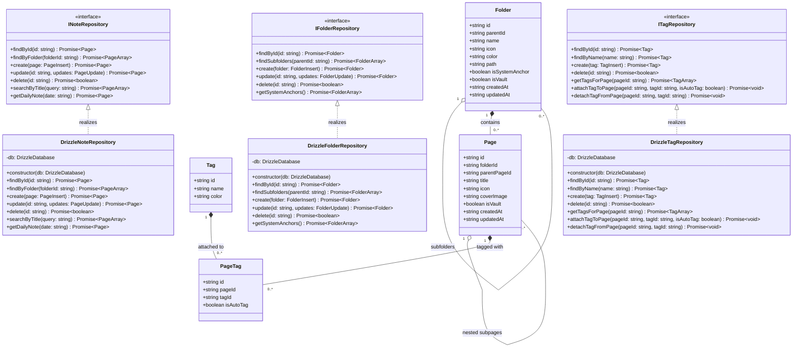

### 2.2 Interface & Entity Contract Details

- **`INoteRepository`**: Handles page CRUD and Daily Note lookup operations. Enforces Zero-Orphans routing into system folders when parent folder ID is omitted.
- **`IFolderRepository`**: Manages recursive folder hierarchies and system anchor retrieval (7 mandatory anchors: Daily Notes, To-Do & Planner, Miscellaneous, Ideas, Vault, Inbox, Flashcards Hub).
- **`ITagRepository`**: Controls flat tag operations and junction record management in `page_tags`.

---

## 3. AI Service Interfaces & Local Intelligence Class Diagrams

Noteee incorporates on-device AI capabilities for embeddings (`all-MiniLM-L6-v2`), local speech-to-text transcription (`whisper.cpp`), text recognition (`Vision OCR`), and auto-filing placement evaluation.

### 3.1 Domain Class Diagram

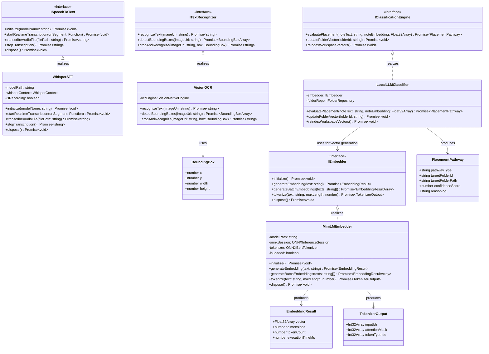

---

## 4. Multi-Modal Capture Strategy Pattern Class Diagrams

The multi-modal capture subsystem uses the **Strategy Pattern** to decouple media acquisition logic from session management and persistence.

### 4.1 Domain Class Diagram

```mermaid
classDiagram
    class CaptureModality {
        <<enumeration>>
        AUDIO
        VIDEO
        IMAGE
        WEB
        TEXT
    }

    class CaptureSessionState {
        <<enumeration>>
        IDLE
        RECORDING
        PROCESSING
        SUGGESTION
        FILED
        CANCELLED
    }

    class RawCapturePayload {
        +string sourceMetadata
        +string[] binaryPaths
        +string textPayload
        +Record~string, any~ metadata
    }

    class CaptureSession {
        +string id
        +CaptureSessionState status
        +CaptureModality mediaType
        +string targetFolderId
        +string targetPageId
        +Record~string, any~ sessionData
        +string createdAt
        +string updatedAt
    }

    class ICaptureSource {
        <<interface>>
        +CaptureModality modality
        +boolean isAvailable
        +initialize() Promise~void~
        +startCapture(options: Record~string, any~) Promise~void~
        +pauseCapture() Promise~void~
        +resumeCapture() Promise~void~
        +stopCapture() Promise~RawCapturePayload~
        +dispose() Promise~void~
    }

    class AudioCaptureSource {
        -audioRecorder: AudioRecorder
        -whisperSTT: ISpeechToText
        +CaptureModality modality
        +boolean isAvailable
        +initialize() Promise~void~
        +startCapture(options: Record~string, any~) Promise~void~
        +pauseCapture() Promise~void~
        +resumeCapture() Promise~void~
        +stopCapture() Promise~RawCapturePayload~
        +dispose() Promise~void~
    }

    class VideoCaptureSource {
        -cameraDriver: VideoCameraDriver
        +CaptureModality modality
        +boolean isAvailable
        +initialize() Promise~void~
        +startCapture(options: Record~string, any~) Promise~void~
        +stopCapture() Promise~RawCapturePayload~
        +dispose() Promise~void~
    }

    class ImageCaptureSource {
        -cameraEngine: ExpoCamera
        -visionOCR: ITextRecognizer
        +CaptureModality modality
        +boolean isAvailable
        +initialize() Promise~void~
        +startCapture(options: Record~string, any~) Promise~void~
        +stopCapture() Promise~RawCapturePayload~
        +dispose() Promise~void~
    }

    class WebCaptureSource {
        -htmlParser: WebScraper
        +CaptureModality modality
        +boolean isAvailable
        +initialize() Promise~void~
        +startCapture(options: Record~string, any~) Promise~void~
        +stopCapture() Promise~RawCapturePayload~
        +dispose() Promise~void~
    }

    class TextCaptureSource {
        -clipboardDetector: ClipboardDetector
        +CaptureModality modality
        +boolean isAvailable
        +initialize() Promise~void~
        +startCapture(options: Record~string, any~) Promise~void~
        +stopCapture() Promise~RawCapturePayload~
        +dispose() Promise~void~
    }

    class CaptureSessionManager {
        -activeSession: CaptureSession
        -currentSource: ICaptureSource
        -observers: ICaptureEventObserverArray
        +startSession(modality: CaptureModality, options: Record~string, any~) Promise~CaptureSession~
        +appendMediaChunk(sessionId: string, chunk: RawCapturePayload) Promise~CaptureSession~
        +pauseSession(sessionId: string) Promise~void~
        +resumeSession(sessionId: string) Promise~void~
        +stopCaptureAndProcess(sessionId: string) Promise~CaptureSession~
        +confirmPlacement(sessionId: string, targetFolderId: string, targetPageId: string) Promise~string~
        +cancelSession(sessionId: string) Promise~void~
        +recoverOrphanSessions() Promise~CaptureSessionArray~
    }

    ICaptureSource <|.. AudioCaptureSource : realizes
    ICaptureSource <|.. VideoCaptureSource : realizes
    ICaptureSource <|.. ImageCaptureSource : realizes
    ICaptureSource <|.. WebCaptureSource : realizes
    ICaptureSource <|.. TextCaptureSource : realizes

    CaptureSessionManager o-- ICaptureSource : encapsulates strategy
    CaptureSessionManager *-- CaptureSession : manages lifecycle
    ICaptureSource --> RawCapturePayload : produces
    CaptureSession --> CaptureModality : uses
    CaptureSession --> CaptureSessionState : tracks
```

---

## 5. Notion-Grade Block Type Hierarchy & Data Models

Noteee's block engine uses a recursive composite pattern where pages are constructed as ordered lists of `BaseBlock` instances. Every block record in SQLite contains fixed core tracking attributes (`id`, `pageId`, `parentBlockId`, `type`, `contentJson`, `sortOrder`, `createdAt`, `updatedAt`).

### 5.1 Domain Class Diagram

```mermaid
classDiagram
    class BaseBlock {
        <<abstract>>
        +string id
        +string pageId
        +string parentBlockId
        +string type
        +Record~string, any~ contentJson
        +number sortOrder
        +string createdAt
        +string updatedAt
        +render() JSXElement*
        +toJSON() Record~string, any~*
        +clone() BaseBlock*
    }

    class ParagraphBlock {
        +ParagraphBlockContent contentJson
        +render() JSXElement
        +toJSON() Record~string, any~
        +clone() BaseBlock
    }

    class HeadingBlock {
        +HeadingBlockContent contentJson
        +render() JSXElement
        +toJSON() Record~string, any~
        +clone() BaseBlock
    }

    class TodoBlock {
        +TodoItemBlockContent contentJson
        +render() JSXElement
        +toJSON() Record~string, any~
        +clone() BaseBlock
    }

    class ToggleBlock {
        +ToggleListBlockContent contentJson
        +render() JSXElement
        +toJSON() Record~string, any~
        +clone() BaseBlock
    }

    class CalloutBlock {
        +QuoteBlockContent contentJson
        +render() JSXElement
        +toJSON() Record~string, any~
        +clone() BaseBlock
    }

    class CodeBlock {
        +CodeBlockContent contentJson
        +render() JSXElement
        +toJSON() Record~string, any~
        +clone() BaseBlock
    }

    class MathBlock {
        +LatexMathBlockContent contentJson
        +render() JSXElement
        +toJSON() Record~string, any~
        +clone() BaseBlock
    }

    class ImageBlock {
        +ImageEmbedBlockContent contentJson
        +render() JSXElement
        +toJSON() Record~string, any~
        +clone() BaseBlock
    }

    class AudioBlock {
        +AudioBlockContent contentJson
        +render() JSXElement
        +toJSON() Record~string, any~
        +clone() BaseBlock
    }

    class SubpageLinkBlock {
        +PageLinkBlockContent contentJson
        +render() JSXElement
        +toJSON() Record~string, any~
        +clone() BaseBlock
    }

    class CanvasEmbedBlock {
        +CanvasEmbedBlockContent contentJson
        +render() JSXElement
        +toJSON() Record~string, any~
        +clone() BaseBlock
    }

    class FlashcardClozeBlock {
        +FlashcardClozeBlockContent contentJson
        +render() JSXElement
        +toJSON() Record~string, any~
        +clone() BaseBlock
    }

    BaseBlock <|-- ParagraphBlock : inherits
    BaseBlock <|-- HeadingBlock : inherits
    BaseBlock <|-- TodoBlock : inherits
    BaseBlock <|-- ToggleBlock : inherits
    BaseBlock <|-- CalloutBlock : inherits
    BaseBlock <|-- CodeBlock : inherits
    BaseBlock <|-- MathBlock : inherits
    BaseBlock <|-- ImageBlock : inherits
    BaseBlock <|-- AudioBlock : inherits
    BaseBlock <|-- SubpageLinkBlock : inherits
    BaseBlock <|-- CanvasEmbedBlock : inherits
    BaseBlock <|-- FlashcardClozeBlock : inherits
```

---

## 6. FSRS Spaced Repetition Engine Class Diagrams

Noteee schedules smart flashcards (Cloze deletion & Q&A) using the **Free Spaced Repetition Scheduler (FSRS v5.0.x)** algorithm implemented via `ts-fsrs`.

### 6.1 Domain Class Diagram

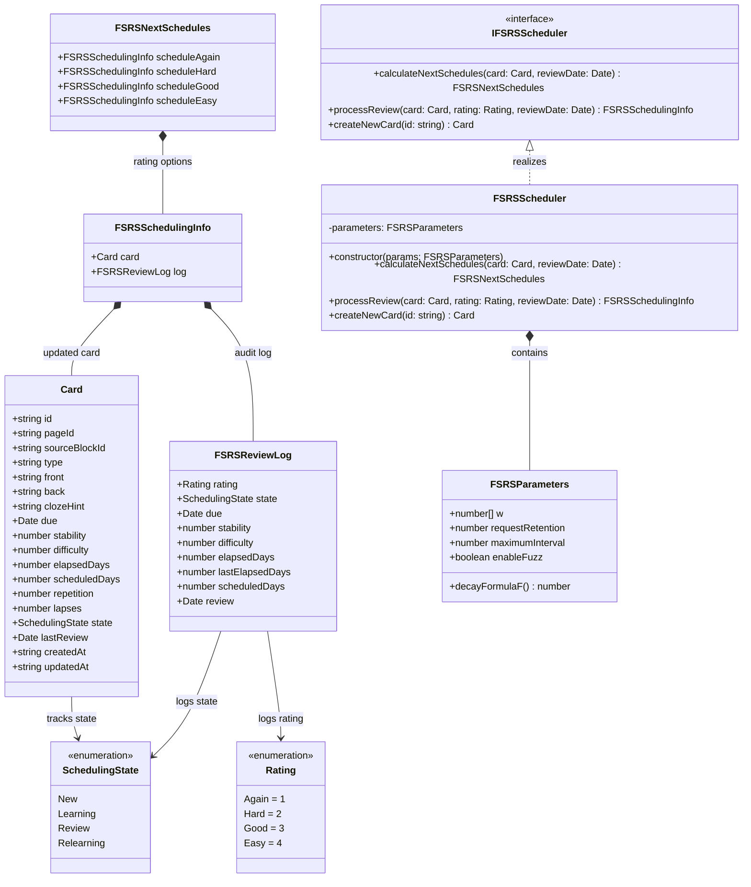

---

## 7. Billing Provider & Entitlement Adapter Class Diagrams

The billing provider adapter abstracts payment SDKs (`react-native-purchases` for RevenueCat) behind `IBillingAdapter`, ensuring isolated monetization checks.

### 7.1 Domain Class Diagram

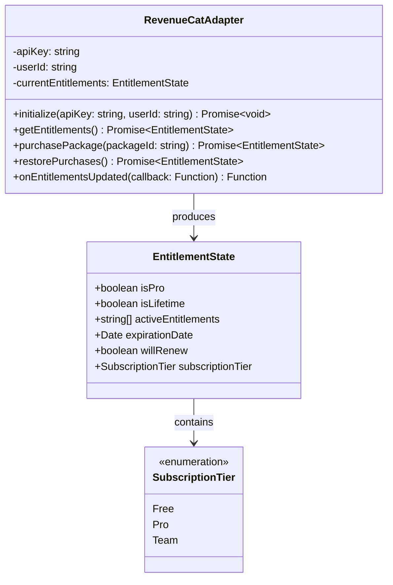

---

## 8. Cross-Domain Class Relationship Macro Map

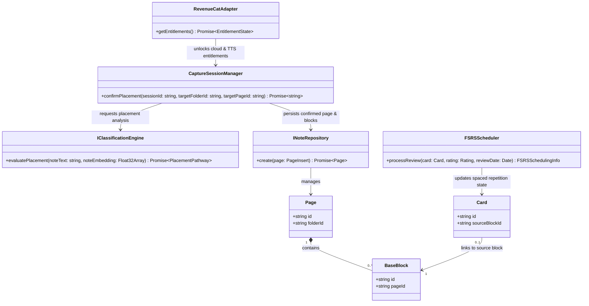

---

## 9. Multi-Modal Agentic RAG Subsystem Class Diagrams (`IRagEngine`)

The Multi-Modal Agentic RAG subsystem isolates query decomposition, hybrid Reciprocal Rank Fusion (RRF) retrieval, and reflective evaluation behind `IRagEngine`.

### 9.1 Domain Class Diagram

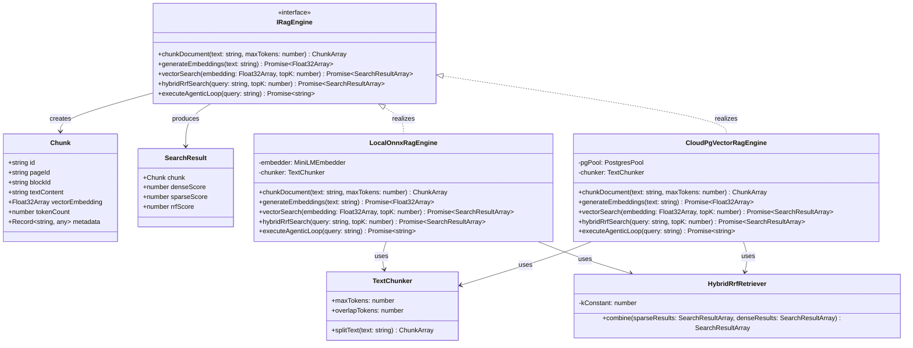

---

## 10. Spatial R-Tree Canvas Index Class Diagrams (`IStrokeSpatialIndex`)

The spatial stroke indexing engine provides $O(\log N)$ spatial query resolution over infinite GPU Skia vector canvas paths.

### 10.1 Domain Class Diagram

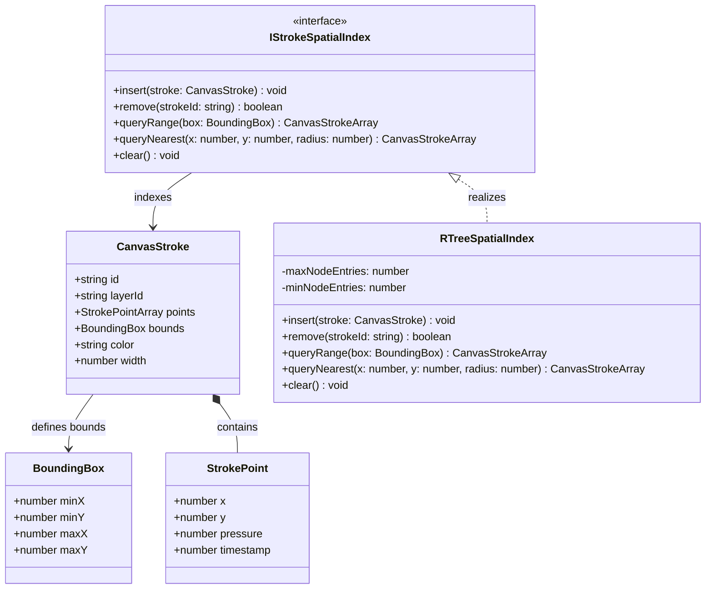

---

## 11. Asynchronous Job Queue Class Diagrams (`IJobQueueAdapter`)

The job queue subsystem wraps BullMQ over Redis Cluster DB 2 to handle background task dispatch, worker concurrency, and retry strategies.

### 11.1 Domain Class Diagram

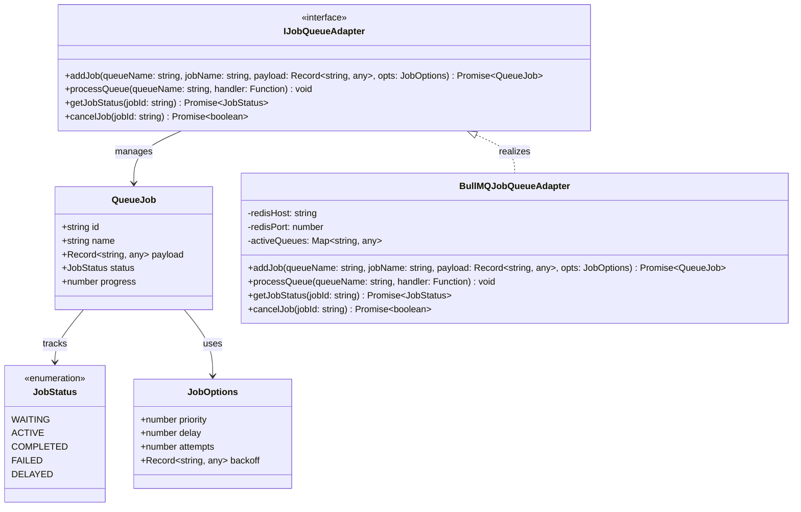

---

## 12. Tiered Rate Limiter Class Diagrams (`IRateLimiter`)

The cloud rate limiter enforces multi-tenant token bucket and sliding window rate limiting backed by Redis Cluster DB 0 Lua scripts.

### 12.1 Domain Class Diagram

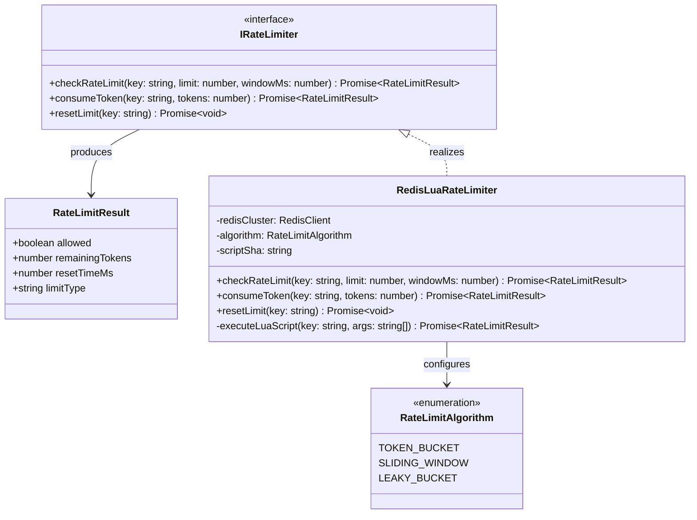

---

## 13. PDF Annotation & Occlusion Engine Class Diagrams (`IPdfAnnotationEngine`)

The PDF Annotation & Occlusion Engine handles text quad snapping and FSRS image occlusion mask creation for active recall study workflows.

### 13.1 Domain Class Diagram

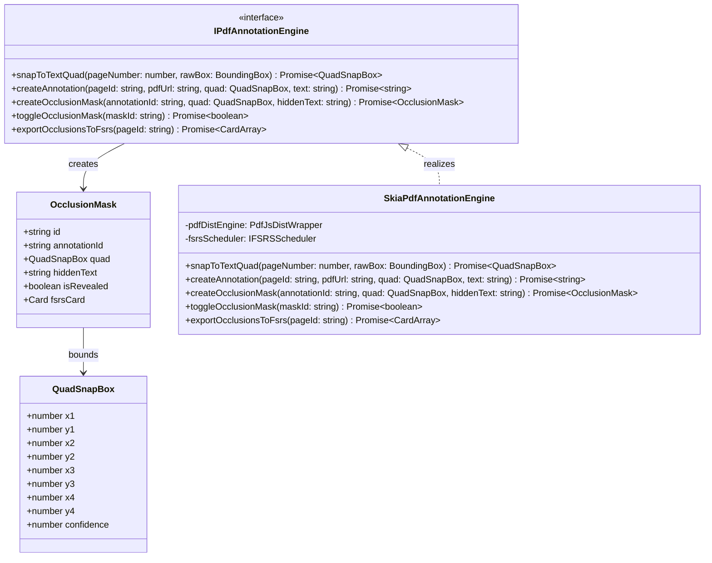

---

## 14. Multi-Source Monetization, BYOK & AdMob Class Diagrams (`IBillingAdapter`)

The monetization adapter provides a unified domain boundary over RevenueCat subscriptions, Bring-Your-Own-Key (BYOK) hardware-secured key management, and AdMob banner ads for Free Tier users.

### 14.1 Domain Class Diagram

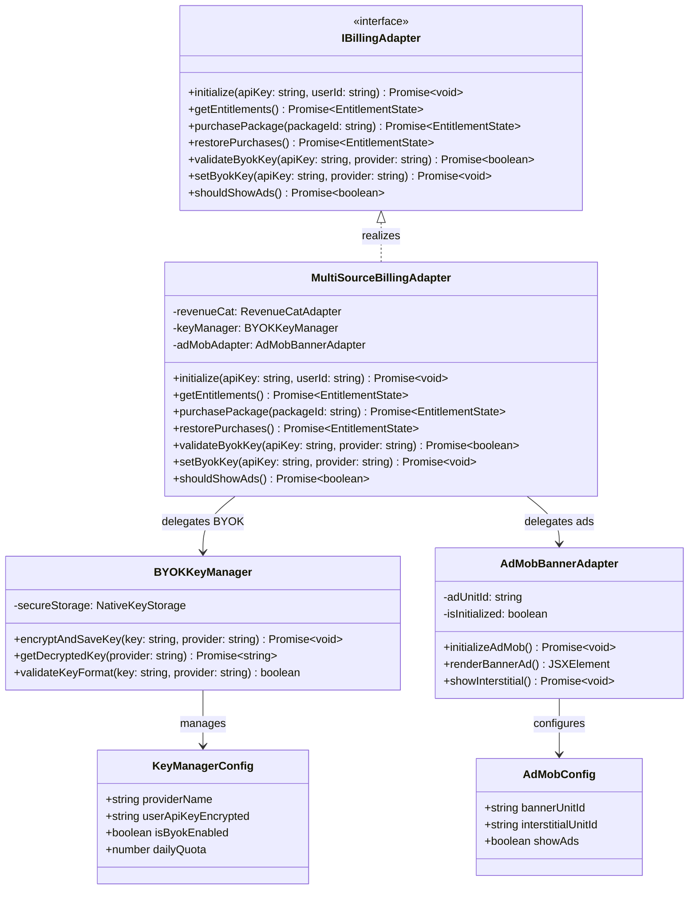

---

## 15. Safety Guardrail Pipeline Class Diagrams (`ISafetyGuardrail`)

The safety guardrail pipeline enforces PII scrubbing, prompt injection canary detection, and HTML/XSS input sanitization across all AI and user data boundaries.

### 15.1 Domain Class Diagram

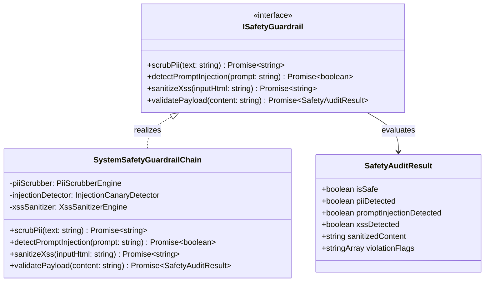

---
*End of Class Diagrams Specification (`11_class_diagrams.md`)*
