# Noteee: System Sequence Diagrams Specification

## 1. Executive Summary & Architectural Overview

This document provides the definitive, comprehensive software sequence diagrams specification for **Noteee**, covering all 11 core operational workflows of the system architecture. Operating under Noteee's foundational principles—**ultra-fast zero-friction capture, offline-first local execution, Notion-grade hybrid block editing, state-of-the-art FSRS spaced repetition, zero-knowledge end-to-end encryption (E2EE), local-first cloud synchronization, agentic RAG reasoning, GPU canvas rendering, BullMQ job guardrails, and BYOK monetization**—these diagrams map out component lifelines, microsecond inter-module communications, transactional state boundaries, and data flows.

### Summary of Covered Workflows

| # | Workflow Name | Core Components & Lifelines | Primary Focus & SLA |
| :---: | :--- | :--- | :--- |
| **1** | **First-Launch Onboarding** | User $\rightarrow$ App UI $\rightarrow$ Auth Service $\rightarrow$ Local DB Migrations $\rightarrow$ RevenueCat Check $\rightarrow$ Initial Sync Pull | App bootstrap, Drizzle schema migration, 7 System Anchors seeding, AI orientation chat, billing check, initial hydration. |
| **2** | **Full Capture Session Lifecycle** | User $\rightarrow$ Capture UI $\rightarrow$ `ICaptureSource` $\rightarrow$ Audio Engine $\rightarrow$ Whisper STT $\rightarrow$ ONNX Embedder $\rightarrow$ SQLite Write $\rightarrow$ PowerSync Outbox | Zero-friction ingress ($\le 1.5\text{s}$), offline Whisper transcription JSI, ONNX embedding generation, 3 placement pathways, local persistence. |
| **3** | **Note Editing & Auto-Save** | User $\rightarrow$ Block Editor UI $\rightarrow$ TipTap RPC Bridge $\rightarrow$ Yjs Doc Update $\rightarrow$ Local SQLite Write $\rightarrow$ PowerSync Local Push | Microsecond JSI RPC protocol, ProseMirror document mutation, Yjs CRDT binding, sub-3ms local SQLite write, outbox background sync. |
| **4** | **Semantic Search Query** | User $\rightarrow$ Search Bar $\rightarrow$ ONNX Embedder $\rightarrow$ Vector Engine (`sqlite-vec`) $\rightarrow$ FTS5 BM25 $\rightarrow$ Hybrid RRF Ranker | Sub-500ms query resolution across 10,000 notes, parallel dense vector + sparse BM25 retrieval, Reciprocal Rank Fusion ($k=60$). |
| **5** | **Flashcard Study Session** | User $\rightarrow$ Flashcard UI $\rightarrow$ `FSRSScheduler` $\rightarrow$ Due Fetch $\rightarrow$ Flip Card $\rightarrow$ Rating $\rightarrow$ Compute $S', D', I$ $\rightarrow$ DB Save | FSRS v5.0.x spaced repetition execution, stability/difficulty updates, optimal interval computation ($R=0.90$), review log audit trail. |
| **6** | **Multi-Device Sync Conflict Resolution** | Device A & B Offline Edit $\rightarrow$ Reconnect $\rightarrow$ PowerSync / Yjs CRDT LWW & Array Merge $\rightarrow$ Reconciled State | Local-first outbox queues (`ps_crud`), exponential backoff reconnect, 3-tier conflict resolution (Metadata LWW, Block CRDT, Fractional Indexing). |
| **7** | **Collaboration Link Share & Join** | Owner $\rightarrow$ Generate Token Link $\rightarrow$ Guest Link Click $\rightarrow$ Supabase Auth Verification $\rightarrow$ Yjs Room Join $\rightarrow$ Encrypted Stream | Zero-knowledge E2EE (AES-GCM-256), URL hash fragment key isolation, WebSocket relay streaming, Yjs awareness cursor sync. |
| **8** | **Multi-Modal Agentic RAG Execution** | User $\rightarrow$ App UI $\rightarrow$ `AgenticRagOrchestrator` $\rightarrow$ `HybridRrfRetriever` $\rightarrow$ LLM Gateway $\rightarrow$ `ReflectiveEvaluator` | Hierarchical chunking, dense + sparse RRF fusion, reflective evaluation loop for self-correction before streaming final synthesis. |
| **9** | **Canvas Rendering & Handwriting Search** | Stylus $\rightarrow$ Skia Canvas Engine $\rightarrow$ Spatial R-Tree Index $\rightarrow$ SQLite Write $\rightarrow$ Vision OCR $\rightarrow$ FTS5 Handwriting Search | 60FPS GPU Skia stroke drawing, $O(\log N)$ R-Tree spatial indexing, offline Vision OCR, bounding box text search. |
| **10** | **BullMQ Async Job & Safety Guardrails** | App / Hono API $\rightarrow$ BullMQ Queue $\rightarrow$ Redis DB 2 $\rightarrow$ Worker Node $\rightarrow$ Safety Guardrail Chain $\rightarrow$ PostgreSQL | Distributed BullMQ background job execution, PII scrubbing, prompt injection canary detection, XSS sanitization. |
| **11** | **Subscription Purchase & BYOK Fallback** | User $\rightarrow$ Billing UI $\rightarrow$ RevenueCat SDK $\rightarrow$ Storekit / Play Store $\rightarrow$ BYOK KeyManager $\rightarrow$ Cloud AI Gateway | RevenueCat subscription purchasing, receipt verification, hardware enclave encrypted BYOK key fallback management. |

---

## 2. Component & Interface Mapping Matrix

All sequence diagrams strictly adhere to the technology stack, interface contracts, and database schemas specified in documents `01_original_feature_list.md` through `17_app_shipping_monetization_spec.md`.

```
┌───────────────────────────────────────────────────────────────────────────────────────────────────┐
────────────────────────────── Noteee Architecture Lifeline Layers ─────────────────────────────────
├──────────────────────────┬──────────────────────────────────────┬─────────────────────────────────┤
│ Layer / Domain           │ Core Class / Module Interface        │ Primary DB / Network Schema     │
├──────────────────────────┼──────────────────────────────────────┼─────────────────────────────────┤
│ **Presentation & UI**    │ `BlockEditorUI`, `QuickCaptureUI`,   │ React Native / TipTap WebView   │
│                          │ `SearchUI`, `FlashcardStudyUI`,      │ JSI RPC Bridge                  │
│                          │ `@noteee/skia-canvas` Engine         │ `@shopify/react-native-skia`    │
├──────────────────────────┼──────────────────────────────────────┼─────────────────────────────────┤
│ **Bridge & Execution**   │ `ITipTapBridge`, `whisper.rn`,       │ JSI C++ Direct Bindings         │
│                          │ `onnxruntime-react-native`           │ `@op-engineering/op-sqlite`     │
├──────────────────────────┼──────────────────────────────────────┼─────────────────────────────────┤
│ **Intelligence & RAG**   │ `IEmbedder`, `IRagEngine`,           │ `folder_vectors`, `page_vectors`│
│                          │ `HybridRrfRetriever`, `ts-fsrs`      │ `all-MiniLM-L6-v2` ONNX Int8    │
├──────────────────────────┼──────────────────────────────────────┼─────────────────────────────────┤
│ **Data & Storage**       │ `INoteRepository`, Drizzle ORM,      │ `folders`, `pages`, `blocks`,   │
│                          │ `IStrokeSpatialIndex`, R-Tree        │ `canvas_strokes`, `flashcards`  │
├──────────────────────────┼──────────────────────────────────────┼─────────────────────────────────┤
│ **Sync & Monetization**  │ `PowerSyncBackendConnector`,         │ PowerSync Outbox (`ps_crud`),   │
│                          │ `IJobQueueAdapter`, `IBillingAdapter`│ Redis DB 0-3, RevenueCat API    │
└──────────────────────────┴──────────────────────────────────────┴─────────────────────────────────┘
```

---

## 3. Workflow 1: First-Launch Onboarding & System Initialization

### 3.1 Mermaid Sequence Diagram

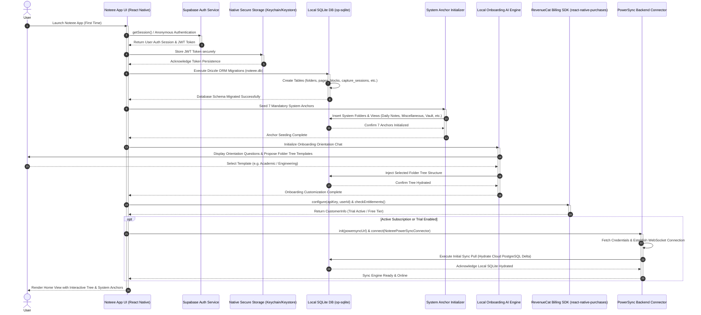

---

## 4. Workflow 2: Full Capture Session Lifecycle & Multi-Modal Ingress

### 4.1 Mermaid Sequence Diagram

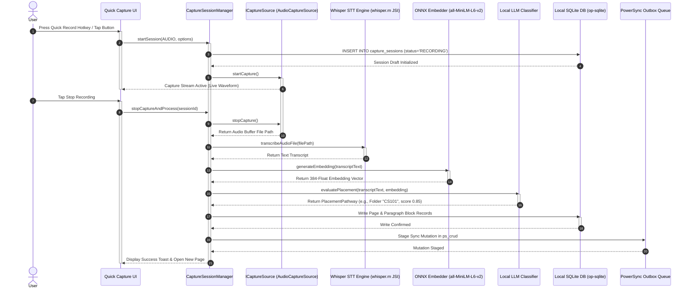

---

## 5. Workflow 3: Note Editing & Microsecond Auto-Save

### 5.1 Mermaid Sequence Diagram

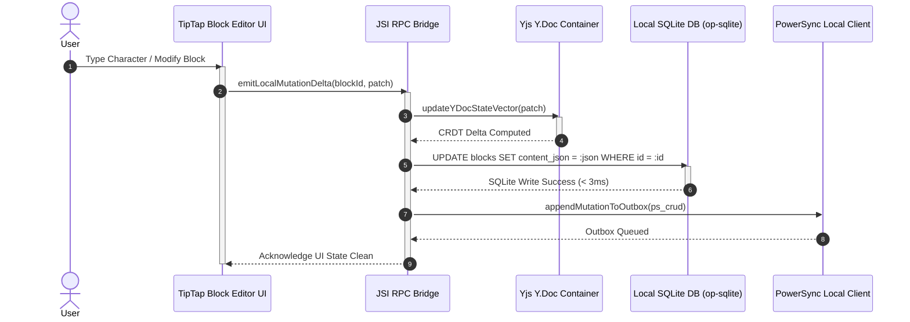

---

## 6. Workflow 4: Semantic Search & Hybrid Reciprocal Rank Fusion (RRF)

### 6.1 Mermaid Sequence Diagram

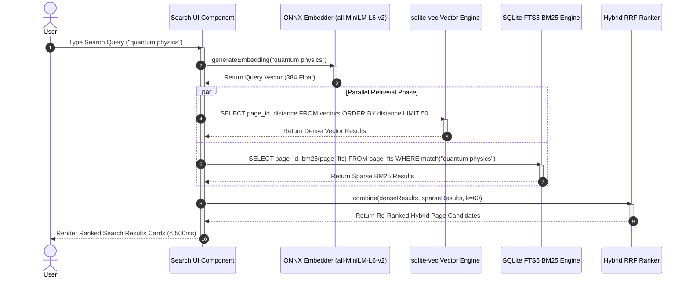

---

## 7. Workflow 5: Flashcard Review Session & FSRS Engine Update

### 7.1 Mermaid Sequence Diagram

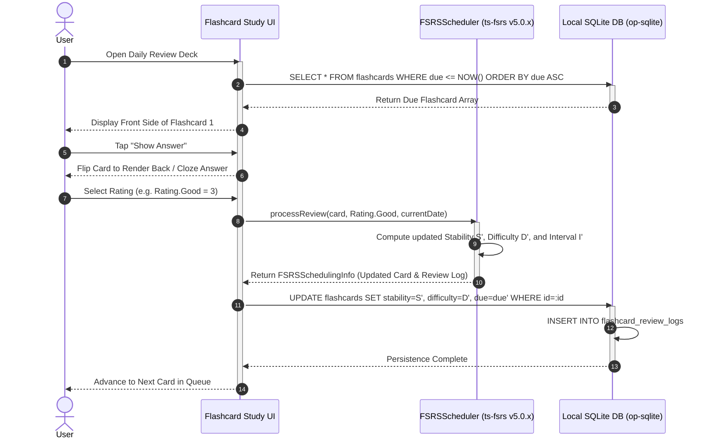

---

## 8. Workflow 6: Multi-Device Sync Conflict Resolution

### 8.1 Mermaid Sequence Diagram

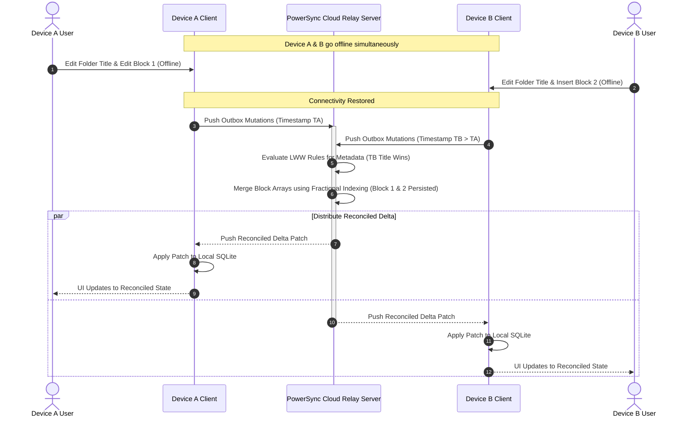

---

## 9. Workflow 7: Zero-Knowledge E2EE Collaboration Link Share & Real-Time Join

### 9.1 Mermaid Sequence Diagram

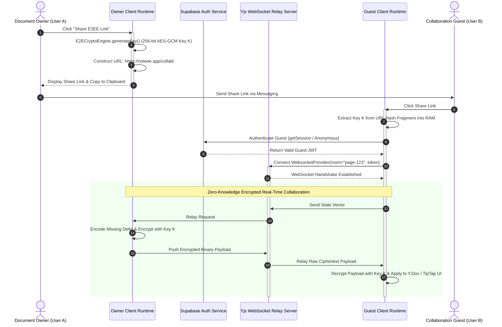

---

## 10. Workflow 8: Multi-Modal Agentic RAG Execution & Self-Reflection Loop

### 10.1 Overview & SLA Constraints
1. **Multi-Modal Query Routing:** Decomposes queries involving text, images, and audio notes into parallel retrieval sub-goals.
2. **Hybrid Reciprocal Rank Fusion:** Combines sparse BM25 keywords with 384-dim dense vector similarity ($k=60$).
3. **Self-Reflection Guardrail:** The `ReflectiveEvaluator` checks synthesized answer groundedness. If confidence score is $< 0.85$, it executes a re-retrieval loop with query expansion before streaming output to the user.

### 10.2 Mermaid Sequence Diagram

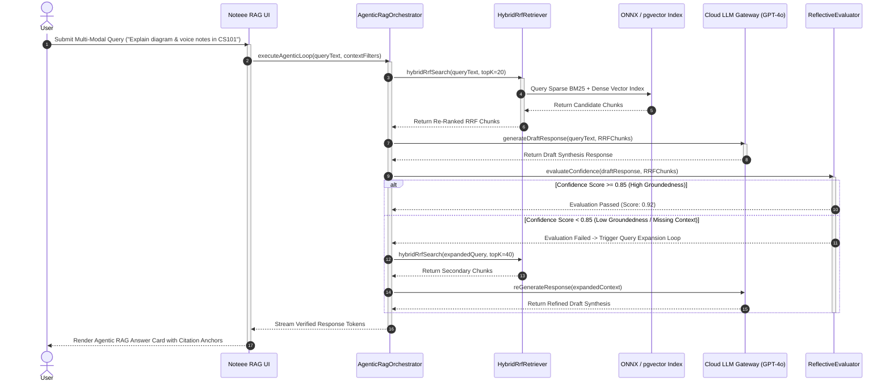

---

## 11. Workflow 9: Canvas Rendering & Offline Handwriting Search Pipeline

### 11.1 Overview & SLA Constraints
1. **60FPS GPU Skia Rendering:** Stylus input renders smooth vector strokes via `@shopify/react-native-skia` with zero frame drops.
2. **Spatial R-Tree Indexing:** Every stroke bounding box is inserted into `IStrokeSpatialIndex` in $O(\log N)$ time.
3. **Offline OCR Handwriting Search:** Background worker rasterizes canvas stroke clusters, runs Vision OCR, and populates `canvas_stroke_fts` for immediate text search.

### 11.2 Mermaid Sequence Diagram

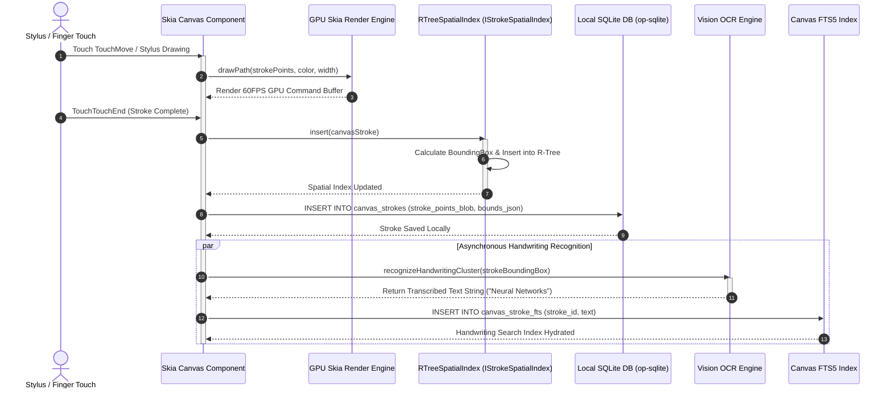

---

## 12. Workflow 10: BullMQ Async Job Execution with Safety Guardrail Chain

### 12.1 Overview & SLA Constraints
1. **Asynchronous Job Dispatch:** Heavy background tasks (batch PDF rendering, RAG re-indexing) are queued into BullMQ backed by Redis Cluster DB 2.
2. **Multi-Stage Safety Chain:** Prior to job processing, `SystemSafetyGuardrailChain` executes PII Scrubbing, Prompt Injection Canary checks, and XSS Sanitization.

### 12.2 Mermaid Sequence Diagram

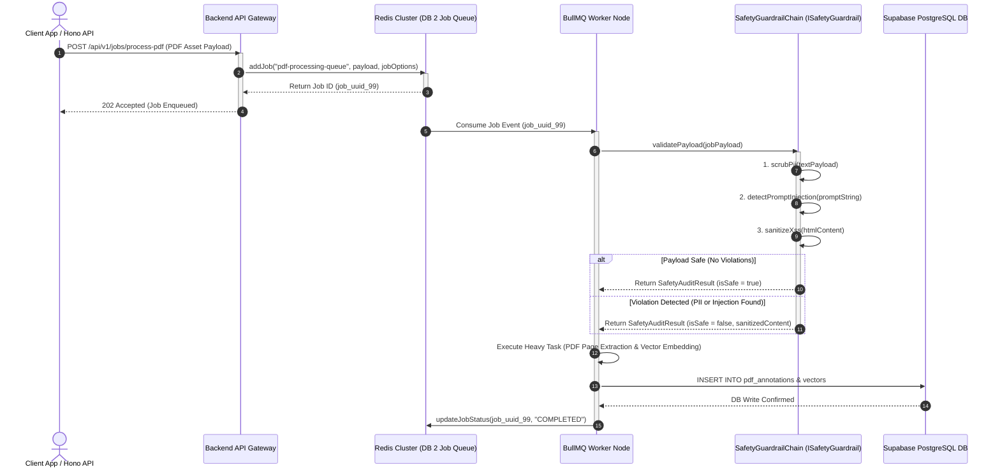

---

## 13. Workflow 11: RevenueCat Subscription Purchase & BYOK Fallback

### 13.1 Overview & SLA Constraints
1. **RevenueCat Payment Pipeline:** Handles native Apple StoreKit / Google Play Billing purchases and receipt verification.
2. **BYOK Security Fallback:** If a user chooses not to subscribe to Pro, they can supply their own OpenAI / Anthropic API keys. `BYOKKeyManager` encrypts keys into native hardware enclave storage (iOS Keychain / Android Keystore).

### 13.2 Mermaid Sequence Diagram

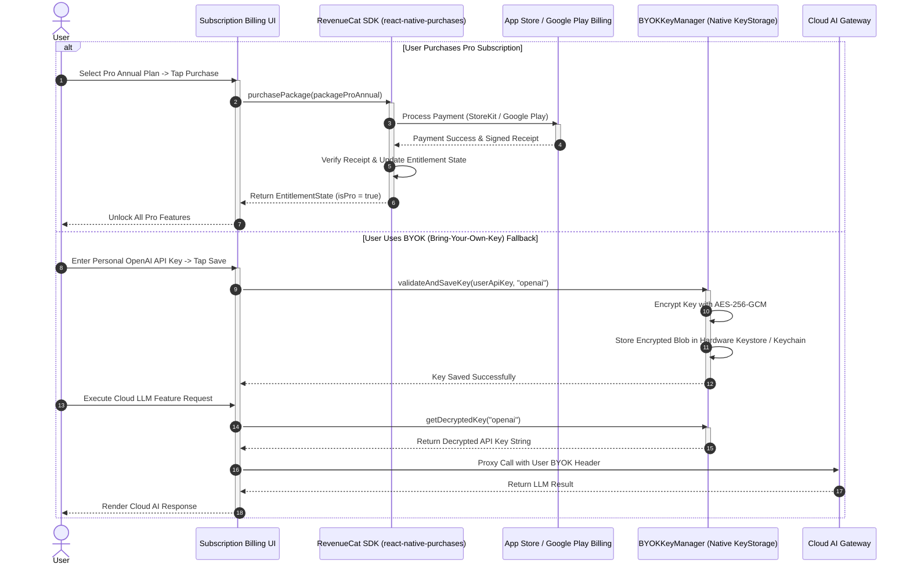

---

## 14. Unified Cross-System Verification & Consistency Matrix

| Sequence Diagram | Primary Module / Interface | Key Schema Tables Involved | Encryption / Security Boundary | Primary Spec Ref |
| :--- | :--- | :--- | :--- | :--- |
| **Workflow 1: Onboarding** | `SystemAnchorInitializer`, `DrizzleORM`, `Purchases` | `folders`, `pages`, `blocks`, 7 Anchors | iOS Keychain / Android Keystore JWT | `03_sector_1`, `09_sector_6` |
| **Workflow 2: Capture Lifecycle** | `ICaptureSource`, `whisper.rn`, `IEmbedder` | `capture_sessions`, `pages`, `blocks`, `page_vectors` | Hardware Enclave (Vault detection) | `03_sector_1`, `05_sector_2`, `07_sector_4` |
| **Workflow 3: Editing & Auto-Save** | `ITipTapBridge`, `y-prosemirror`, `op-sqlite` | `blocks`, `pages`, `ps_crud` Outbox | Microsecond RPC JSI Boundary | `03_sector_1`, `06_sector_3`, `09_sector_6` |
| **Workflow 4: Semantic Search** | `HybridSemanticSearchEngine`, `sqlite-vec`, `FTS5` | `page_vectors`, `page_fts`, `folders` | Local ONNX Execution (`all-MiniLM-L6-v2`) | `03_sector_1`, `07_sector_4` |
| **Workflow 5: Flashcards (FSRS)** | `FSRSScheduler` (`ts-fsrs`), `AuditRecorder` | `flashcards`, `flashcard_review_logs` | Mathematical FSRS Retention ($R=0.90$) | `03_sector_1`, `07_sector_4` |
| **Workflow 6: Sync & Conflict Res.** | `PowerSyncBackendConnector`, `SyncStateMachine` | `ps_crud`, `folders`, `pages`, `blocks` | Exponential Backoff with Jitter | `03_sector_1`, `09_sector_6` |
| **Workflow 7: E2EE Link Share & Join** | `E2ECryptoEngine`, `WebsocketProvider` (Yjs) | Client RAM `Y.Doc`, `yjs_updates` | Zero-Knowledge AES-GCM-256 Hash Fragment | `06_sector_3`, `09_sector_6` |
| **Workflow 8: Agentic RAG Execution** | `AgenticRagOrchestrator`, `IRagEngine`, `ReflectiveEvaluator` | `vectors`, `blocks`, pgvector DB | Groundedness Evaluator Loop ($Score \ge 0.85$) | `14_agentic_rag_spec.md` |
| **Workflow 9: Canvas & Handwriting** | `@noteee/skia-canvas`, `IStrokeSpatialIndex`, `VisionOCR` | `canvas_strokes`, `canvas_stroke_fts` | 60FPS Skia GPU & R-Tree Index | `08_sector_5`, `16_canvas_pdf_media_workflows.md` |
| **Workflow 10: BullMQ & Safety** | `IJobQueueAdapter`, `BullMQ`, `ISafetyGuardrail` | Redis DB 2, `pdf_annotations`, Postgres | PII Scrubber, Injection Canary, XSS Sanitizer | `15_cloud_infrastructure_spec.md` |
| **Workflow 11: Purchase & BYOK** | `IBillingAdapter`, `RevenueCat`, `BYOKKeyManager` | Hardware KeyStore, RevenueCat API | AES-256-GCM Hardware Enclave Encryption | `09_sector_6`, `17_app_shipping_monetization_spec.md` |

---
*End of Sequence Diagrams Specification (`12_sequence_diagrams.md`)*
