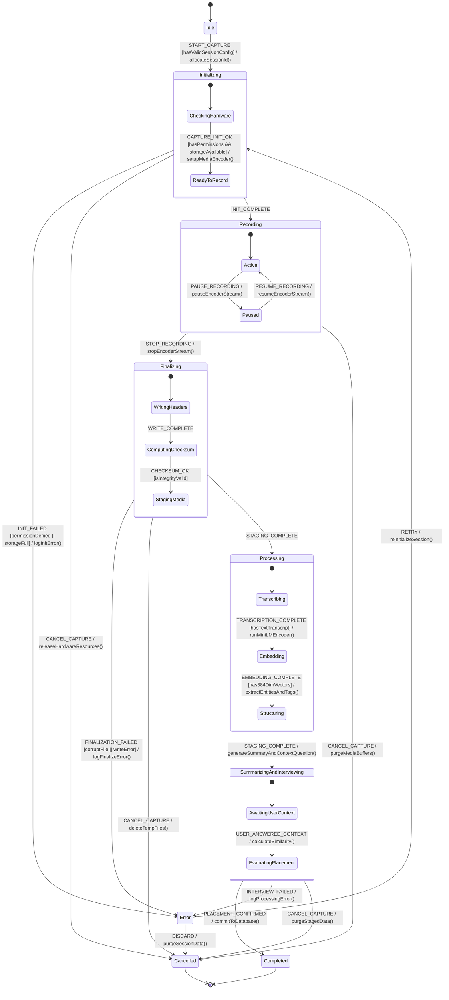
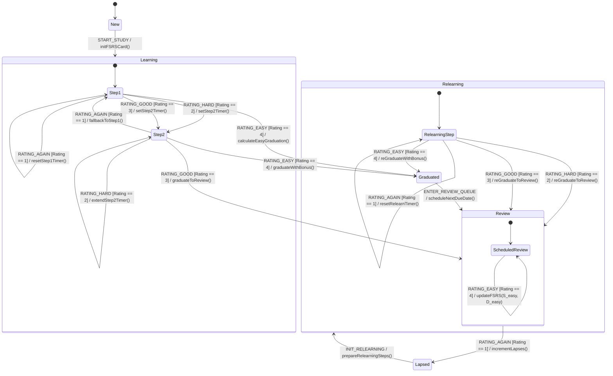
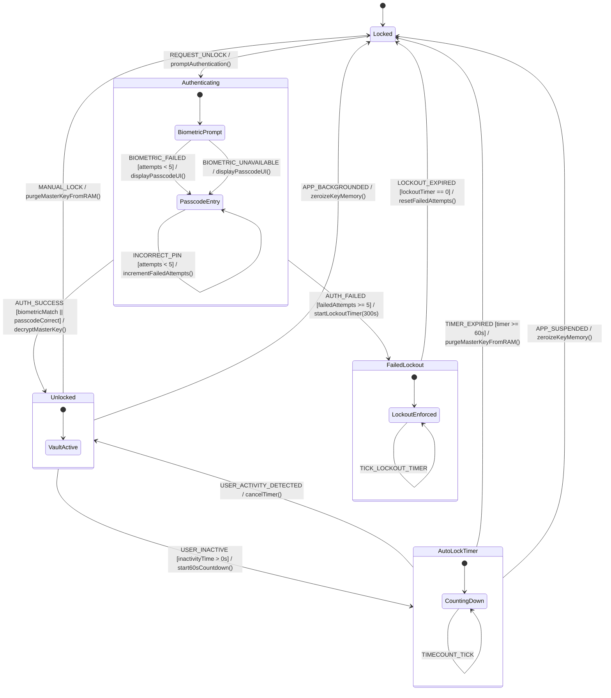
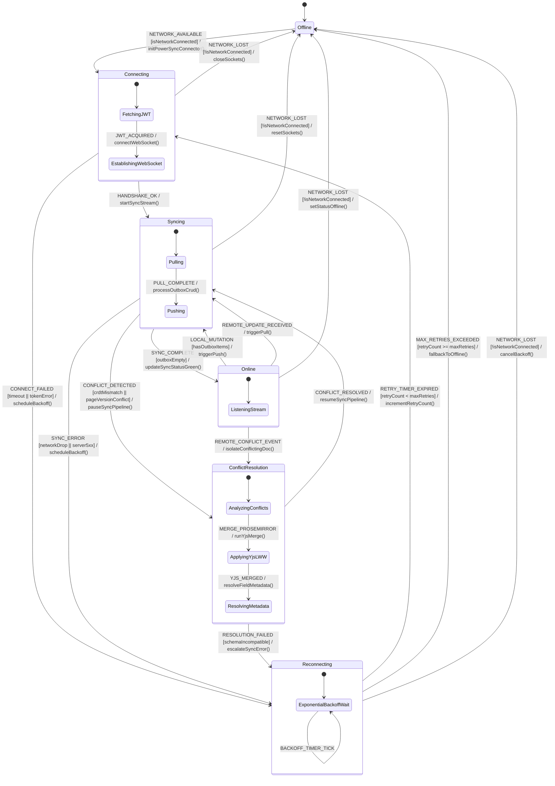
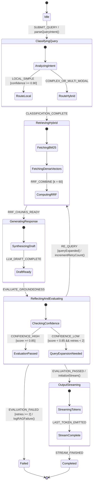
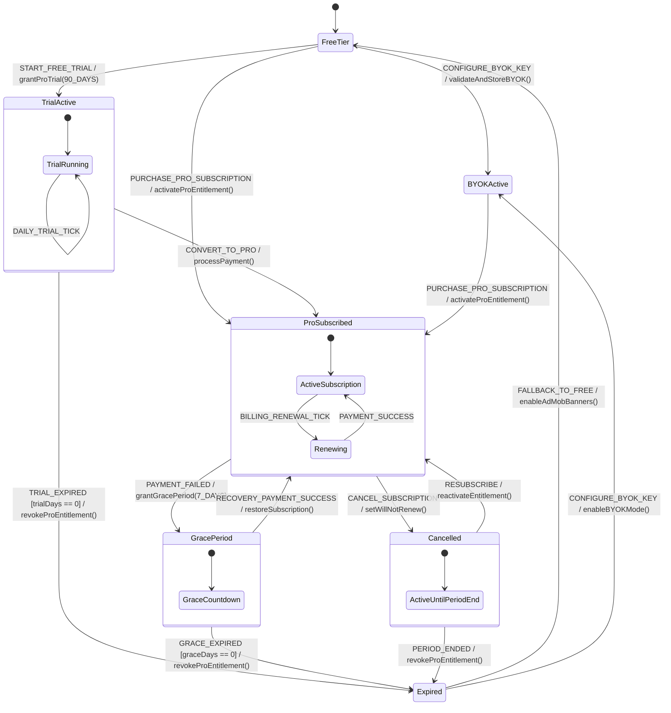
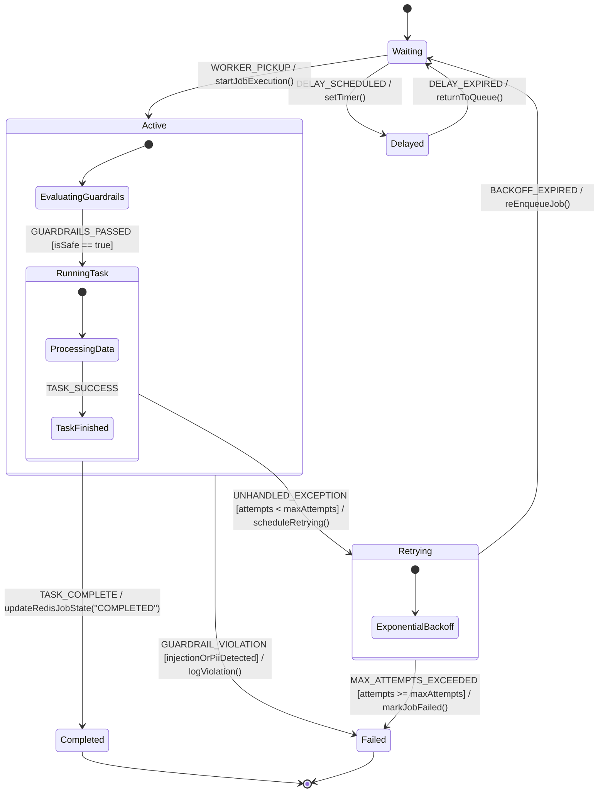
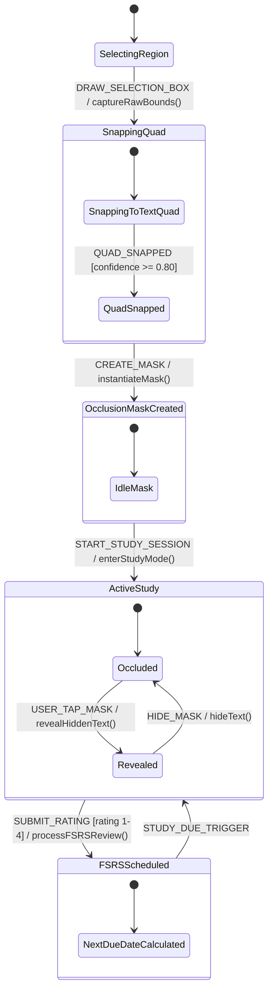

# Noteee: Software State Machines Specification

**Document Identifier:** `13_state_machines.md`  
**System Target:** Noteee Cross-Platform Notebook Architecture  
**Dependencies:** `01_original_feature_list.md` through `17_app_shipping_monetization_spec.md`  
**Specification Version:** 1.0.0 (Production Release)  

---

## 1. Executive Summary & State Architecture Principles

Noteee relies on deterministic Finite State Machines (FSMs) to govern its core reactive subsystems: **Multi-Modal Capture Engine**, **Spaced Repetition Flashcards (FSRS v5.0.x)**, **Encrypted Vault Security**, **Local-First Cloud Synchronization**, **Agentic RAG Query Control**, **Subscription Entitlements**, **BullMQ Job Lifecycles**, and **PDF Occlusion Masks**. In a local-first, offline-ready architecture, dynamic runtime entities must maintain deterministic state transitions, clear data invariants, crash recovery mechanisms, and strict error handling boundaries.

### Core Architectural Directives
1. **Deterministic State Transitions:** State transitions are pure functions of `(CurrentState, TriggerEvent, GuardConditions) => (NextState, SideEffects)`. Invalid or non-permitted transitions produce immediate exception handling without altering persistent state.
2. **Offline-First State Persistence:** Critical state transitions (e.g., active capture buffering, FSRS review score logs, outbox queueing) write atomically to SQLite buffers (`capture_sessions`, `ps_crud`, `blocks`, `pages`). Cold launches or process kills restore exact prior states.
3. **Composite & Nested Isolation:** Complex lifecycles (e.g., capture session recording/processing, flashcard learning/relearning steps, RAG control loops, sync push/pull loops) use composite/nested states to encapsulate sub-state transitions without leaking internal state noise to external system observers.
4. **Security & Memory Safety Invariants:** Cryptographic secrets and decrypted data models exist in RAM exclusively during `Unlocked` states and undergo zero-fill key purging immediately upon entering `Locked`, `AutoLockTimer` expiration, or app process suspension.

---

## 2. Standardized FSM Specification Conventions

All state machine diagrams and specification tables in this document conform to standard Unified Modeling Language (UML) / Mermaid `stateDiagram-v2` syntax using the following formal notation:

| Component | Syntax Format | Description | Example |
| :--- | :--- | :--- | :--- |
| **State Name** | `PascalCase` | Standard identifier for top-level and nested composite states. | `Recording`, `BiometricPrompt`, `Syncing` |
| **Trigger Event** | `UPPER_SNAKE_CASE` | Event string emitting from UI actions, timers, or network triggers. | `START_CAPTURE`, `RATING_GOOD`, `LOCK_TIMEOUT` |
| **Guard Condition** | `[camelCaseCondition]` | Boolean predicate evaluated prior to executing state transition. | `[hasPermissions]`, `[failedAttempts >= 5]` |
| **Entry Action** | `entry / action()` | Side effect executed upon entering the state. | `entry / startAudioStream()` |
| **Exit Action** | `exit / action()` | Side effect executed immediately prior to leaving the state. | `exit / purgeRAMKeyBuffer()` |
| **Transition Action** | `/ action()` | Action executed during state transition. | `/ commitToDatabase()` |

---

## 3. State Machine 1: Capture Session Lifecycle Specification

### 3.1 Capture Session State Diagram



---

## 4. State Machine 2: Flashcard Review Card Lifecycle Specification (FSRS v5.0.x)

### 4.1 Flashcard Review Card State Diagram



---

## 5. State Machine 3: Vault Lock/Unlock Security Specification

### 5.1 Vault Lock/Unlock State Diagram



---

## 6. State Machine 4: Cloud Sync Connection Lifecycle Specification

### 6.1 Cloud Sync Connection State Diagram



---

## 7. State Machine 5: Agentic RAG Query Control Loop Specification

### 7.1 Agentic RAG Query Control Loop State Diagram



---

## 8. State Machine 6: User Subscription Lifecycle & Entitlements Specification

### 8.1 User Subscription Lifecycle State Diagram



---

## 9. State Machine 7: BullMQ Async Job Lifecycle Specification

### 9.1 BullMQ Async Job Lifecycle State Diagram



---

## 10. State Machine 8: PDF Annotation & FSRS Occlusion Card Specification

### 10.1 PDF Annotation & FSRS Occlusion Card State Diagram



---

## 11. Cross-State Machine Interactions & System Integration Matrix

The 8 state machines operate concurrently, coordinating through the central Event Bus and local SQLite database:

```
┌─────────────────────────┐          Structured Blocks          ┌─────────────────────────┐
│ Capture Session FSM     │ ──────────────────────────────────> │ Vault Security FSM      │
│ (Ingress & Parsing)     │   Sensitive Data Trigger Check      │ (Encryption & Lockout)  │
└─────────────────────────┘                                     └─────────────────────────┘
            │                                                                │
            │ Auto-Generated Cloze Flashcards                                │ Encrypted Page Payload
            ▼                                                                ▼
┌─────────────────────────┐                                     ┌─────────────────────────┐
│ Flashcard / Occlusion   │                                     │ Cloud Sync / BullMQ FSM │
│ (FSRS Spaced Repetition)│ ──────────────────────────────────> │ (PowerSync & Jobs Out)  │
└─────────────────────────┘      Sync Review Logs & Stability   └─────────────────────────┘
```

| Primary Initiating FSM | Event Trigger | Secondary Target FSM | Inter-FSM Reaction & Action |
| :--- | :--- | :--- | :--- |
| **Capture Session** | `Processing.Structuring` complete | **Vault Security FSM** | Sensitive data detector identifies passwords/API keys $\rightarrow$ Triggers prompt for auto-routing into encrypted Vault. |
| **Capture Session** | `Completed` | **Flashcard Review FSM** | AI block parser generates `flashcard_cloze` blocks $\rightarrow$ Instantiates new card record in `New` state in FSRS deck. |
| **Flashcard / Occlusion** | Review rating submitted (`1-4`) | **Cloud Sync FSM** | Rating updates `FSRSCard` parameters in SQLite $\rightarrow$ Inserts mutation row into `ps_crud` outbox for cloud sync. |
| **Vault Security** | Transition to `Locked` | **Cloud Sync FSM** | Clears decrypted Vault page caches in memory; ensures only encrypted ciphertext blobs are passed to PowerSync connector outbox. |
| **Agentic RAG FSM** | `ReflectingAndEvaluating` retry | **Cloud Sync / DB** | Low confidence triggers expanded vector search against local and cloud RRF indices. |
| **Subscription FSM** | Transition to `BYOKActive` | **Agentic RAG FSM** | Decrypts and injects user BYOK API keys into LLM request headers. |
| **BullMQ Job FSM** | `GUARDRAIL_VIOLATION` | **Audit Logger** | Logs injection canary or PII detection flags to Redis security stream. |
| **PDF Occlusion FSM** | `SUBMIT_RATING` | **Flashcard Review FSM** | Integrates image occlusion masks into standard FSRS review queue ($R \ge 0.90$). |

---
*End of State Machines Specification (`13_state_machines.md`)*
