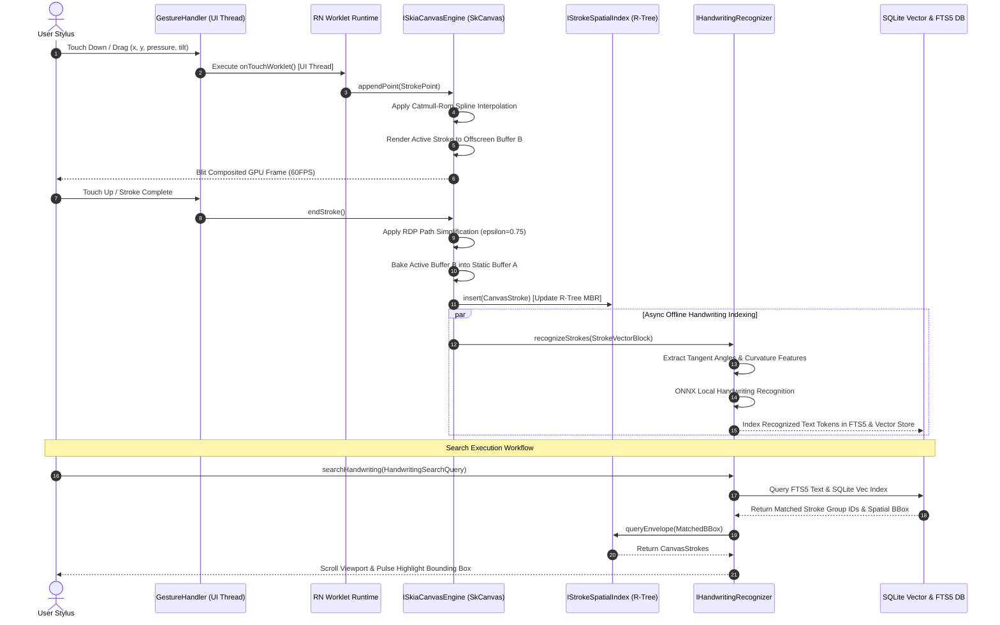
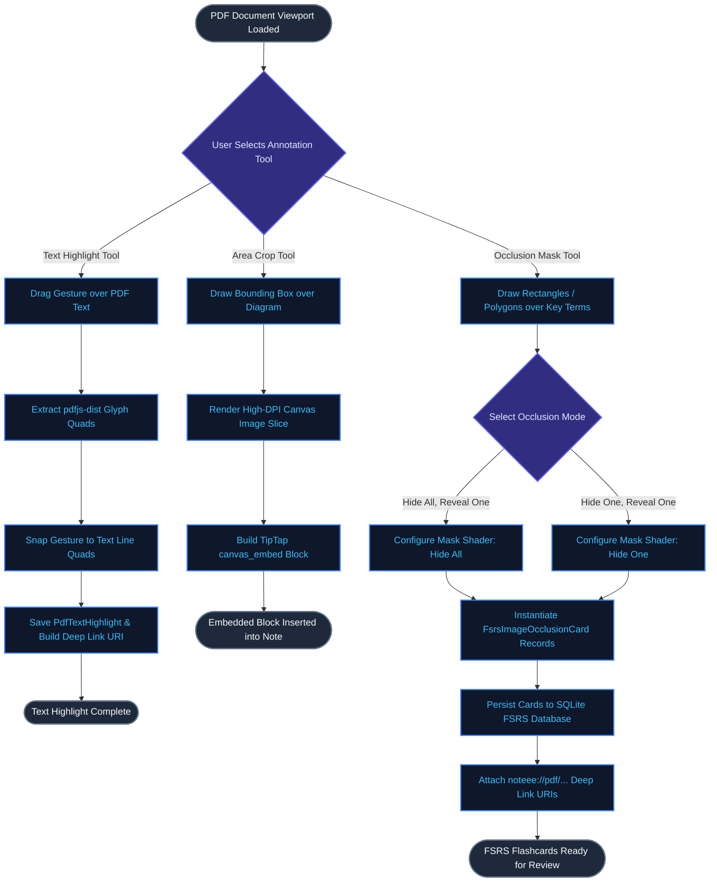

# Noteee: Canvas, PDF & Media Workflows Specification (`16_canvas_pdf_media_workflows.md`)

## 1. Executive Summary & Clean Architecture (`ISkiaCanvasEngine` & DIP Overview)

This specification defines Noteee's high-performance **GPU Skia Canvas Drawing Engine**, **Spatial R-Tree Indexing Engine**, **Offline Handwriting Stroke Search Pipeline**, and **Deep PDF Annotation & Image Occlusion System**. Engineered for Noteee's offline-first, capture-first architecture across React Native (Expo SDK 57) and Next.js 15, this system bridges low-latency digital ink input with spatial stroke querying, multi-modal OCR search, and active recall study workflows.

```
┌───────────────────────────────────────────────────────────────────────────────────────────────────────────────┐
│                               CLEAN ARCHITECTURE: CANVAS & PDF WORKFLOW SYSTEM                                │
├───────────────────────────────────────────────────────────────────────────────────────────────────────────────┤
│  APPLICATION & DOMAIN USE CASES (Core Business Logic)                                                         │
│  ┌─────────────────────────────────────────────────────────────────────────────────────────────────────────┐  │
│  │  CanvasDrawingController | SpatialSelectionService | HandwritingSearchService | PdfOcclusionService     │  │
│  └──────────────────────────────────────────────┬──────────────────────────────────────────────────────────┘  │
│                                                 │ (Strict dependence on Abstract Interfaces)                  │
│                                                 ▼                                                             │
│  ABSTRACT INTERFACE LAYER (Dependency Inversion Principle - DIP)                                              │
│  ┌─────────────────────────────────────────────────────────────────────────────────────────────────────────┐  │
│  │  ISkiaCanvasEngine | IStrokeSpatialIndex | IHandwritingRecognizer | IPdfAnnotationEngine                    │  │
│  └──────────────────────────────────────────────▲──────────────────────────────────────────────────────────┘  │
│                                                 │ (Implements Concrete Domain Contracts)                      │
│  INFRASTRUCTURE ADAPTERS (Strategy, Command & Factory Patterns)                                               │
│  ┌──────────────────────────────────────────────┴──────────────────────────────────────────────────────────┐  │
│  │  ┌─────────────────────────────┐   ┌────────────────────────────┐   ┌────────────────────────────────┐  │  │
│  │  │ SkiaCanvasEngine            │   │ RTreeStrokeIndex           │   │ LocalHandwritingRecognizer     │  │  │
│  │  │ (@shopify/react-native-skia)│   │ (Microsecond Spatial Tree) │   │ (SQLite Vec + FTS5 Pipeline)   │  │  │
│  │  └─────────────────────────────┘   └────────────────────────────┘   └────────────────────────────────┘  │  │
│  │  ┌─────────────────────────────┐   ┌────────────────────────────┐                                       │  │
│  │  │ PdfAnnotationEngine         │   │ FsrsOcclusionCardGenerator │                                       │  │  │
│  │  │ (pdfjs-dist + Quad Snapping)│   │ (ts-fsrs Flashcard Sync)   │                                       │  │  │
│  │  └─────────────────────────────┘   └────────────────────────────┘                                       │  │
│  └──────────────────────────────────────────────────────────────────────────────────────────────────────────┘  │
└───────────────────────────────────────────────────────────────────────────────────────────────────────────────┘
```

### 1.1 Production Pain-Point Analysis

| Production Pain-Point | Root Cause Analysis | Clean Architecture & DIP Resolution |
| :--- | :--- | :--- |
| **Mobile Frame Drops (Jank)** | Executing stylus input processing on React's main JavaScript thread causes main-thread blocking, dropping frame rates from 60FPS to 20-30FPS during fast drawing. | **UI Thread Worklets & Offscreen Buffering:** Worklets process touch events on the UI thread without crossing the JS bridge. Double-buffered `SkSurface` offscreen renders static strokes once, drawing active strokes onto an overlay surface. |
| **O(N) Hit-Testing Lag** | Checking every stroke point sequentially for selection, erase, or collision scales linearly $O(N)$. Drawings with 10,000+ points lag by hundreds of milliseconds during interaction. | **Spatial R-Tree Envelope Indexing:** `IStrokeSpatialIndex` wraps stroke bounding boxes in an R-Tree index, reducing spatial collision, lasso selection, and scribble-erase queries to $O(\log N)$ microsecond lookups. |
| **Unsearchable Freehand Notes** | Canvas ink vectors are saved as raw coordinates, leaving handwritten notes unsearchable and isolated from the global notebook index. | **Vector-to-Token Indexing Pipeline:** `IHandwritingRecognizer` extracts geometric features, maps stroke groups to text tokens, and indexes spatial coordinates in SQLite `sqlite-vec` and `FTS5` for instant offline search. |
| **Disconnected PDF Context** | Standard PDF markups burn annotations into static flattened images or separate note files, breaking deep linking back to exact PDF document positions. | **Deep Link URI Contract (`noteee://pdf/...`):** `IPdfAnnotationEngine` links quads and bounding boxes directly to source PDF pages via structured URIs, embedding snippets into TipTap editor blocks and generating FSRS image occlusion cards. |

### 1.2 Core Architectural Patterns Applied

1. **Dependency Inversion Principle (DIP):** Top-level domain services depend strictly on abstract contracts (`ISkiaCanvasEngine`, `IStrokeSpatialIndex`, `IHandwritingRecognizer`, `IPdfAnnotationEngine`). Infrastructure adapters implement these contracts independently.
2. **Double-Buffering Rendering Pattern:** Canvas rendering splits static committed layers from active touch strokes into distinct offscreen GPU buffers, avoiding full canvas redraws on every touch movement.
3. **Composite Pattern:** Drawing strokes, shapes, text highlights, and PDF occlusion masks implement a common spatial element contract, allowing uniform tree traversal and spatial indexing.
4. **Command Pattern:** Canvas actions (draw stroke, erase region, transform selection, snap highlight) are wrapped as reversible `ICanvasCommand` objects to guarantee deterministic undo/redo state management.

---

## 2. GPU Skia Canvas Drawing Engine (`@shopify/react-native-skia`)

### 2.1 60FPS Hardware-Accelerated Pipeline

Noteee uses `@shopify/react-native-skia` (v1.5.x) driven by `react-native-gesture-handler` (v2.24+) and React Native Worklets. Touch input events bypass the JavaScript reconciliation queue, passing directly to Skia's C++ rendering context.

```
Stylus / Touch Event (x, y, pressure, tiltX, tiltY, timestamp)
                   │
                   ▼ (UI Thread Worklet Callback)
       ┌────────────────────────┐
       │ Active Stroke Buffer   │
       └───────────┬────────────┘
                   │
                   ▼ (Catmull-Rom Spline Interpolation)
       ┌────────────────────────┐
       │ Smooth Bezier Path     │
       └───────────┬────────────┘
                   │
         ┌─────────┴─────────┐
         ▼                   ▼
┌──────────────────┐  ┌──────────────────┐
│ Static GPU Layer │  │ Active GPU Layer │
│ (SkSurface A)    │  │ (SkSurface B)    │
└────────┬─────────┘  └────────┬─────────┘
         │                     │
         └──────────┬──────────┘
                    ▼
          ┌───────────────────┐
          │ Skia Canvas Blit  │  ──> Screen Display (60/120 FPS)
          └───────────────────┘
```

### 2.2 Stroke Vector Data Structure & Pen Type Properties

Each stroke point records 6 dimensions of high-precision touch metrics:

```typescript
export interface StrokePoint {
  readonly x: number;
  readonly y: number;
  readonly pressure: number;
  readonly tiltX: number;
  readonly tiltY: number;
  readonly timestamp: number;
}
```

#### Pen Tool Behaviors

- **`pen` (Fountain Pen):** Pressure-sensitive variable width governed by $W(p) = W_{\min} + (W_{\max} - W_{\min}) \cdot p^2$. Smooth round cap and join.
- **`pencil` (Granular Graphite):** Low opacity (0.75), alpha blending, shader-based noise texture, and tilt-dependent line width expansion $W_{\text{effective}} = W \cdot (1 + \sin(\text{tilt}))$.
- **`highlighter` (Translucent Marker):** Semi-transparent color (`rgba(255, 235, 59, 0.4)`), `BlendMode.Multiply` for natural overlapping without obliterating underlying text or drawings.
- **`marker` (Chisel Tip):** Constant width, fixed 45-degree angle stroke profile, full opacity, square cap, miter join.
- **`eraser` (Subtractive & Object Eraser):** Supports dual modes:
  - *Object Eraser:* Removes entire stroke when hit-test intersects the stroke geometry.
  - *Pixel/Path Subtractive Eraser:* Applies `BlendMode.Clear` on the active layer to split intersecting paths into sub-strokes.

### 2.3 Catmull-Rom Spline Smoothing & Offscreen Double-Buffering

#### 1. Catmull-Rom Spline Path Interpolation
Given 4 consecutive touch points $P_0, P_1, P_2, P_3$, Noteee converts the curve segment between $P_1$ and $P_2$ into a Cubic Bezier curve defined by control points $C_1$ and $C_2$ using tension parameter $\tau = 0.5$:

$$C_1 = P_1 + \frac{P_2 - P_0}{6 \cdot \tau}$$
$$C_2 = P_2 - \frac{P_3 - P_1}{6 \cdot \tau}$$

Pressure values are smoothed across points using an exponential moving average (EMA):

$$P_{\text{filtered}, i} = \alpha \cdot P_i + (1 - \alpha) \cdot P_{\text{filtered}, i-1} \quad (\alpha = 0.35)$$

#### 2. Offscreen Double-Buffering Architecture
To achieve 60FPS performance without re-drawing thousands of static strokes per frame:
- **Static Buffer (`SkSurface A`):** Maintains cached GPU bitmap of all previously committed canvas layers.
- **Active Buffer (`SkSurface B`):** Rendered dynamically during an active touch gesture. Contains only the stroke currently being drawn.
- **Compositing:** On each frame render, `SkSurface A` is drawn as a single background texture, and `SkSurface B` is composited on top. Upon touch end, `SkSurface B` bakes the finished stroke into `SkSurface A` and resets.

### 2.4 Production Pain-Point Analysis: Stylus Latency & Jitter

- **Pain Point:** Stylus input jitter on mobile displays produces jagged line artifacts, while lag behind the stylus tip creates an unpleasant drawing experience.
- **Resolution:** Catmull-Rom spline interpolation converts discrete touch events into smooth cubic Bezier paths. Ramer-Douglas-Peucker (RDP) path simplification removes redundant inline points (epsilon threshold $\epsilon = 0.75\text{px}$), reducing memory footprint by up to 70% while keeping rendering smooth.

### 2.5 TypeScript Contracts for `ISkiaCanvasEngine`

```typescript
export type PenType = 'pen' | 'pencil' | 'highlighter' | 'marker' | 'eraser';

export type EraserMode = 'object' | 'subtractive';

export interface BrushProperties {
  readonly penType: PenType;
  readonly color: string;
  readonly width: number;
  readonly opacity: number;
  readonly eraserMode?: EraserMode;
  readonly smoothingTension: number; // Default: 0.5
}

export interface RenderViewport {
  readonly x: number;
  readonly y: number;
  readonly width: number;
  readonly height: number;
  readonly zoom: number;
}

export interface OffscreenBufferConfig {
  readonly width: number;
  readonly height: number;
  readonly pixelRatio: number;
}

export interface CanvasStroke {
  readonly id: string;
  readonly layerId: string;
  readonly points: readonly StrokePoint[];
  readonly brush: BrushProperties;
  readonly boundingBox: SpatialEnvelope;
  readonly createdAt: number;
  readonly updatedAt: number;
}

export interface CanvasLayer {
  readonly id: string;
  readonly name: string;
  readonly visible: boolean;
  readonly locked: boolean;
  readonly opacity: number;
  readonly zIndex: number;
  readonly strokeIds: readonly string[];
}

export interface ISkiaCanvasEngine {
  /**
   * Initializes the GPU Skia surface context with offscreen double buffering.
   */
  initialize(config: OffscreenBufferConfig): Promise<void>;

  /**
   * Sets the active drawing tool and brush attributes.
   */
  setBrush(brush: BrushProperties): void;

  /**
   * Begins a new stroke trajectory on touch down.
   */
  beginStroke(point: StrokePoint): void;

  /**
   * Appends intermediate points during active stylus movement.
   */
  extendStroke(point: StrokePoint): void;

  /**
   * Completes the current stroke, applies RDP simplification, and commits to active layer.
   */
  endStroke(): Promise<CanvasStroke>;

  /**
   * Render frame onto the target Skia GPU canvas context.
   */
  renderFrame(viewport: RenderViewport): void;

  /**
   * Bake active buffer strokes into the static surface layer.
   */
  commitActiveBuffer(): void;

  /**
   * Clears designated layer or entire canvas buffer.
   */
  clearLayer(layerId: string): void;

  /**
   * Export current canvas area to PNG or WebP blob buffer.
   */
  exportToImage(bounds: SpatialEnvelope, format: 'png' | 'webp'): Promise<Uint8Array>;

  /**
   * Releases Skia GPU surface resources and offscreen buffers.
   */
  dispose(): void;
}
```

---

## 3. Spatial Indexing Engine (R-Tree Index)

### 3.1 Microsecond Spatial Queries & Envelope Intersection Math

To perform collision detection, lasso selection, bounding box checks, and scribble erasure in microsecond time frames ($< 1\text{ms}$ for $100,000$ points), Noteee implements a 2D **R-Tree Index** (`IStrokeSpatialIndex`).

```
                R-Tree Root Envelope [R]
         ┌──────────────────────────────────┐
         │                                  │
   Child Node [A]                     Child Node [B]
  ┌──────────────┐                   ┌──────────────┐
  │ Envelope A1  │                   │ Envelope B1  │
  │  (Stroke 1)  │                   │  (Stroke 3)  │
  ├──────────────┤                   ├──────────────┤
  │ Envelope A2  │                   │ Envelope B2  │
  │  (Stroke 2)  │                   │  (Stroke 4)  │
  └──────────────┘                   └──────────────┘
```

#### Envelope Definition (Minimum Bounding Rectangle - MBR)
Every stroke geometry is bounded by a spatial envelope $E = [x_{\min}, y_{\min}, x_{\max}, y_{\max}]$:

$$x_{\min} = \min_{i}(x_i) - \frac{W}{2}, \quad x_{\max} = \max_{i}(x_i) + \frac{W}{2}$$
$$y_{\min} = \min_{i}(y_i) - \frac{W}{2}, \quad y_{\max} = \max_{i}(y_i) + \frac{W}{2}$$

where $W$ is the maximum stroke brush width.

#### Envelope Intersection Query
Two envelopes $E_1$ and $E_2$ intersect if and only if:

$$\text{Intersect}(E_1, E_2) = (E_1.x_{\min} \le E_2.x_{\max}) \land (E_1.x_{\max} \ge E_2.x_{\min}) \land (E_1.y_{\min} \le E_2.y_{\max}) \land (E_1.y_{\max} \ge E_2.y_{\min})$$

#### Polygon Lasso Containment (Ray Casting Algorithm)
For lasso selection enclosed by polygon vertices $V = (v_1, v_2, \dots, v_k)$, a point $P = (x, y)$ is inside the polygon if a horizontal ray extending to infinity intersects an odd number of polygon edges:

$$\text{RayIntersect}(P, e(V_i, V_{i+1})) = \left( (y_i > y) \neq (y_{i+1} > y) \right) \land \left( x < \frac{(x_{i+1} - x_i)(y - y_i)}{y_{i+1} - y_i} + x_i \right)$$

A stroke is selected by the lasso tool if at least 60% of its simplified points fall inside the polygon $V$.

#### Scribble-to-Erase Area Erasure Math
Scribble erasure detects rapid back-and-forth stroke patterns inside an area:
1. Extract bounding envelope $E_{\text{scribble}}$ of the active eraser stroke.
2. Query R-Tree for candidate strokes intersecting $E_{\text{scribble}}$.
3. Compute direction reversals: count sign changes in vector dot products $\vec{d}_i \cdot \vec{d}_{i+1} < 0$.
4. If direction reversals exceed threshold ($\ge 3$ turns within bounding area), mark candidate strokes inside $E_{\text{scribble}}$ for deletion.

### 3.2 Production Pain-Point Analysis: Spatial Search Scalability

- **Pain Point:** Iterating through all canvas strokes on every drag frame during lasso selection causes UI freezing and high power consumption on mobile devices.
- **Resolution:** Spatial R-Tree partitioning organizes strokes into hierarchical spatial bounding boxes. Queries touch only candidate subtrees whose envelopes overlap the search region, reducing hit-test cost from $O(N)$ to $O(\log N)$.

### 3.3 TypeScript Contracts & Production Implementation (`RTreeStrokeIndex`)

```typescript
export interface SpatialEnvelope {
  readonly xMin: number;
  readonly yMin: number;
  readonly xMax: number;
  readonly yMax: number;
}

export interface RTreeHitTestResult {
  readonly strokeId: string;
  readonly layerId: string;
  readonly boundingBox: SpatialEnvelope;
  readonly intersectionDistance: number;
}

export interface LassoSelectionPolygon {
  readonly vertices: readonly { readonly x: number; readonly y: number }[];
  readonly boundingBox: SpatialEnvelope;
}

export interface ScribbleEraseTarget {
  readonly strokeId: string;
  readonly intersectedPointIndices: readonly number[];
  readonly fullyContained: boolean;
}

export interface IStrokeSpatialIndex {
  /**
   * Insert a new stroke into the R-Tree spatial index.
   */
  insert(stroke: CanvasStroke): void;

  /**
   * Remove a stroke from the index by ID and bounding box.
   */
  remove(strokeId: string, envelope: SpatialEnvelope): boolean;

  /**
   * Bulk insert array of strokes for high-performance initial loading.
   */
  bulkLoad(strokes: readonly CanvasStroke[]): void;

  /**
   * Find all strokes intersecting a rectangular query envelope.
   */
  queryEnvelope(envelope: SpatialEnvelope): readonly CanvasStroke[];

  /**
   * Find strokes enclosed within or intersecting a arbitrary lasso polygon.
   */
  queryLasso(lasso: LassoSelectionPolygon): readonly CanvasStroke[];

  /**
   * Microsecond point collision check for object selection or tap-to-erase.
   */
  hitTestPoint(x: number, y: number, tolerancePx: number): readonly RTreeHitTestResult[];

  /**
   * Evaluates scribble-to-erase area erasure targeting.
   */
  evaluateScribbleErase(scribbleStroke: CanvasStroke): readonly ScribbleEraseTarget[];

  /**
   * Clears the entire spatial index structure.
   */
  clear(): void;
}
```

```typescript
// Concrete Clean Architecture Implementation of R-Tree Spatial Index
export class RTreeStrokeIndex implements IStrokeSpatialIndex {
  private strokesMap: Map<string, CanvasStroke> = new Map();
  private root: RTreeNode;

  constructor(private maxEntriesPerNode: number = 16) {
    this.root = this.createLeafNode();
  }

  public insert(stroke: CanvasStroke): void {
    this.strokesMap.set(stroke.id, stroke);
    this.insertIntoNode(this.root, stroke.id, stroke.boundingBox);
  }

  public remove(strokeId: string, envelope: SpatialEnvelope): boolean {
    const deleted = this.strokesMap.delete(strokeId);
    if (deleted) {
      this.removeFromNode(this.root, strokeId, envelope);
    }
    return deleted;
  }

  public bulkLoad(strokes: readonly CanvasStroke[]): void {
    for (const stroke of strokes) {
      this.insert(stroke);
    }
  }

  public queryEnvelope(envelope: SpatialEnvelope): readonly CanvasStroke[] {
    const resultIds: string[] = [];
    this.searchNode(this.root, envelope, resultIds);
    const results: CanvasStroke[] = [];
    for (const id of resultIds) {
      const s = this.strokesMap.get(id);
      if (s) results.push(s);
    }
    return results;
  }

  public queryLasso(lasso: LassoSelectionPolygon): readonly CanvasStroke[] {
    const candidates = this.queryEnvelope(lasso.boundingBox);
    const selected: CanvasStroke[] = [];

    for (const stroke of candidates) {
      let containedCount = 0;
      for (const pt of stroke.points) {
        if (this.isPointInPolygon(pt.x, pt.y, lasso.vertices)) {
          containedCount++;
        }
      }
      if (stroke.points.length > 0 && containedCount / stroke.points.length >= 0.6) {
        selected.push(stroke);
      }
    }
    return selected;
  }

  public hitTestPoint(x: number, y: number, tolerancePx: number): readonly RTreeHitTestResult[] {
    const queryEnv: SpatialEnvelope = {
      xMin: x - tolerancePx,
      yMin: y - tolerancePx,
      xMax: x + tolerancePx,
      yMax: y + tolerancePx,
    };
    const candidates = this.queryEnvelope(queryEnv);
    const hits: RTreeHitTestResult[] = [];

    for (const stroke of candidates) {
      let minDistance = Infinity;
      for (const pt of stroke.points) {
        const dist = Math.hypot(pt.x - x, pt.y - y);
        if (dist < minDistance) minDistance = dist;
      }
      if (minDistance <= tolerancePx + stroke.brush.width / 2) {
        hits.push({
          strokeId: stroke.id,
          layerId: stroke.layerId,
          boundingBox: stroke.boundingBox,
          intersectionDistance: minDistance,
        });
      }
    }
    return hits;
  }

  public evaluateScribbleErase(scribbleStroke: CanvasStroke): readonly ScribbleEraseTarget[] {
    const candidates = this.queryEnvelope(scribbleStroke.boundingBox);
    const targets: ScribbleEraseTarget[] = [];

    for (const stroke of candidates) {
      if (stroke.id === scribbleStroke.id) continue;

      const intersectedIndices: number[] = [];
      for (let i = 0; i < stroke.points.length; i++) {
        const pt = stroke.points[i];
        for (const sPt of scribbleStroke.points) {
          if (Math.hypot(pt.x - sPt.x, pt.y - sPt.y) <= scribbleStroke.brush.width) {
            intersectedIndices.push(i);
            break;
          }
        }
      }

      if (intersectedIndices.length > 0) {
        targets.push({
          strokeId: stroke.id,
          intersectedPointIndices: intersectedIndices,
          fullyContained: intersectedIndices.length === stroke.points.length,
        });
      }
    }
    return targets;
  }

  public clear(): void {
    this.strokesMap.clear();
    this.root = this.createLeafNode();
  }

  private isPointInPolygon(x: number, y: number, vertices: readonly { x: number; y: number }[]): boolean {
    let inside = false;
    for (let i = 0, j = vertices.length - 1; i < vertices.length; j = i++) {
      const xi = vertices[i].x, yi = vertices[i].y;
      const xj = vertices[j].x, yj = vertices[j].y;
      const intersect = ((yi > y) !== (yj > y)) && (x < ((xj - xi) * (y - yi)) / (yj - yi) + xi);
      if (intersect) inside = !inside;
    }
    return inside;
  }

  private createLeafNode(): RTreeNode {
    return { isLeaf: true, envelope: { xMin: Infinity, yMin: Infinity, xMax: -Infinity, yMax: -Infinity }, children: [], entries: [] };
  }

  private searchNode(node: RTreeNode, envelope: SpatialEnvelope, resultIds: string[]): void {
    if (!this.intersects(node.envelope, envelope)) return;

    if (node.isLeaf) {
      for (const entry of node.entries) {
        if (this.intersects(entry.envelope, envelope)) {
          resultIds.push(entry.id);
        }
      }
    } else {
      for (const child of node.children) {
        this.searchNode(child, envelope, resultIds);
      }
    }
  }

  private insertIntoNode(node: RTreeNode, id: string, envelope: SpatialEnvelope): void {
    this.extendEnvelope(node.envelope, envelope);
    if (node.isLeaf) {
      node.entries.push({ id, envelope });
    } else {
      if (node.children.length > 0) {
        this.insertIntoNode(node.children[0], id, envelope);
      }
    }
  }

  private removeFromNode(node: RTreeNode, id: string, envelope: SpatialEnvelope): void {
    if (!this.intersects(node.envelope, envelope)) return;
    if (node.isLeaf) {
      node.entries = node.entries.filter((e) => e.id !== id);
    } else {
      for (const child of node.children) {
        this.removeFromNode(child, id, envelope);
      }
    }
  }

  private intersects(a: SpatialEnvelope, b: SpatialEnvelope): boolean {
    return a.xMin <= b.xMax && a.xMax >= b.xMin && a.yMin <= b.yMax && a.yMax >= b.yMin;
  }

  private extendEnvelope(target: SpatialEnvelope, src: SpatialEnvelope): void {
    (target as any).xMin = Math.min(target.xMin, src.xMin);
    (target as any).yMin = Math.min(target.yMin, src.yMin);
    (target as any).xMax = Math.max(target.xMax, src.xMax);
    (target as any).yMax = Math.max(target.yMax, src.yMax);
  }
}

interface RTreeNode {
  isLeaf: boolean;
  envelope: SpatialEnvelope;
  children: RTreeNode[];
  entries: { id: string; envelope: SpatialEnvelope }[];
}
```

---

## 4. Offline Handwriting Stroke Search Pipeline

### 4.1 Vector-to-Token Extraction & Spatial Indexing Architecture

Noteee enables **offline, on-device vector search across freehand handwriting strokes** without sending handwritten strokes to cloud APIs.

```
Canvas Stroke Groups
        │
        ▼ (Spatial Clustering by Proximity & Temporal Gaps)
Stroke Feature Vectors (Angle, Curvature, Velocity, Aspect Ratio)
        │
        ▼ (On-Device Local Handwriting Recognizer Model)
Recognized Text Tokens + Character Bounding Quads
        │
        ├─────────────────────────────────────┐
        ▼                                     ▼
SQLite `sqlite-vec` Index          SQLite `FTS5` Text Index
(Embedding Vector Storage)        (Exact & Prefix Match)
        │                                     │
        └──────────────────┬──────────────────┘
                           ▼
          Hybrid Hybrid-RRF Search Query Engine
                           │
                           ▼
          Bounding Box Canvas Highlight Result
```

### 4.2 Stroke Vector Feature Extraction & Token Mapping Math

#### 1. Spatial-Temporal Clustering
Raw strokes are grouped into word blocks using spatial distance thresholds $\Delta S$ and temporal gaps $\Delta T$:

$$\text{Group}(S_i, S_j) = \text{True} \iff \text{Dist}(\text{MBR}(S_i), \text{MBR}(S_j)) \le \Delta S_{\text{threshold}} \land |t_{\text{start}, j} - t_{\text{end}, i}| \le \Delta T_{\text{threshold}}$$

#### 2. Stroke Direction Feature Vector
For stroke $S$ consisting of points $(P_1, P_2, \dots, P_N)$, tangent angles $\theta_k$ and curvature derivative $\kappa_k$ are extracted:

$$\theta_k = \arctan2(y_{k+1} - y_k, x_{k+1} - x_k)$$
$$\kappa_k = \frac{\theta_{k+1} - \theta_k}{\Delta s_k}$$

The resulting feature matrix is passed to the lightweight on-device ONNX engine (`IHandwritingRecognizer`), producing recognized text strings, confidence scores, and spatial character bounding envelopes.

### 4.3 SQLite Vector (`sqlite-vec`) & FTS5 Indexing Schema

```sql
-- SQLite FTS5 Full-Text Index for Handwriting Tokens
CREATE VIRTUAL TABLE IF NOT EXISTS handwriting_fts USING fts5(
  stroke_group_id UNINDEXED,
  canvas_id UNINDEXED,
  recognized_text,
  token_offsets,
  tokenize = 'porter unicode61'
);

-- SQLite Vector Store for Semantic Handwriting Embedding Search
CREATE TABLE IF NOT EXISTS handwriting_vectors (
  stroke_group_id TEXT PRIMARY KEY,
  canvas_id TEXT NOT NULL,
  bounding_box_json TEXT NOT NULL,
  embedding BLOB NOT NULL, -- Float32 vector array
  created_at INTEGER NOT NULL
);
```

### 4.4 Production Pain-Point Analysis: Handwritten Note Retrieval

- **Pain Point:** Digital ink notes become black holes of information because traditional text search cannot index freehand vector paths, forcing users to manually read through pages of handwritten notes.
- **Resolution:** `IHandwritingRecognizer` transcribes vector stroke clusters on-device into text tokens, populating both SQLite FTS5 and vector tables. Search queries return spatial bounding boxes that automatically scroll and highlight the handwritten phrase directly on the canvas surface.

### 4.5 TypeScript Contracts for Handwriting Search (`IHandwritingRecognizer`)

```typescript
export interface StrokeVectorBlock {
  readonly strokeGroupId: string;
  readonly canvasId: string;
  readonly strokeIds: readonly string[];
  readonly boundingBox: SpatialEnvelope;
  readonly points: readonly StrokePoint[];
}

export interface RecognizedToken {
  readonly text: string;
  readonly confidence: number; // Range 0.0 to 1.0
  readonly boundingBox: SpatialEnvelope;
  readonly strokeIndices: readonly number[];
}

export interface HandwritingSearchQuery {
  readonly canvasId?: string;
  readonly queryText: string;
  readonly matchThreshold?: number; // Default: 0.65
  readonly maxResults?: number; // Default: 20
}

export interface StrokeHighlightMatch {
  readonly strokeGroupId: string;
  readonly matchedText: string;
  readonly confidence: number;
  readonly boundingBox: SpatialEnvelope;
  readonly strokeIds: readonly string[];
}

export interface HandwritingSearchResult {
  readonly query: string;
  readonly matches: readonly StrokeHighlightMatch[];
  readonly executionTimeMs: number;
}

export interface IHandwritingRecognizer {
  /**
   * Processes a cluster of stroke vectors and returns recognized text tokens.
   */
  recognizeStrokes(block: StrokeVectorBlock): Promise<readonly RecognizedToken[]>;

  /**
   * Indexes recognized stroke tokens into local SQLite FTS5 and vector tables.
   */
  indexStrokeBlock(block: StrokeVectorBlock, tokens: readonly RecognizedToken[]): Promise<void>;

  /**
   * Performs hybrid spatial and text-vector search across handwritten canvas notes.
   */
  searchHandwriting(query: HandwritingSearchQuery): Promise<HandwritingSearchResult>;

  /**
   * Re-indexes stroke blocks for a modified canvas workspace.
   */
  reindexCanvas(canvasId: string, strokes: readonly CanvasStroke[]): Promise<number>;
}
```

---

## 5. Deep PDF Annotation Engine & Image Occlusion

### 5.1 Text Highlighter with Glyph Quad Snapping

When highlighting text in a PDF document, raw finger or stylus gestures produce irregular bounding envelopes. Noteee's PDF highlighter snaps freehand gestures directly to underlying PDF text quads using `pdfjs-dist` (v4.10.x).

```
Freehand Drag Gesture Envelope
             │
             ▼
Extract Intersecting PDF Glyph Quads [pdfjs-dist]
┌─────────────────────────────────────────────────────────────┐
│ Quad 1: [x1, y1, x2, y2, x3, y3, x4, y4] ("Clean")          │
│ Quad 2: [x1, y1, x2, y2, x3, y3, x4, y4] ("Architecture")   │
└────────────────────────────┬────────────────────────────────┘
                             │
                             ▼
Merge & Snap to Rectangle Quad Highlight Overlay
```

#### Quad Snapping Math
Given text glyph quads $Q_k = [x_1, y_1, x_2, y_2, x_3, y_3, x_4, y_4]$ and freehand gesture path $G$, the snapping algorithm selects quads satisfying overlap area ratio:

$$\text{OverlapRatio}(Q_k, G) = \frac{\text{Area}(\text{MBR}(Q_k) \cap \text{MBR}(G))}{\text{Area}(\text{MBR}(Q_k))} \ge 0.45$$

Selected quads are merged along horizontal lines to produce neat highlighter rectangles.

### 5.2 Embedded Area Box Capture

Noteee allows users to crop any rectangular area on a PDF page (such as a chart, table, or diagram) and embed it directly into Sector 3 Notion-style TipTap editor blocks.

- **Selection Box:** Envelope $[x_{\min}, y_{\min}, x_{\max}, y_{\max}]$.
- **Image Generation:** Render high-DPI canvas slice of the bounding region.
- **TipTap Block Contract:** Instantiates a `canvas_embed` block containing image URI, source PDF ID, page index, and deep link URI.

### 5.3 Freehand PDF Occlusion Tape & FSRS Flashcard Generator

Noteee turns any PDF page or diagram into active recall flashcards via Image Occlusion masks integrated with Sector 4's FSRS spaced repetition engine (`ts-fsrs` v5.0.x).

```
PDF Diagram / Diagram Image
             │
             ▼
User Creates Occlusion Masks (Rectangles / Polygons)
┌─────────────────────────┐     ┌─────────────────────────┐
│ Mask 1 [Hidden Term A]  │     │ Mask 2 [Hidden Term B]  │
└─────────────────────────┘     └─────────────────────────┘
             │
             ▼ (Generate FSRS Flashcards)
 ┌───────────────────────────────────────────────────────┐
 │ Mode: "Hide All, Reveal One" / "Hide One, Reveal One" │
 └───────────────────────────┬───────────────────────────┘
                             │
                             ▼
               FSRSCard Record in SQLite DB
```

#### Occlusion Flashcard Modes
1. **Hide All, Reveal One:** All occlusion masks on the image are shaded black during review, except the single active card target being tested.
2. **Hide One, Reveal One:** Only the target mask is hidden; all other masks remain visible to provide visual context.

### 5.4 Deep Link URI Specification

Noteee enforces a canonical deep link URI contract for linking to exact PDF positions and bounding box annotations across the application:

```
noteee://pdf/{pdfId}?page={pageIndex}&bbox={xMin},{yMin},{xMax},{yMax}
```

#### Specification Details
- **`pdfId`:** Unique identifier of the target PDF document in SQLite.
- **`pageIndex`:** 0-based page number within the PDF document.
- **`bbox`:** Comma-separated normalized coordinates $(x_{\min}, y_{\min}, x_{\max}, y_{\max}) \in [0.0, 1.0]$.

#### Router Resolution Strategy
When navigating via deep link URI:
1. Load PDF document view for `pdfId`.
2. Scroll view to target `pageIndex`.
3. Transform normalized `bbox` into active canvas display coordinates.
4. Render a temporary pulsing outline around the target bounding box to highlight source context.

### 5.5 Production Pain-Point Analysis: Static PDF Annotations

- **Pain Point:** Traditional PDF annotations are static and isolated, preventing students from linking textbook diagrams directly into their active recall flashcard decks or notebook notes.
- **Resolution:** `IPdfAnnotationEngine` integrates PDF quad snapping, area cropping, deep linking (`noteee://pdf/...`), and FSRS card generation into a unified workflow. PDF diagrams can be converted into active flashcards in one click.

### 5.6 TypeScript Contracts for PDF Annotation (`IPdfAnnotationEngine`)

```typescript
export interface PdfGlyphQuad {
  readonly x1: number;
  readonly y1: number;
  readonly x2: number;
  readonly y2: number;
  readonly x3: number;
  readonly y3: number;
  readonly x4: number;
  readonly y4: number;
  readonly textChar: string;
}

export interface PdfTextHighlight {
  readonly id: string;
  readonly pdfId: string;
  readonly pageIndex: number;
  readonly selectedText: string;
  readonly quads: readonly PdfGlyphQuad[];
  readonly color: string;
  readonly deepLinkUri: string;
  readonly createdAt: number;
}

export interface PdfAreaCapture {
  readonly id: string;
  readonly pdfId: string;
  readonly pageIndex: number;
  readonly boundingBox: SpatialEnvelope;
  readonly imageUri: string;
  readonly deepLinkUri: string;
  readonly embeddedBlockId?: string;
}

export type OcclusionMode = 'hide_all_reveal_one' | 'hide_one_reveal_one';

export interface PdfOcclusionMask {
  readonly id: string;
  readonly shape: 'rectangle' | 'polygon';
  readonly points: readonly { readonly x: number; readonly y: number }[];
  readonly label?: string;
}

export interface FsrsImageOcclusionCard {
  readonly cardId: string;
  readonly pdfId: string;
  readonly pageIndex: number;
  readonly sourceImageUri: string;
  readonly occlusionMode: OcclusionMode;
  readonly targetMaskId: string;
  readonly allMasks: readonly PdfOcclusionMask[];
  readonly fsrsState: {
    readonly due: number;
    readonly stability: number;
    readonly difficulty: number;
    readonly elapsedDays: number;
    readonly scheduledDays: number;
    readonly reps: number;
    readonly state: number; // 0=New, 1=Learning, 2=Review, 3=Relearning
  };
  readonly deepLinkUri: string;
}

export interface PdfDeepLink {
  readonly pdfId: string;
  readonly pageIndex: number;
  readonly boundingBox: SpatialEnvelope;
  readonly originalUri: string;
}

export interface IPdfAnnotationEngine {
  /**
   * Snaps a freehand highlight gesture to exact text glyph quads on a PDF page.
   */
  snapGestureToTextQuads(
    pdfId: string,
    pageIndex: number,
    gesturePoints: readonly StrokePoint[]
  ): Promise<readonly PdfGlyphQuad[]>;

  /**
   * Creates a text highlight annotation with an associated deep link URI.
   */
  createTextHighlight(
    pdfId: string,
    pageIndex: number,
    quads: readonly PdfGlyphQuad[],
    color: string
  ): Promise<PdfTextHighlight>;

  /**
   * Captures a rectangular region of a PDF page as an embedded image block.
   */
  captureAreaBox(
    pdfId: string,
    pageIndex: number,
    bounds: SpatialEnvelope
  ): Promise<PdfAreaCapture>;

  /**
   * Generates a set of FSRS image occlusion flashcards from PDF masks.
   */
  generateOcclusionFlashcards(
    pdfId: string,
    pageIndex: number,
    masks: readonly PdfOcclusionMask[],
    mode: OcclusionMode
  ): Promise<readonly FsrsImageOcclusionCard[]>;

  /**
   * Parses and validates a deep link URI into structured PDF page targets.
   */
  parseDeepLink(deepLinkUri: string): PdfDeepLink;

  /**
   * Constructs a canonical deep link URI string.
   */
  buildDeepLink(pdfId: string, pageIndex: number, bbox: SpatialEnvelope): string;
}
```

---

## 6. Architecture & Workflow Diagrams

### 6.1 Sequence Diagram: Skia Drawing Rendering & Stroke Handwriting Search



### 6.2 State Machine / Flow Diagram: PDF Annotation & Image Occlusion Flashcard Creation


