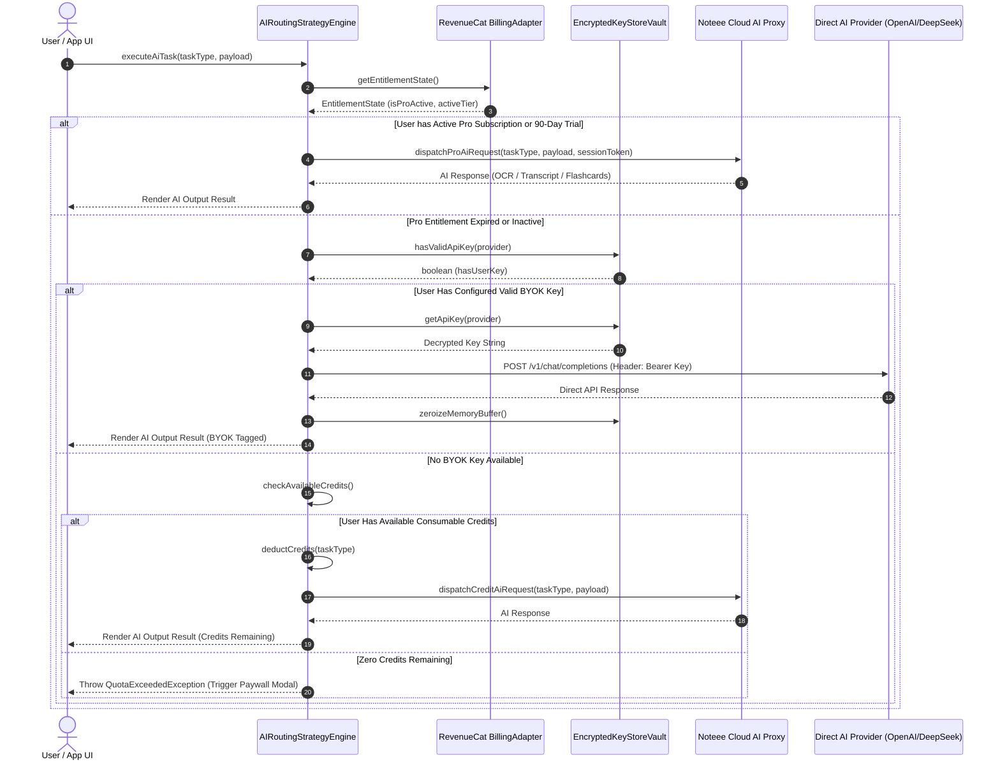
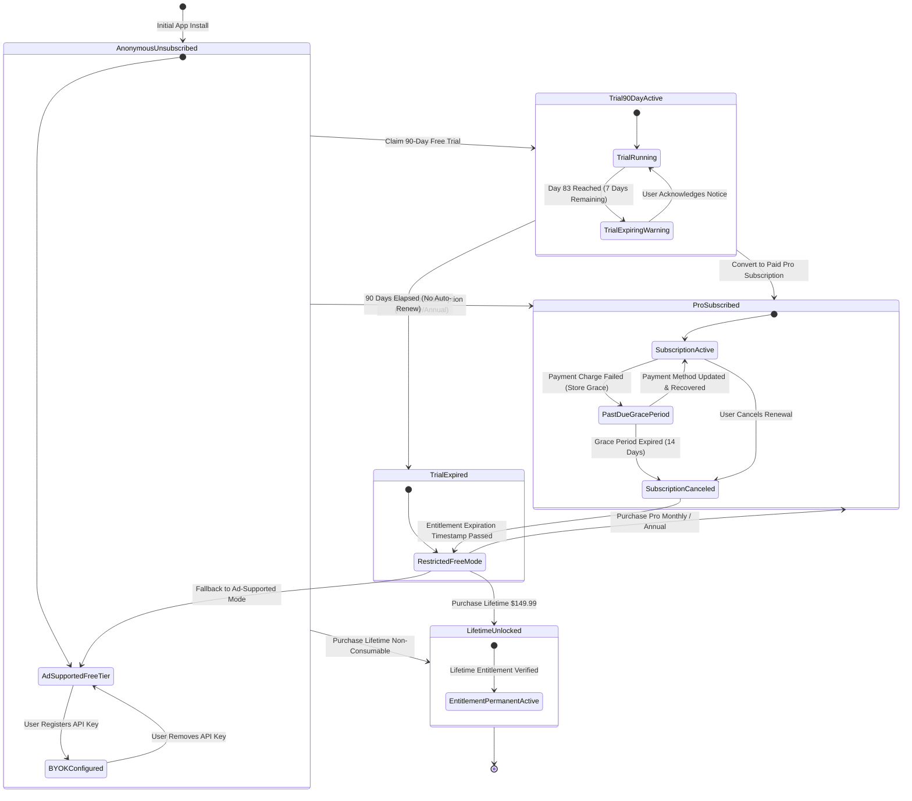

# Noteee: App Store Shipping, RevenueCat Monetization, BYOK Security & Observability Specification

## Executive Summary & Architectural Core Principles

### Architectural Methodology: SOLID & Clean Architecture
Noteee's shipping, monetization, security, and observability subsystem is built upon strict **Clean Architecture** and **Dependency Inversion Principle (DIP)** guidelines. The core application logic does not depend directly on third-party SDKs (such as RevenueCat, Sentry, Google Mobile Ads, or Apple StoreKit). Instead, all external infrastructure capabilities are encapsulated behind explicit domain interface ports.

```
┌──────────────────────────────────────────────────────────────────────────────────┐
│                                Frameworks & Drivers                              │
│   ┌────────────────────┐   ┌──────────────────────┐   ┌──────────────────────┐   │
│   │ RevenueCat SDK     │   │ Sentry RN / Next.js  │   │ Google AdMob SDK     │   │
│   └─────────┬──────────┘   └──────────┬───────────┘   └──────────┬───────────┘   │
└─────────────┼─────────────────────────┼──────────────────────────┼───────────────┘
              │                         │                          │
              ▼                         ▼                          ▼
┌──────────────────────────────────────────────────────────────────────────────────┐
│                                Interface Adapters                                │
│   ┌────────────────────┐   ┌──────────────────────┐   ┌──────────────────────┐   │
│   │ RevenueCatBilling  │   │ SentryObservability  │   │ AdMobBannerAdapter   │   │
│   │ Adapter            │   │ Service              │   │                      │   │
│   └─────────┬──────────┘   └──────────┬───────────┘   └──────────┬───────────┘   │
└─────────────┼─────────────────────────┼──────────────────────────┼───────────────┘
              │                         │                          │
              ▼                         ▼                          ▼
┌──────────────────────────────────────────────────────────────────────────────────┐
│                            Application Business Rules                            │
│   ┌────────────────────┐   ┌──────────────────────┐   ┌──────────────────────┐   │
│   │ Subscription       │   │ FeatureFlagGating    │   │ BYOKKeyVaultManager  │   │
│   │ Orchestrator       │   │ UseCase              │   │ UseCase              │   │
│   └─────────┬──────────┘   └──────────┬───────────┘   └──────────┬───────────┘   │
└─────────────┼─────────────────────────┼──────────────────────────┼───────────────┘
              │                         │                          │
              ▼                         ▼                          ▼
┌──────────────────────────────────────────────────────────────────────────────────┐
│                              Domain Entities & Ports                             │
│   ┌──────────────────────────────────────────────────────────────────────────┐   │
│   │ Interfaces: IBillingAdapter, IKeyStoreManager, IUsageQuotaTracker,       │   │
│   │             IObservabilityService, IAdMobService, IInAppReviewManager    │   │
│   │ Entities:   Entitlement, UserSubscriptionState, UsageQuota, FeatureFlag  │   │
│   └──────────────────────────────────────────────────────────────────────────┘   │
└──────────────────────────────────────────────────────────────────────────────────┘
```

### Applied Gang of Four (GOF) Design Patterns

1. **Adapter Pattern**: Third-party frameworks (RevenueCat, Sentry SDK, AdMob SDK, `expo-store-review`) are wrapped behind explicit domain interfaces (`IBillingAdapter`, `IObservabilityService`, `IAdMobService`, `IInAppReviewManager`). This isolates the core domain from SDK API breaking changes and enables seamless unit testing via mock implementations.
2. **Strategy Pattern**: AI Routing & Execution selects dynamically between three execution strategies based on user entitlements:
   - *Cloud Proxy Strategy*: Routes AI inference through Noteee Managed Infrastructure for Pro subscribers.
   - *BYOK Strategy*: Routes AI requests directly to OpenAI/Anthropic/DeepSeek/Gemini endpoints using local encrypted keys.
   - *Consumable Credit Pack Strategy*: Deducts credits from local ledger for pay-as-you-go users.
3. **Proxy / Decorator Pattern**: `EncryptedKeyStoreProxy` decorates key storage access by transparently handling hardware key generation, biometrics verification, and memory zeroization.
4. **State Pattern**: `SubscriptionStateMachine` governs state transitions (e.g. `Anonymous` -> `TrialActive` -> `ProActive` -> `PastDue` -> `Expired`) with deterministic entitlement calculations.
5. **Observer Pattern**: Customer entitlement changes, Sentry error events, and telemetry metrics are processed asynchronously through reactive event emitters and subscribers.
6. **Factory Pattern**: `BillingAdapterFactory` resolves the active billing implementation (`RevenueCatBillingAdapter` for production, `MockBillingAdapter` for UI testing and E2E automation).

---

## Section 1: App Store (iOS) & Google Play Store Submission Engine

### 1.1 Guidelines Compliance & Metadata Framework

#### Apple App Store Review Guidelines Compliance
- **Guideline 3.1.1 (In-App Purchase)**:
  - All digital features, Pro subscriptions, lifetime unlocks, and consumable AI credit packs use Apple In-App Purchase via RevenueCat.
  - A explicit "Restore Purchases" button is rendered on all paywalls and setting screens.
  - Subscription terms, renewal terms, auto-renew behavior, and links to Privacy Policy and Terms of Use are displayed above the CTA button.
  - BYOK (Bring Your Own Key) is compliant with 3.1.1 because it allows users to input their own pre-existing developer API keys without selling API keys inside the app.
- **Guideline 5.1.1 (Data Collection & Privacy)**:
  - Data collection follows data minimization principles. Local note contents, voice recordings, and flashcards remain local-first on device.
  - No PII or raw note content is sent to third-party tracking services.

#### Apple Privacy Manifest (`PrivacyInfo.xcprivacy`)
iOS 17+ requires a native `PrivacyInfo.xcprivacy` manifest declaring data usage and required reason APIs.

```xml
<?xml version="1.0" encoding="UTF-8"?>
<!DOCTYPE plist PUBLIC "-//Apple//DTD PLIST 1.0//EN" "http://www.apple.com/DTDs/PropertyList-1.0.dtd">
<plist version="1.0">
<dict>
	<key>NSPrivacyTracking</key>
	<false/>
	<key>NSPrivacyTrackingDomains</key>
	<array/>
	<key>NSPrivacyCollectedDataTypes</key>
	<array>
		<dict>
			<key>NSPrivacyCollectedDataType</key>
			<string>NSPrivacyCollectedDataTypeCrashData</string>
			<key>NSPrivacyCollectedDataTypeLinked</key>
			<false/>
			<key>NSPrivacyCollectedDataTypeTracking</key>
			<false/>
			<key>NSPrivacyCollectedDataTypePurposes</key>
			<array>
				<string>NSPrivacyCollectedDataTypePurposeAppFunctionality</string>
			</array>
		</dict>
		<dict>
			<key>NSPrivacyCollectedDataType</key>
			<string>NSPrivacyCollectedDataTypePerformanceData</string>
			<key>NSPrivacyCollectedDataTypeLinked</key>
			<false/>
			<key>NSPrivacyCollectedDataTypeTracking</key>
			<false/>
			<key>NSPrivacyCollectedDataTypePurposes</key>
			<array>
				<string>NSPrivacyCollectedDataTypePurposeAppFunctionality</string>
			</array>
		</dict>
		<dict>
			<key>NSPrivacyCollectedDataType</key>
			<string>NSPrivacyCollectedDataTypePurchaseHistory</string>
			<key>NSPrivacyCollectedDataTypeLinked</key>
			<true/>
			<key>NSPrivacyCollectedDataTypeTracking</key>
			<false/>
			<key>NSPrivacyCollectedDataTypePurposes</key>
			<array>
				<string>NSPrivacyCollectedDataTypePurposeAppFunctionality</string>
			</array>
		</dict>
	</array>
	<key>NSPrivacyAccessedAPITypes</key>
	<array>
		<dict>
			<key>NSPrivacyAccessedAPIType</key>
			<string>NSPrivacyAccessedAPICategoryFileTimestamp</string>
			<key>NSPrivacyAccessedAPITypeReasons</key>
			<array>
				<string>C617.1</string>
			</array>
		</dict>
		<dict>
			<key>NSPrivacyAccessedAPIType</key>
			<string>NSPrivacyAccessedAPICategoryDiskSpace</string>
			<key>NSPrivacyAccessedAPITypeReasons</key>
			<array>
				<string>E174.1</string>
			</array>
		</dict>
		<dict>
			<key>NSPrivacyAccessedAPIType</key>
			<string>NSPrivacyAccessedAPICategoryUserDefaults</string>
			<key>NSPrivacyAccessedAPITypeReasons</key>
			<array>
				<string>CA92.1</string>
			</array>
		</dict>
	</array>
</dict>
</plist>
```

#### Google Play Store Policy Compliance
- **Target SDK**: Android 15 (API Level 35) target SDK compliance.
- **Background Execution & Foreground Services**:
  - Offline Whisper audio processing and background PowerSync database synchronization use Foreground Services with declared types `shortService` and `dataSync`.
  - Android permission `POST_NOTIFICATIONS` requested explicitly at runtime on Android 13+ (API 33+).
- **Data Safety Declarations**:
  - Declarations declare zero data sharing with third parties. Financial data (purchases) processed solely by Google Play Billing via RevenueCat.

---

### 1.2 Native Permission Manifests

#### iOS Permission Manifest (`Info.plist`)

```xml
<?xml version="1.0" encoding="UTF-8"?>
<!DOCTYPE plist PUBLIC "-//Apple//DTD PLIST 1.0//EN" "http://www.apple.com/DTDs/PropertyList-1.0.dtd">
<plist version="1.0">
<dict>
	<!-- Camera Permission -->
	<key>NSCameraUsageDescription</key>
	<string>Noteee uses the camera to scan handwritten documents, capture whiteboard notes, and extract text via local OCR.</string>
	
	<!-- Microphone Permission -->
	<key>NSMicrophoneUsageDescription</key>
	<string>Noteee uses the microphone to record audio notes, lectures, and meetings for offline AI transcription.</string>
	
	<!-- Photo Library Permissions -->
	<key>NSPhotoLibraryUsageDescription</key>
	<string>Noteee accesses your photo library to import images, screenshots, and PDF attachments into your notes.</string>
	<key>NSPhotoLibraryAddUsageDescription</key>
	<string>Noteee requests permission to save exported notes, flashcards, and rendered canvas diagrams to your photo library.</string>
	
	<!-- Speech Recognition Permission -->
	<key>NSSpeechRecognitionUsageDescription</key>
	<string>Noteee uses speech recognition to convert voice notes into structured text notes locally on device.</string>
	
	<!-- Local Notifications Permission -->
	<key>NSUserNotificationUsageDescription</key>
	<string>Noteee sends notifications to remind you of scheduled flashcard review sessions and active audio recordings.</string>
	
	<!-- Live Activities / Dynamic Island Support -->
	<key>NSSupportsLiveActivities</key>
	<true/>
	<key>NSSupportsLiveActivitiesFrequentUpdates</key>
	<true/>
	
	<!-- Background Modes -->
	<key>UIBackgroundModes</key>
	<array>
		<string>audio</string>
		<string>fetch</string>
		<string>remote-notification</string>
	</array>
</dict>
</plist>
```

#### Android Permission Manifest (`AndroidManifest.xml`)

```xml
<manifest xmlns:android="http://schemas.android.com/apk/res/android"
    package="com.noteee.app">

    <!-- Hardware & Capture Permissions -->
    <uses-permission android:name="android.permission.CAMERA" />
    <uses-permission android:name="android.permission.RECORD_AUDIO" />
    <uses-permission android:name="android.permission.MODIFY_AUDIO_SETTINGS" />

    <!-- Storage & Media Permissions (Android 13+ Granular Permissions) -->
    <uses-permission android:name="android.permission.READ_MEDIA_IMAGES" />
    <uses-permission android:name="android.permission.READ_MEDIA_AUDIO" />
    <uses-permission android:name="android.permission.READ_EXTERNAL_STORAGE" android:maxSdkVersion="32" />
    <uses-permission android:name="android.permission.WRITE_EXTERNAL_STORAGE" android:maxSdkVersion="28" />

    <!-- Notifications & Foreground Services -->
    <uses-permission android:name="android.permission.POST_NOTIFICATIONS" />
    <uses-permission android:name="android.permission.FOREGROUND_SERVICE" />
    <uses-permission android:name="android.permission.FOREGROUND_SERVICE_MICROPHONE" />
    <uses-permission android:name="android.permission.FOREGROUND_SERVICE_DATA_SYNC" />
    <uses-permission android:name="android.permission.RECEIVE_BOOT_COMPLETED" />
    <uses-permission android:name="android.permission.VIBRATE" />

    <!-- Billing & Network -->
    <uses-permission android:name="com.android.vending.BILLING" />
    <uses-permission android:name="android.permission.INTERNET" />
    <uses-permission android:name="android.permission.ACCESS_NETWORK_STATE" />

    <application
        android:name=".MainApplication"
        android:label="@string/app_name"
        android:icon="@mipmap/ic_launcher"
        android:allowBackup="false"
        android:supportsRtl="true"
        android:theme="@style/AppTheme">

        <!-- Foreground Service Declarations for Audio Capture & PowerSync Sync -->
        <service
            android:name=".services.AudioRecordingForegroundService"
            android:enabled="true"
            android:exported="false"
            android:foregroundServiceType="microphone" />

        <service
            android:name=".services.DatabaseSyncForegroundService"
            android:enabled="true"
            android:exported="false"
            android:foregroundServiceType="dataSync" />
            
    </application>
</manifest>
```

---

### 1.3 In-App Rating & Review Trigger Architecture (`expo-store-review`)

#### Production Pain-Point Analysis: Store Review Fatigue & Failure Triggers
- **Pain Point**: App store reviews prompted immediately after launch or right after a sync error or audio recording crash lead to 1-star reviews and store rejection. Furthermore, Apple strictly limits store review prompts to **3 times per 365-day period** per device. Calling `StoreReview.requestReview()` recklessly exhausts prompts without displaying a dialog.
- **Architecture Solution**: `InAppReviewManager` enforces strict trigger rules, zero-error suppression, event counting, and hardware-backed frequency capping.

```typescript
/**
 * In-App Rating Review Trigger Criteria Rules:
 * 1. Prompt AFTER 3 completed note capture sessions (OCR, audio transcript, or rich canvas save).
 * 2. OR prompt AFTER 5 completed spaced-repetition flashcard review sessions.
 * 3. NEVER prompt if an error, crash, low-memory warning, or network timeout occurred in the last 24 hours.
 * 4. NEVER prompt if prompt count in the last 365 days >= 3.
 * 5. Minimum 60 days interval between prompt attempts.
 */
```

#### Clean Architecture Interface (`IInAppReviewManager`)

```typescript
export interface ReviewEligibilityCriteria {
  completedCapturesCount: number;
  completedFlashcardSessionsCount: number;
  hasErrorsInLast24Hours: boolean;
  lastPromptTimestampMs: number;
  promptsInLast365DaysCount: number;
}

export interface IInAppReviewManager {
  recordCompletedCapture(): Promise<void>;
  recordCompletedFlashcardSession(): Promise<void>;
  recordSystemError(error: Error): Promise<void>;
  checkAndTriggerReviewIfEligible(): Promise<boolean>;
  resetReviewCounters(): Promise<void>;
}
```

---

## Section 2: Monetization Engine & RevenueCat Hybrid Infrastructure

### 2.1 Tiered Billing & Entitlement Model

Noteee employs a multi-tiered monetization strategy combining trials, ads, subscriptions, lifetime purchases, and BYOK AI routing.

| Tier | Price | Access Rights & Entitlements | AI Model Execution Path | Ad Policy |
| :--- | :--- | :--- | :--- | :--- |
| **90-Day Free Trial** | $0.00 (90 Days) | Full Pro Entitlements (Unlimited OCR, Audio Transcription, Vector Search, Flashcards) | Noteee Cloud Proxy (Pro Tier) | No Ads |
| **Ad-Supported Free** | $0.00 | Local notes, markdown editor, canvas drawing, 5 OCR scans/mo, 15 min transcript/mo | Local ONNX / AdMob Gated | AdMob Banners + Native Ads |
| **BYOK Free Tier** | $0.00 | Unlimited AI features using user's API key | Direct User API (OpenAI / Anthropic / DeepSeek / Gemini) | No Ads when BYOK Key Valid |
| **Pro Monthly** | $9.99 / month | Full Pro Entitlements, Cloud Sync, Multi-device, Unlimited AI | Noteee Cloud Proxy (Managed AI) | No Ads |
| **Pro Annual** | $69.99 / year | Full Pro Entitlements (Save 40% vs Monthly), Priority Support | Noteee Cloud Proxy (Managed AI) | No Ads |
| **Lifetime Unlock** | $149.99 Non-Consumable | Permanent Pro Entitlements, All Future Pro Updates | Noteee Cloud Proxy (Managed AI) | No Ads |
| **AI Credit Packs** | $2.99 / $9.99 Consumable | 500 / 2,000 Pay-As-You-Go AI Credits for Free Tier Users | Noteee Cloud Proxy Credit Ledger | No Ads during credit usage |

#### AdMob Integration Constraints & Frequency Capping
- **Banner Placement**: Restricted to bottom of note list and folder tree. Strictly forbidden inside active Markdown editor or Canvas view.
- **Native Ad Placement**: Inserted after every 8th item in note list views.
- **Interstitial Ad Policy**:
  - Maximum 1 interstitial per 5 completed capture sessions.
  - **STRICT PROHIBITION**: Interstitials MUST NEVER be shown during active voice recording, camera scanning, live canvas drawing, or when user has an active BYOK key or Pro subscription.
- **Privacy & Consent (UMP SDK)**: Uses Google User Messaging Platform (UMP) SDK for GDPR / CCPA consent management.

---

### 2.2 BYOK (Bring Your Own Key) Security Vault

#### Production Pain-Point Analysis: API Key Compromise & Insecure Mobile Storage
- **Pain Point**: Storing user-supplied API keys (OpenAI `sk-...`, Anthropic `sk-ant-...`, DeepSeek `sk-...`) in standard React Native `AsyncStorage` or unencrypted SQLite exposes keys to root access, backup extraction, and reverse engineering.
- **Architecture Solution**: `EncryptedKeyStoreManager` leverages native hardware enclaves via `expo-secure-store` wrapping iOS Keychain (`kSecAccessControlBiometryAny` / `kSecAttrAccessibleAfterFirstUnlockThisDeviceOnly`) and Android Keystore with AES-256-GCM hardware encryption. Keys exist in decrypted memory only for the exact duration of the HTTPS request lifecycle, after which memory buffers are zeroed out.

```
┌─────────────────────────────────────────────────────────────────────────────────┐
│                           BYOK Key Encrypted Storage                            │
└────────────────────────────────────────┬────────────────────────────────────────┘
                                         │
                                         ▼
                 ┌───────────────────────────────────────────────┐
                 │       Is Biometric Auth Required?            │
                 └───────┬───────────────────────────────┬───────┘
                         │ YES                           │ NO
                         ▼                               ▼
      ┌─────────────────────────────────────┐ ┌─────────────────────────────────────┐
      │ Request iOS LocalAuthentication /   │ │ Access iOS Secure Enclave /         │
      │ Android BiometricPrompt             │ │ Android KeyStore Hardware Enclave   │
      └──────────────────┬──────────────────┘ └──────────────────┬──────────────────┘
                         │                                       │
                         └───────────────────┬───────────────────┘
                                             │ Decrypt AES-256 Key String
                                             ▼
                               ┌──────────────────────────┐
                               │ EncryptedKeyStoreProxy   │
                               │ In-Memory Volatile Buffer│
                               └─────────────┬────────────┘
                                             │ Inject into Auth Header
                                             ▼
                               ┌──────────────────────────┐
                               │ AI Provider API Endpoint │
                               │ (OpenAI/Anthropic/etc.)  │
                               └─────────────┬────────────┘
                                             │ HTTPS Response Returned
                                             ▼
                               ┌──────────────────────────┐
                               │ Immediate Memory Zero    │
                               │ Buffer Purge             │
                               └──────────────────────────┘
```

---

### 2.3 Pay-As-You-Go AI Credit Packs

#### Consumable Credit Rates & Atomic Local Ledger
Users without Pro subscriptions or BYOK keys can purchase consumable AI credit packs ($2.99 for 500 credits, $9.99 for 2,000 credits).

- **1 Credit**: 1 page local OCR text extraction & cleaning.
- **2 Credits**: 1 minute audio transcript processing via Whisper AI.
- **3 Credits**: Semantic vector embedding generation for 10 note chunks.
- **5 Credits**: Synthesis of 1 complete flashcard deck (10 cards) from note context.

#### Optimistic Offline Ledger Architecture
- Local SQLite DB (`op-sqlite`) maintains an immutable transaction ledger table `ai_credit_transactions`.
- Every deduction writes a local debit transaction with an `idempotency_key` and updates the optimistic credit balance.
- When network is restored, local credit transactions sync with RevenueCat and Noteee backend credit verification services. If a discrepancy occurs (e.g. refund or multi-device sync), the ledger reconciles via cloud snapshot authority.

---

### 2.4 Core Monetization Domain Interfaces

```typescript
export type BillingProvider = 'REVENUECAT' | 'MOCK' | 'NATIVE_STOREKIT';

export type ProductTier = 'TRIAL_90_DAY' | 'FREE_ADMOB' | 'PRO_MONTHLY' | 'PRO_ANNUAL' | 'LIFETIME_UNLOCK';

export interface EntitlementState {
  isProActive: boolean;
  isTrialActive: boolean;
  isLifetimeActive: boolean;
  activeTier: ProductTier;
  expirationDateMs: number | null;
  isInGracePeriod: boolean;
  isSandbox: boolean;
  byokProvidersConfigured: Array<'OPENAI' | 'ANTHROPIC' | 'DEEPSEEK' | 'GEMINI'>;
  availableAiCredits: number;
}

export interface PackageOffer {
  identifier: string;
  productId: string;
  priceFormatted: string;
  priceMicros: number;
  currencyCode: string;
  packageType: 'MONTHLY' | 'ANNUAL' | 'LIFETIME' | 'CONSUMABLE';
  title: string;
  description: string;
}

export interface IBillingAdapter {
  initialize(apiKey: string, appUserId?: string): Promise<void>;
  fetchOfferings(): Promise<PackageOffer[]>;
  purchasePackage(packageId: string): Promise<EntitlementState>;
  restorePurchases(): Promise<EntitlementState>;
  getEntitlementState(): Promise<EntitlementState>;
  addEntitlementChangeListener(listener: (state: EntitlementState) => void): () => void;
}

export interface IKeyStoreManager {
  storeApiKey(provider: 'OPENAI' | 'ANTHROPIC' | 'DEEPSEEK' | 'GEMINI', key: string): Promise<void>;
  getApiKey(provider: 'OPENAI' | 'ANTHROPIC' | 'DEEPSEEK' | 'GEMINI'): Promise<string | null>;
  removeApiKey(provider: 'OPENAI' | 'ANTHROPIC' | 'DEEPSEEK' | 'GEMINI'): Promise<void>;
  hasValidApiKey(provider: 'OPENAI' | 'ANTHROPIC' | 'DEEPSEEK' | 'GEMINI'): Promise<boolean>;
  clearAllKeys(): Promise<void>;
}

export interface IUsageQuotaTracker {
  canExecuteAiTask(taskType: 'OCR' | 'WHISPER' | 'FLASHCARD' | 'VECTOR', estimatedCost: number): Promise<boolean>;
  deductAiCredits(taskType: 'OCR' | 'WHISPER' | 'FLASHCARD' | 'VECTOR', cost: number, idempotencyKey: string): Promise<number>;
  getRemainingFreeQuota(taskType: 'OCR' | 'WHISPER'): Promise<{ remaining: number; totalMonthly: number }>;
}

export interface IAdMobService {
  initialize(): Promise<void>;
  showInterstitialIfAllowed(): Promise<boolean>;
  recordCaptureSessionForAdFrequency(): void;
  shouldShowBannerAd(): boolean;
  requestConsentInfoUpdate(): Promise<void>;
}
```

---

## Section 3: Telemetry, Observability & Remote Feature Flag System

### 3.1 Sentry Error Monitoring & PII Sanitization

#### Production Pain-Point Analysis: PII Leakage in Crash Diagnostics
- **Pain Point**: Crash reporting tools default to capturing all exception frames, HTTP payload parameters, audio filenames, note titles, user emails, and API keys. Transmitting PII to third-party logs violates GDPR, CCPA, Apple App Review Guidelines 5.1.1, and HIPAA compliance requirements.
- **Architecture Solution**: `SentryObservabilityService` decorates Sentry initialization with a mandatory `beforeSend` scrubbing pipeline using strict regular expressions and deep object tree traversals.

```typescript
/**
 * Strict Regex Patterns for PII & Key Sanitization
 */
const PII_PATTERNS = {
  EMAIL: /[a-zA-Z0-9._%+-]+@[a-zA-Z0-9.-]+\.[a-zA-Z]{2,}/g,
  BEARER_TOKEN: /Bearer\s+[A-Za-z0-9\-\._~\+\/]+=*/gi,
  OPENAI_KEY: /sk-[a-zA-Z0-9]{32,64}/g,
  ANTHROPIC_KEY: /sk-ant-[a-zA-Z0-9\-_]{32,64}/g,
  DEEPSEEK_KEY: /sk-[a-f0-9]{32}/g,
  GENERIC_API_KEY: /(key|api_key|token|auth|secret)=["']?[a-zA-Z0-9_\-]{16,}["']?/gi,
  NOTE_CONTENT_BODY: /(body|content|text|transcript|rawText|extractedText)\s*:\s*["'][^"']{10,}["']/gi,
};

export function scrubPiiFromObject<T>(obj: T): T {
  if (!obj) return obj;
  if (typeof obj === 'string') {
    let sanitized = obj;
    sanitized = sanitized.replace(PII_PATTERNS.EMAIL, '[REDACTED_EMAIL]');
    sanitized = sanitized.replace(PII_PATTERNS.BEARER_TOKEN, 'Bearer [REDACTED_TOKEN]');
    sanitized = sanitized.replace(PII_PATTERNS.OPENAI_KEY, '[REDACTED_OPENAI_KEY]');
    sanitized = sanitized.replace(PII_PATTERNS.ANTHROPIC_KEY, '[REDACTED_ANTHROPIC_KEY]');
    sanitized = sanitized.replace(PII_PATTERNS.DEEPSEEK_KEY, '[REDACTED_DEEPSEEK_KEY]');
    sanitized = sanitized.replace(PII_PATTERNS.GENERIC_API_KEY, '$1=[REDACTED]');
    return sanitized as T;
  }
  if (Array.isArray(obj)) {
    return obj.map(scrubPiiFromObject) as unknown as T;
  }
  if (typeof obj === 'object') {
    const sanitizedObj: Record<string, unknown> = {};
    for (const [key, value] of Object.entries(obj as Record<string, unknown>)) {
      const lowerKey = key.toLowerCase();
      if (['content', 'body', 'transcript', 'rawtext', 'note_text', 'password', 'apikey', 'secret'].includes(lowerKey)) {
        sanitizedObj[key] = '[REDACTED_SENSITIVE_FIELD]';
      } else {
        sanitizedObj[key] = scrubPiiFromObject(value);
      }
    }
    return sanitizedObj as T;
  }
  return obj;
}
```

#### Offline Crash Log Persistence Pipeline
When device is offline during a crash, crash events are serialized and written to SQLite table `sentry_offline_crash_queue`. Upon application launch and network restoration, the queue flushes through `IObservabilityService` with exponential backoff.

---

### 3.2 Privacy-Preserving Telemetry Metrics Pipeline

- **Zero-Telemetry Opt-Out**: Users can flip a toggle in Settings ("Help Improve Noteee"). When disabled, `TelemetryPipeline` drops all metric events at the port interface boundary before serialization.
- **Anonymous Session UUID**: Device identifiers (IDFA, GAID) are NEVER tracked. Telemetry uses a randomly generated cryptographically secure UUID v4 stored in `expo-secure-store`, rotated upon app reinstall.
- **Batched Dispatch Engine**: Metrics are buffered locally in SQLite and flushed in batches of 20 events or every 60 seconds to conserve battery and bandwidth.

---

### 3.3 Remote Feature Flags & A/B Experimentation Engine

#### Remote Config Cache & Fallback Architecture
Feature flags are fetched from the remote configuration server during app launch and cached in SQLite table `feature_flags_cache`. If offline or network request fails, the application falls back to default compile-time flag values instantly without delaying splash screen dismissal.

```typescript
export interface FeatureFlagsMap {
  enable_live_activities: boolean;
  enable_deepseek_v3_byok: boolean;
  enable_admob_interstitials: boolean;
  admob_interstitial_cap_captures: number;
  free_trial_duration_days: number;
  ai_routing_strategy_default: 'CLOUD_PROXY' | 'BYOK_DIRECT' | 'CREDIT_PACK';
  experimental_canvas_webgl: boolean;
}

export const DEFAULT_FEATURE_FLAGS: FeatureFlagsMap = {
  enable_live_activities: true,
  enable_deepseek_v3_byok: true,
  enable_admob_interstitials: true,
  admob_interstitial_cap_captures: 5,
  free_trial_duration_days: 90,
  ai_routing_strategy_default: 'CLOUD_PROXY',
  experimental_canvas_webgl: false,
};
```

---

## Section 4: System Architecture Diagrams (Mermaid)

### 4.1 Sequence Diagram: RevenueCat Subscription & BYOK Fallback Execution



---

### 4.2 State Machine Diagram: User Subscription Lifecycle & Entitlements



---

## Section 5: Production TypeScript Interfaces & Clean Architecture Code Contracts

### 5.1 Domain Models & Value Objects

```typescript
/**
 * Noteee Domain Entities & Value Objects
 * Strict TypeScript definition following Clean Architecture principles.
 */

export type AIProvider = 'OPENAI' | 'ANTHROPIC' | 'DEEPSEEK' | 'GEMINI';

export type AITaskType = 'OCR' | 'WHISPER' | 'FLASHCARD' | 'VECTOR';

export interface UserSubscriptionInfo {
  readonly userId: string;
  readonly isPro: boolean;
  readonly isTrial: boolean;
  readonly isLifetime: boolean;
  readonly activeTier: ProductTier;
  readonly expirationTimestampMs: number | null;
  readonly isInGracePeriod: boolean;
  readonly availableCredits: number;
}

export interface AIExecutionRequest {
  readonly taskId: string;
  readonly taskType: AITaskType;
  readonly payload: Record<string, unknown>;
  readonly estimatedCredits: number;
  readonly preferredProvider?: AIProvider;
}

export interface AIExecutionResponse<T = unknown> {
  readonly taskId: string;
  readonly success: boolean;
  readonly executionStrategyUsed: 'CLOUD_PROXY' | 'BYOK_DIRECT' | 'CREDIT_PACK';
  readonly providerUsed: AIProvider | 'NOTEEE_CLOUD';
  readonly resultData: T;
  readonly creditsDeducted: number;
  readonly durationMs: number;
}

export interface FeatureFlagConfig {
  readonly key: string;
  readonly value: boolean | string | number;
  readonly isOverriddenLocally: boolean;
}
```

---

### 5.2 Ports & Adapters Interfaces

```typescript
/**
 * Clean Architecture Ports Interfaces
 */

export interface IBillingAdapter {
  initialize(apiKey: string, appUserId?: string): Promise<void>;
  fetchOfferings(): Promise<PackageOffer[]>;
  purchasePackage(packageId: string): Promise<EntitlementState>;
  restorePurchases(): Promise<EntitlementState>;
  getEntitlementState(): Promise<EntitlementState>;
  addEntitlementChangeListener(listener: (state: EntitlementState) => void): () => void;
}

export interface IKeyStoreManager {
  storeApiKey(provider: AIProvider, key: string): Promise<void>;
  getApiKey(provider: AIProvider): Promise<string | null>;
  removeApiKey(provider: AIProvider): Promise<void>;
  hasValidApiKey(provider: AIProvider): Promise<boolean>;
  clearAllKeys(): Promise<void>;
}

export interface IUsageQuotaTracker {
  canExecuteAiTask(taskType: AITaskType, estimatedCost: number): Promise<boolean>;
  deductAiCredits(taskType: AITaskType, cost: number, idempotencyKey: string): Promise<number>;
  getRemainingFreeQuota(taskType: 'OCR' | 'WHISPER'): Promise<{ remaining: number; totalMonthly: number }>;
}

export interface IObservabilityService {
  initialize(dsn: string, environment: string): void;
  captureException(error: Error, context?: Record<string, unknown>): void;
  captureMessage(message: string, level?: 'info' | 'warning' | 'error'): void;
  recordMetric(name: string, value: number, tags?: Record<string, string>): void;
  setUserContext(userId: string | null): void;
}

export interface IAdMobService {
  initialize(): Promise<void>;
  showInterstitialIfAllowed(): Promise<boolean>;
  recordCaptureSessionForAdFrequency(): void;
  shouldShowBannerAd(): boolean;
  requestConsentInfoUpdate(): Promise<void>;
}

export interface IInAppReviewManager {
  recordCompletedCapture(): Promise<void>;
  recordCompletedFlashcardSession(): Promise<void>;
  recordSystemError(error: Error): Promise<void>;
  checkAndTriggerReviewIfEligible(): Promise<boolean>;
  resetReviewCounters(): Promise<void>;
}

export interface IFeatureFlagService {
  initialize(): Promise<void>;
  isFeatureEnabled(flagKey: keyof FeatureFlagsMap): boolean;
  getFlagValue<T extends boolean | string | number>(flagKey: keyof FeatureFlagsMap, defaultValue: T): T;
  refreshFlagsRemote(): Promise<void>;
}
```

---

### 5.3 Application Use Case Contracts & Error Hierarchy

```typescript
/**
 * Production Custom Error Hierarchy
 */
export class NoteeeShippingBaseError extends Error {
  constructor(
    message: string,
    public readonly code: string,
    public readonly details?: Record<string, unknown>
  ) {
    super(message);
    this.name = this.constructor.name;
    Object.setPrototypeOf(this, new.target.prototype);
  }
}

export class BillingAdapterError extends NoteeeShippingBaseError {
  constructor(message: string, code: string = 'BILLING_ADAPTER_ERROR', details?: Record<string, unknown>) {
    super(message, code, details);
  }
}

export class EncryptedKeyStoreError extends NoteeeShippingBaseError {
  constructor(message: string, code: string = 'KEYSTORE_ERROR', details?: Record<string, unknown>) {
    super(message, code, details);
  }
}

export class QuotaExceededError extends NoteeeShippingBaseError {
  constructor(message: string, code: string = 'QUOTA_EXCEEDED', details?: Record<string, unknown>) {
    super(message, code, details);
  }
}

export class ObservabilityError extends NoteeeShippingBaseError {
  constructor(message: string, code: string = 'OBSERVABILITY_ERROR', details?: Record<string, unknown>) {
    super(message, code, details);
  }
}

/**
 * AI Execution Orchestrator Use Case Interface
 */
export interface IExecuteAiTaskUseCase {
  execute<T>(request: AIExecutionRequest): Promise<AIExecutionResponse<T>>;
}
```
